# Common Characteristics of Top-Performing Stocks

Motivation: determine common characteristics (e.g. EPS growth, 1y revenue growth, etc.) of stocks that show a price growth of more than 40% per year.

Steps:
1. We look at top 40 companies that achieved the highest stock price growth in the first 3 months of 2017, then top 40 stocks achieving highest price growth in next quarter, etc.
2. We try to find common characteristics of those stocks.
3. We try to find indicators that can be used to identify when to buy and when to sell a stock 

## Insights

Filter: highest returns, top 40 stocks


Q1, 2018
- Most companies are in healthcare, followed by technology

Q1, 2017
- Most companies are in healthcare, followed by technology

Q1, 2016
- Most companies are in basic materials, followed by technology, consumer cyclicals, and industrials

Q1, 2015
- Most companies are in healthcare, followed by technology

Q1, 2014
- Most companies are in healthcare, followed by technology, and industrials

Q1, 2013
- Most companies are in healthcare, followed by technology


```python
import numpy as np
import pandas as pd
import matplotlib.pyplot as plt
from collections import Counter
```


```python
from quantopian.research import returns, symbols, run_pipeline, prices
from quantopian.pipeline import Pipeline, CustomFactor
from quantopian.pipeline.factors import Returns
from quantopian.pipeline.data import USEquityPricing, morningstar
from quantopian.pipeline.data.psychsignal import stocktwits
from quantopian.pipeline.experimental import QTradableStocksUS

import alphalens as al

class Industry(CustomFactor):
    inputs = [ morningstar.asset_classification.morningstar_industry_code ]
    window_length = 1
    def compute(self, today, assets, out, morningstar_industry_code):
        out[:] = morningstar_industry_code

class Industry_Group(CustomFactor):
    inputs = [ morningstar.asset_classification.morningstar_industry_group_code ]
    window_length = 1
    def compute(self, today, assets, out, morningstar_industry_group_code):
        out[:] = morningstar_industry_group_code
        
class Sector(CustomFactor):
    inputs = [ morningstar.asset_classification.morningstar_sector_code ]
    window_length = 1
    def compute(self, today, assets, out, sector):
        out[:] = sector

# Pipeline definition
def make_pipeline():

    base_universe = QTradableStocksUS()
    return_3m = Returns(window_length=60, mask=base_universe)
    return_1m = Returns(window_length=20, mask=base_universe)
    return_1w = Returns(window_length=5, mask=base_universe)

    sector = Sector()
    industry_group = Industry_Group()
    industry = Industry()
    
    top_40 = return_3m.top(40)
    
    universe = base_universe & (return_3m > 0.25)
    
    return Pipeline(
        columns={
            'return_3m': return_3m,
            'return_1m': return_1m,
            'return_1w': return_1w,
            'sector': sector,
            'industry_group': industry_group,
            'industry': industry,
            'financial_health_grade': morningstar.asset_classification.financial_health_grade.latest,
            'diluted_eps_growth': morningstar.earnings_ratios.diluted_eps_growth.latest
        },
        screen=universe
    )
```


```python
# Select a time range to inspect
q1_period_start = '2018-06-30'
q1_period_end = '2018-06-30'

# Pipeline execution
q1_pipeline_output = run_pipeline(make_pipeline() ,start_date=q1_period_start, end_date=q1_period_end)
# q2_pipeline_output = run_pipeline(make_pipeline() ,start_date=period_start, end_date=period_end)
# q3_pipeline_output = run_pipeline(make_pipeline() ,start_date=period_start, end_date=period_end)
# q4_pipeline_output = run_pipeline(make_pipeline() ,start_date=period_start, end_date=period_end)
```


```python
# q1_pipeline_output.hist(bins=40)
# .loc[:,('sector','second')]

q1_pipeline_output['sector'][q1_pipeline_output['sector'] == 311.] = 'Technology'
q1_pipeline_output['sector'][q1_pipeline_output['sector'] == 310.] = 'Industrials'
q1_pipeline_output['sector'][q1_pipeline_output['sector'] == 309.] = 'Energy'
q1_pipeline_output['sector'][q1_pipeline_output['sector'] == 308.] = 'Communication_Services'
q1_pipeline_output['sector'][q1_pipeline_output['sector'] == 207.] = 'Utilities'
q1_pipeline_output['sector'][q1_pipeline_output['sector'] == 206.] = 'Healthcare'
q1_pipeline_output['sector'][q1_pipeline_output['sector'] == 205.] = 'Consumer_Defensive'
q1_pipeline_output['sector'][q1_pipeline_output['sector'] == 104.] = 'Real_Estate'
q1_pipeline_output['sector'][q1_pipeline_output['sector'] == 103.] = 'Financial_Services'
q1_pipeline_output['sector'][q1_pipeline_output['sector'] == 102.] = 'Consumer_Cyclical'
q1_pipeline_output['sector'][q1_pipeline_output['sector'] == 101.] = 'Basic_Materials'
```

    /usr/local/lib/python2.7/dist-packages/ipykernel_launcher.py:4: SettingWithCopyWarning: 
    A value is trying to be set on a copy of a slice from a DataFrame
    
    See the caveats in the documentation: http://pandas.pydata.org/pandas-docs/stable/indexing.html#indexing-view-versus-copy
      after removing the cwd from sys.path.


```python
letter_counts = Counter(q1_pipeline_output.sector)
df = pd.DataFrame.from_dict(letter_counts, orient='index')
df.plot(kind='bar', title='Histogram of Sectors, Return > 25%')
```


    <matplotlib.axes._subplots.AxesSubplot at 0x7febc1ed85d0>


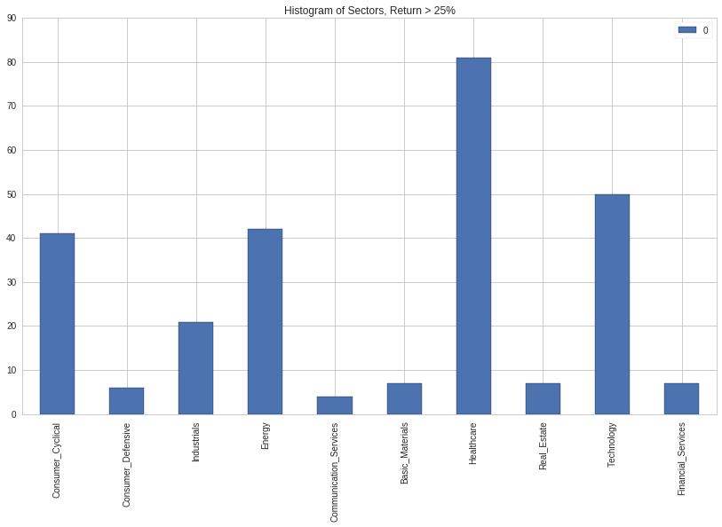


```python
letter_counts = Counter(q1_pipeline_output.industry_group)
df = pd.DataFrame.from_dict(letter_counts, orient='index')
df.plot(kind='bar', title='Histogram of Industry Groups, Return > 25%')
```


    <matplotlib.axes._subplots.AxesSubplot at 0x7febc137edd0>


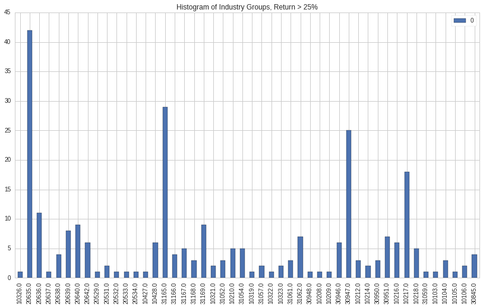


```python
letter_counts = Counter(q1_pipeline_output.industry)
df = pd.DataFrame.from_dict(letter_counts, orient='index')
df.plot(kind='bar', title='Histogram of Industry, Return > 25%')
```


    <matplotlib.axes._subplots.AxesSubplot at 0x7febc48f5b50>


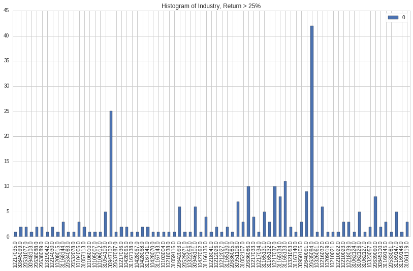


```python
print(q1_pipeline_output.groupby('sector').describe())
q1_pipeline_output.groupby('sector').describe().plot.bar()
```

                                  diluted_eps_growth      industry  \
    sector                                                           
    Basic_Materials        count            7.000000  7.000000e+00   
                           mean             1.485387  1.010458e+07   
                           std              2.583606  1.136771e+03   
                           min             -0.997291  1.010300e+07   
                           25%             -0.733977  1.010400e+07   
                           50%              0.631068  1.010400e+07   
                           75%              3.365942  1.010551e+07   
                           max              5.500000  1.010601e+07   
    Communication_Services count            3.000000  4.000000e+00   
                           mean             0.234393  3.084510e+07   
                           std              1.866509  5.773503e-01   
                           min             -0.918033  3.084510e+07   
                           25%                   NaN  3.084510e+07   
                           50%                   NaN  3.084510e+07   
                           75%                   NaN  3.084510e+07   
                           max              2.387879  3.084510e+07   
    Consumer_Cyclical      count           40.000000  4.100000e+01   
                           mean             6.620842  1.021523e+07   
                           std             25.737652  3.007936e+03   
                           min             -0.952261  1.020802e+07   
                           25%                   NaN  1.021403e+07   
                           50%                   NaN  1.021703e+07   
                           75%                   NaN  1.021704e+07   
                           max            123.000000  1.021804e+07   
    Consumer_Defensive     count            6.000000  6.000000e+00   
                           mean             0.296120  2.053174e+07   
                           std              0.707966  1.755264e+03   
                           min             -0.325843  2.052907e+07   
                           25%             -0.210577  2.053108e+07   
                           50%              0.050000  2.053158e+07   
    ...                                          ...           ...   
    Healthcare             std              4.672593  2.353712e+03   
                           min             -0.976771  2.063508e+07   
                           25%                   NaN  2.063508e+07   
                           50%                   NaN  2.063508e+07   
                           75%                   NaN  2.063909e+07   
                           max             24.045455  2.064209e+07   
    Industrials            count           21.000000  2.100000e+01   
                           mean             0.460991  3.105802e+07   
                           std              0.991378  4.068382e+03   
                           min             -0.995516  3.105211e+07   
                           25%             -0.396154  3.105411e+07   
                           50%              0.548387  3.105912e+07   
                           75%              1.062500  3.106213e+07   
                           max              2.500000  3.106213e+07   
    Real_Estate            count            7.000000  7.000000e+00   
                           mean             0.655457  1.042792e+07   
                           std              2.049379  3.799214e+02   
                           min             -0.916667  1.042706e+07   
                           25%             -0.494117  1.042806e+07   
                           50%             -0.171429  1.042807e+07   
                           75%              0.832264  1.042807e+07   
                           max              5.000000  1.042807e+07   
    Technology             count           39.000000  5.000000e+01   
                           mean             1.763895  3.116632e+07   
                           std              5.544832  1.605282e+03   
                           min             -0.906542  3.116513e+07   
                           25%                   NaN  3.116513e+07   
                           50%                   NaN  3.116513e+07   
                           75%                   NaN  3.116714e+07   
                           max             26.000000  3.116915e+07   
    
                                  industry_group  return_1m  return_1w  return_3m  
    sector                                                                         
    Basic_Materials        count        7.000000   7.000000   7.000000   7.000000  
                           mean     10104.571429   0.041236   0.038021   0.300372  
                           std          1.133893   0.069636   0.036514   0.032112  
                           min      10103.000000  -0.030580   0.000000   0.271663  
                           25%      10104.000000  -0.012364   0.011620   0.275977  
                           50%      10104.000000   0.030777   0.027397   0.289256  
                           75%      10105.500000   0.087248   0.056153   0.316979  
                           max      10106.000000   0.138686   0.103200   0.355769  
    Communication_Services count        4.000000   4.000000   4.000000   4.000000  
                           mean     30845.000000   0.054710  -0.007025   0.844941  
                           std          0.000000   0.074960   0.015033   0.930473  
                           min      30845.000000  -0.027161  -0.020870   0.359490  
                           25%      30845.000000   0.000263  -0.014420   0.367532  
                           50%      30845.000000   0.062506  -0.010755   0.390000  
                           75%      30845.000000   0.116952  -0.003360   0.867409  
                           max      30845.000000   0.120989   0.014279   2.240272  
    Consumer_Cyclical      count       41.000000  41.000000  41.000000  41.000000  
                           mean     10215.195122   0.131374   0.003731   0.480118  
                           std          3.001829   0.138324   0.045732   0.199159  
                           min      10208.000000  -0.035661  -0.124226   0.260428  
                           25%      10214.000000   0.009174  -0.017262   0.326779  
                           50%      10217.000000   0.090411   0.000320   0.388142  
                           75%      10217.000000   0.210376   0.019868   0.574586  
                           max      10218.000000   0.449541   0.134004   0.944881  
    Consumer_Defensive     count        6.000000   6.000000   6.000000   6.000000  
                           mean     20531.666667   0.059600   0.016237   0.406177  
                           std          1.751190   0.094399   0.046378   0.078164  
                           min      20529.000000  -0.036599  -0.025432   0.331319  
                           25%      20531.000000  -0.006861  -0.007150   0.341072  
                           50%      20531.500000   0.027724  -0.001258   0.388114  
    ...                                      ...        ...        ...        ...  
    Healthcare             std          2.350532   0.134247   0.066363   0.398119  
                           min      20635.000000  -0.172775  -0.164001   0.251101  
                           25%      20635.000000  -0.023677  -0.045114   0.323632  
                           50%      20635.000000   0.039127  -0.006920   0.386284  
                           75%      20639.000000   0.102233   0.010052   0.582133  
                           max      20642.000000   0.490506   0.355407   2.827826  
    Industrials            count       21.000000  21.000000  21.000000  21.000000  
                           mean     31057.904762   0.069122   0.005016   0.387155  
                           std          4.060847   0.096632   0.077068   0.109579  
                           min      31052.000000  -0.087662  -0.194785   0.255323  
                           25%      31054.000000   0.010142  -0.021978   0.290110  
                           50%      31059.000000   0.047059  -0.002183   0.361377  
                           75%      31062.000000   0.112500   0.019526   0.499534  
                           max      31062.000000   0.335878   0.225425   0.583112  
    Real_Estate            count        7.000000   7.000000   7.000000   7.000000  
                           mean     10427.857143   0.051192  -0.004964   0.307861  
                           std          0.377964   0.064592   0.036028   0.038359  
                           min      10427.000000  -0.059002  -0.056419   0.255853  
                           25%      10428.000000   0.013840  -0.026722   0.287631  
                           50%      10428.000000   0.082353  -0.007098   0.308207  
                           75%      10428.000000   0.094547   0.022853   0.322498  
                           max      10428.000000   0.118217   0.036507   0.370706  
    Technology             count       50.000000  50.000000  50.000000  50.000000  
                           mean     31166.180000   0.043319   0.006537   0.420675  
                           std          1.599617   0.078469   0.033388   0.166319  
                           min      31165.000000  -0.160862  -0.064444   0.250766  
                           25%      31165.000000   0.000000  -0.017214   0.295113  
                           50%      31165.000000   0.021957   0.004978   0.363882  
                           75%      31167.000000   0.106751   0.028334   0.509266  
                           max      31169.000000   0.222222   0.116331   0.966660  
    
    [80 rows x 6 columns]


    <matplotlib.axes._subplots.AxesSubplot at 0x7febbf015a90>


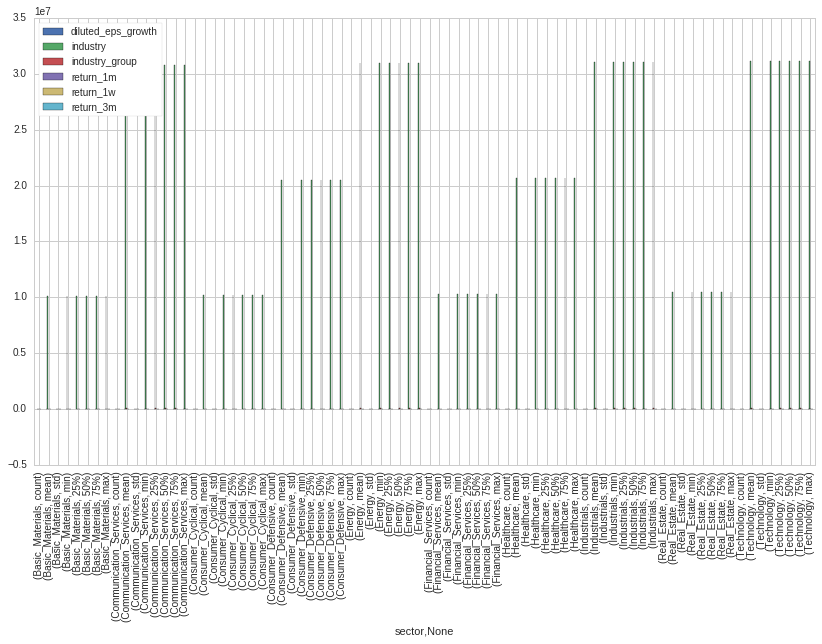


```python
q1_pipeline_output.hist(bins=40)
```


    array([[<matplotlib.axes._subplots.AxesSubplot object at 0x7febc09990d0>,
            <matplotlib.axes._subplots.AxesSubplot object at 0x7febc11c0c90>],
           [<matplotlib.axes._subplots.AxesSubplot object at 0x7febc026c190>,
            <matplotlib.axes._subplots.AxesSubplot object at 0x7febbee91f10>],
           [<matplotlib.axes._subplots.AxesSubplot object at 0x7febc2fe6650>,
            <matplotlib.axes._subplots.AxesSubplot object at 0x7febc2fd2d50>]], dtype=object)


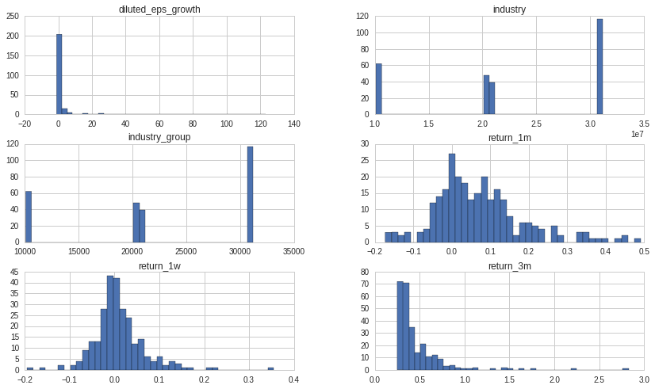


```python
# q1_pipeline_output.groupby('sector').describe()
```


```python
# plt.scatter(q1_pipeline_output['return_3m'], q1_pipeline_output['sector'])
# plt.xlabel('3 Months Returns')
# plt.ylabel('Sector')
# plt.title('Daily Prices in 2014');
q1_pipeline_output.plot.bar()
```


    <matplotlib.axes._subplots.AxesSubplot at 0x7febbf5f2750>


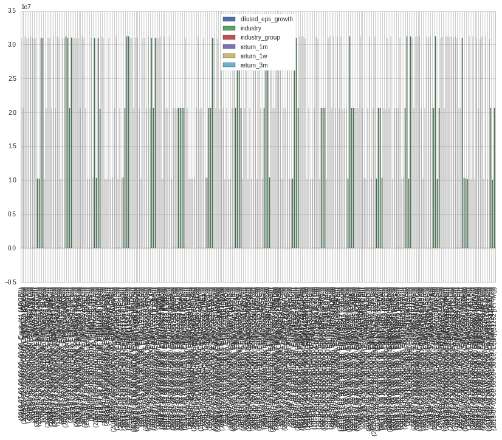


```python
q1_pipeline_output['financial_health_grade'] = q1_pipeline_output['financial_health_grade'].astype('string')
q1_pipeline_output['financial_health_grade'][q1_pipeline_output['financial_health_grade'] == 'A'] = 1
q1_pipeline_output['financial_health_grade'][q1_pipeline_output['financial_health_grade'] == 'B'] = 2
q1_pipeline_output['financial_health_grade'][q1_pipeline_output['financial_health_grade'] == 'C'] = 3
q1_pipeline_output['financial_health_grade'][q1_pipeline_output['financial_health_grade'] == 'D'] = 4
q1_pipeline_output['financial_health_grade'][q1_pipeline_output['financial_health_grade'] == 'E'] = 5
q1_pipeline_output['financial_health_grade'][q1_pipeline_output['financial_health_grade'] == 'F'] = 6

# q1_pipeline_output['financial_health_grade']
```

    /usr/local/lib/python2.7/dist-packages/ipykernel_launcher.py:2: SettingWithCopyWarning: 
    A value is trying to be set on a copy of a slice from a DataFrame
    
    See the caveats in the documentation: http://pandas.pydata.org/pandas-docs/stable/indexing.html#indexing-view-versus-copy
      
    /usr/local/lib/python2.7/dist-packages/ipykernel_launcher.py:3: SettingWithCopyWarning: 
    A value is trying to be set on a copy of a slice from a DataFrame
    
    See the caveats in the documentation: http://pandas.pydata.org/pandas-docs/stable/indexing.html#indexing-view-versus-copy
      This is separate from the ipykernel package so we can avoid doing imports until
    /usr/local/lib/python2.7/dist-packages/ipykernel_launcher.py:4: SettingWithCopyWarning: 
    A value is trying to be set on a copy of a slice from a DataFrame
    
    See the caveats in the documentation: http://pandas.pydata.org/pandas-docs/stable/indexing.html#indexing-view-versus-copy
      after removing the cwd from sys.path.
    /usr/local/lib/python2.7/dist-packages/ipykernel_launcher.py:5: SettingWithCopyWarning: 
    A value is trying to be set on a copy of a slice from a DataFrame
    
    See the caveats in the documentation: http://pandas.pydata.org/pandas-docs/stable/indexing.html#indexing-view-versus-copy
      """
    /usr/local/lib/python2.7/dist-packages/ipykernel_launcher.py:6: SettingWithCopyWarning: 
    A value is trying to be set on a copy of a slice from a DataFrame
    
    See the caveats in the documentation: http://pandas.pydata.org/pandas-docs/stable/indexing.html#indexing-view-versus-copy
      
    /usr/local/lib/python2.7/dist-packages/ipykernel_launcher.py:7: SettingWithCopyWarning: 
    A value is trying to be set on a copy of a slice from a DataFrame
    
    See the caveats in the documentation: http://pandas.pydata.org/pandas-docs/stable/indexing.html#indexing-view-versus-copy
      import sys


    2018-04-02 00:00:00+00:00  Equity(31 [ABAX])       1
                               Equity(53 [ABMD])       1
                               Equity(3885 [IMGN])     3
                               Equity(5343 [THC])      4
                               Equity(8816 [FOSL])     4
                               Equity(10417 [ARWR])    3
                               Equity(13984 [TGTX])    3
                               Equity(14112 [NVAX])    4
                               Equity(21415 [LPSN])    2
                               Equity(22651 [HRTX])    3
                               Equity(22846 [AAXN])    2
                               Equity(23709 [NFLX])    2
                               Equity(24518 [STX])     3
                               Equity(24572 [NKTR])    2
                               Equity(26892 [HLF])     2
                               Equity(32660 [SFLY])    3
                               Equity(33979 [INFN])    3
                               Equity(36209 [IOVA])    2
                               Equity(44332 [ENTA])    1
                               Equity(44830 [EPZM])    3
                               Equity(44955 [PTCT])    3
                               Equity(45080 [MRTX])    3
                               Equity(45800 [WIX])     2
                               Equity(46053 [ITCI])    2
                               Equity(46189 [CBAY])    3
                               Equity(46693 [GRUB])    2
                               Equity(46918 [ZEN])     1
                               Equity(47432 [LOXO])    3
                               Equity(47901 [ATRA])    3
                               Equity(47979 [ENVA])    3
                               Equity(48934 [ETSY])    2
                               Equity(48943 [VIRT])    4
                               Equity(49321 [RUN])     3
                               Equity(49608 [MTCH])    2
                               Equity(50077 [TWLO])    2
                               Equity(50350 [COUP])    2
                               Equity(50400 [CRSP])    3
                               Equity(50403 [QCP])     3
                               Equity(50758 [OKTA])    3
                               Equity(50900 [SGH])     3
    Name: financial_health_grade, dtype: object


```python
plt.scatter(q1_pipeline_output.financial_health_grade, q1_pipeline_output.return_3m)
plt.xlabel('Financial Health Grade')
plt.ylabel('Returns')
plt.title('Daily Prices in 2014');
```


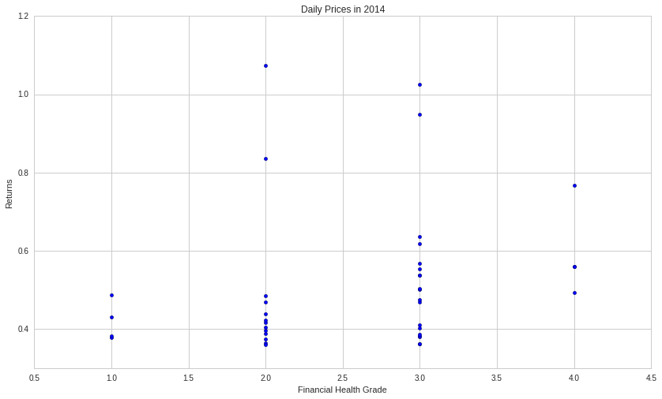


```python
# q1_pipeline_output.hist(column='financial_health_grade', bins=['1','2','3','4','5'])
q1_pipeline_output.financial_health_grade.astype('int').plot(kind='hist')
```


    <matplotlib.axes._subplots.AxesSubplot at 0x7f91867202d0>


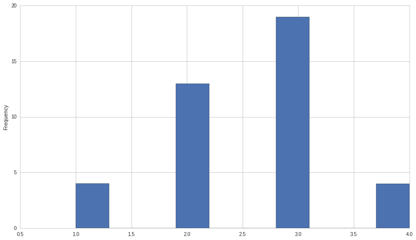


```python

```


    <pandas.core.groupby.DataFrameGroupBy object at 0x7f918652b210>


# Biotechnology (20635084) Industry Analysis

- Get all companies in biotech industry, Q1 2018
- Calculate Q1 returns of all companies
- Plot histogram of returns
- Describe => where is the mean located?


```python
import numpy as np
import pandas as pd
import matplotlib.pyplot as plt
from collections import Counter
from quantopian.research import returns, symbols, run_pipeline, prices
from quantopian.pipeline import Pipeline, CustomFactor
from quantopian.pipeline.factors import Returns
from quantopian.pipeline.data import USEquityPricing, morningstar
from quantopian.pipeline.data.psychsignal import stocktwits
from quantopian.pipeline.experimental import QTradableStocksUS

import alphalens as al
```


```python
class Industry(CustomFactor):
    inputs = [ morningstar.asset_classification.morningstar_industry_code ]
    window_length = 1
    def compute(self, today, assets, out, morningstar_industry_code):
        out[:] = morningstar_industry_code

class Industry_Group(CustomFactor):
    inputs = [ morningstar.asset_classification.morningstar_industry_group_code ]
    window_length = 1
    def compute(self, today, assets, out, morningstar_industry_group_code):
        out[:] = morningstar_industry_group_code
        
class Sector(CustomFactor):
    inputs = [ morningstar.asset_classification.morningstar_sector_code ]
    window_length = 1
    def compute(self, today, assets, out, sector):
        out[:] = sector

# Pipeline definition
def make_pipeline():

    base_universe = QTradableStocksUS()
    return_3m = Returns(window_length=60, mask=base_universe)
    return_1m = Returns(window_length=20, mask=base_universe)
    return_1w = Returns(window_length=5, mask=base_universe)

    sector = Sector()
    industry_group = Industry_Group()
    industry = Industry()
    
#     top_40 = return_3m.top(40)
    
    universe = base_universe & (industry.eq(20635084))
    
    return Pipeline(
        columns={
            'return_3m': return_3m,
            'return_1m': return_1m,
            'return_1w': return_1w,
            'sector': sector,
            'industry_group': industry_group,
            'industry': industry,
            'financial_health_grade': morningstar.asset_classification.financial_health_grade.latest,
            'diluted_eps_growth': morningstar.earnings_ratios.diluted_eps_growth.latest
        },
        screen=universe
    )
```


```python
# Select a time range to inspect
year = '2018'
q1_period_start = '{year}-03-31'.format(year=year)
q1_period_end = '{year}-03-31'.format(year=year)
q2_period_start = '{year}-06-30'.format(year=year)
q2_period_end = '{year}-06-30'.format(year=year)
q3_period_start = '{year}-09-30'.format(year=year)
q3_period_end = '{year}-09-30'.format(year=year)
q4_period_start = '{year}-12-31'.format(year=year)
q4_period_end = '{year}-12-31'.format(year=year)

# Pipeline execution
q1_pipeline_output = run_pipeline(make_pipeline() ,start_date=q1_period_start, end_date=q1_period_end)
q2_pipeline_output = run_pipeline(make_pipeline() ,start_date=q2_period_start, end_date=q2_period_end)
# q3_pipeline_output = run_pipeline(make_pipeline() ,start_date=q3_period_start, end_date=q3_period_end)
# q4_pipeline_output = run_pipeline(make_pipeline() ,start_date=q4_period_start, end_date=q4_period_end)
```


```python
q2_pipeline_output.return_3m.describe()
```


    count    139.000000
    mean       0.154423
    std        0.362298
    min       -0.631139
    25%       -0.081879
    50%        0.106561
    75%        0.291395
    max        1.742113
    Name: return_3m, dtype: float64


```python
q1_pipeline_output.return_3m.plot.hist(bins=40, alpha=0.5)
q2_pipeline_output.return_3m.plot.hist(bins=40, alpha=0.5)
# q3_pipeline_output.return_3m.plot.hist(bins=40, alpha=0.5)
# q4_pipeline_output.return_3m.plot.hist(bins=40, alpha=0.5)

plt.title('Histogram, Biotech Returns');
plt.legend(loc=0);
plt.legend(["Q1", "Q2"]);
```


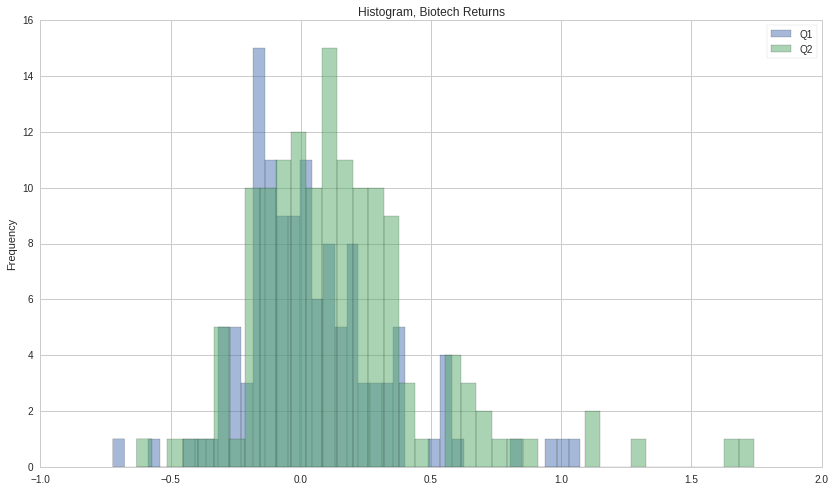


```python
# q1 = q1_pipeline_output.return_3m.describe()
# q2 = q2_pipeline_output.return_3m.describe()
# q3 = q3_pipeline_output.return_3m.describe()
# q4 = q4_pipeline_output.return_3m.describe()

# data13 = pd.concat({'q1': q1, 'q2': q2, 'q3': q3, 'q4': q4}, axis=1)
# data13
```


<div>
<table border="1" class="dataframe">
  <thead>
    <tr style="text-align: right;">
      <th></th>
      <th>q1</th>
      <th>q2</th>
      <th>q3</th>
      <th>q4</th>
    </tr>
  </thead>
  <tbody>
    <tr>
      <th>count</th>
      <td>52.000000</td>
      <td>53.000000</td>
      <td>56.000000</td>
      <td>67.000000</td>
    </tr>
    <tr>
      <th>mean</th>
      <td>0.169640</td>
      <td>0.128534</td>
      <td>0.186874</td>
      <td>0.056887</td>
    </tr>
    <tr>
      <th>std</th>
      <td>0.315344</td>
      <td>0.324348</td>
      <td>0.254152</td>
      <td>0.288957</td>
    </tr>
    <tr>
      <th>min</th>
      <td>-0.359657</td>
      <td>-0.650752</td>
      <td>-0.330357</td>
      <td>-0.651596</td>
    </tr>
    <tr>
      <th>25%</th>
      <td>-0.081739</td>
      <td>-0.025519</td>
      <td>0.038935</td>
      <td>-0.122692</td>
    </tr>
    <tr>
      <th>50%</th>
      <td>0.147556</td>
      <td>0.056199</td>
      <td>0.190358</td>
      <td>0.060208</td>
    </tr>
    <tr>
      <th>75%</th>
      <td>0.322638</td>
      <td>0.257226</td>
      <td>0.285417</td>
      <td>0.181766</td>
    </tr>
    <tr>
      <th>max</th>
      <td>1.523297</td>
      <td>1.361508</td>
      <td>0.974390</td>
      <td>1.114035</td>
    </tr>
  </tbody>
</table>
</div>


```python
# q1 = q1_pipeline_output.return_3m.describe()
# q2 = q2_pipeline_output.return_3m.describe()
# q3 = q3_pipeline_output.return_3m.describe()
# q4 = q4_pipeline_output.return_3m.describe()

# data14 = pd.concat({'q1': q1, 'q2': q2, 'q3': q3, 'q4': q4}, axis=1)
data14
```


<div>
<table border="1" class="dataframe">
  <thead>
    <tr style="text-align: right;">
      <th></th>
      <th>q1</th>
      <th>q2</th>
      <th>q3</th>
      <th>q4</th>
    </tr>
  </thead>
  <tbody>
    <tr>
      <th>count</th>
      <td>82.000000</td>
      <td>90.000000</td>
      <td>89.000000</td>
      <td>90.000000</td>
    </tr>
    <tr>
      <th>mean</th>
      <td>0.044939</td>
      <td>0.086733</td>
      <td>0.055821</td>
      <td>0.221463</td>
    </tr>
    <tr>
      <th>std</th>
      <td>0.271696</td>
      <td>0.264781</td>
      <td>0.364429</td>
      <td>0.342773</td>
    </tr>
    <tr>
      <th>min</th>
      <td>-0.562008</td>
      <td>-0.402958</td>
      <td>-0.394705</td>
      <td>-0.389801</td>
    </tr>
    <tr>
      <th>25%</th>
      <td>-0.098939</td>
      <td>-0.070098</td>
      <td>-0.134488</td>
      <td>0.015065</td>
    </tr>
    <tr>
      <th>50%</th>
      <td>-0.003007</td>
      <td>0.041280</td>
      <td>-0.029805</td>
      <td>0.202250</td>
    </tr>
    <tr>
      <th>75%</th>
      <td>0.141419</td>
      <td>0.192938</td>
      <td>0.171238</td>
      <td>0.383058</td>
    </tr>
    <tr>
      <th>max</th>
      <td>1.130493</td>
      <td>1.449367</td>
      <td>2.578826</td>
      <td>1.652186</td>
    </tr>
  </tbody>
</table>
</div>


```python
# q1 = q1_pipeline_output.return_3m.describe()
# q2 = q2_pipeline_output.return_3m.describe()
# q3 = q3_pipeline_output.return_3m.describe()
# q4 = q4_pipeline_output.return_3m.describe()

# data15 = pd.concat({'q1': q1, 'q2': q2, 'q3': q3, 'q4': q4}, axis=1)
data15
```


<div>
<table border="1" class="dataframe">
  <thead>
    <tr style="text-align: right;">
      <th></th>
      <th>q1</th>
      <th>q2</th>
      <th>q3</th>
      <th>q4</th>
    </tr>
  </thead>
  <tbody>
    <tr>
      <th>count</th>
      <td>100.000000</td>
      <td>111.000000</td>
      <td>114.000000</td>
      <td>112.000000</td>
    </tr>
    <tr>
      <th>mean</th>
      <td>0.158054</td>
      <td>0.065815</td>
      <td>-0.272808</td>
      <td>0.153911</td>
    </tr>
    <tr>
      <th>std</th>
      <td>0.318697</td>
      <td>0.250656</td>
      <td>0.193730</td>
      <td>0.323159</td>
    </tr>
    <tr>
      <th>min</th>
      <td>-0.379406</td>
      <td>-0.602391</td>
      <td>-0.799627</td>
      <td>-0.775323</td>
    </tr>
    <tr>
      <th>25%</th>
      <td>-0.072372</td>
      <td>-0.090944</td>
      <td>-0.395192</td>
      <td>-0.019327</td>
    </tr>
    <tr>
      <th>50%</th>
      <td>0.093444</td>
      <td>0.046755</td>
      <td>-0.282758</td>
      <td>0.122187</td>
    </tr>
    <tr>
      <th>75%</th>
      <td>0.316722</td>
      <td>0.194951</td>
      <td>-0.155522</td>
      <td>0.308633</td>
    </tr>
    <tr>
      <th>max</th>
      <td>1.258755</td>
      <td>0.913995</td>
      <td>0.597718</td>
      <td>1.594510</td>
    </tr>
  </tbody>
</table>
</div>


```python
# q1 = q1_pipeline_output.return_3m.describe()
# q2 = q2_pipeline_output.return_3m.describe()
# q3 = q3_pipeline_output.return_3m.describe()
# q4 = q4_pipeline_output.return_3m.describe()

# data16 = pd.concat({'q1': q1, 'q2': q2, 'q3': q3, 'q4': q4}, axis=1)
data16
```


<div>
<table border="1" class="dataframe">
  <thead>
    <tr style="text-align: right;">
      <th></th>
      <th>q1</th>
      <th>q2</th>
      <th>q3</th>
      <th>q4</th>
    </tr>
  </thead>
  <tbody>
    <tr>
      <th>count</th>
      <td>101.000000</td>
      <td>100.000000</td>
      <td>90.000000</td>
      <td>89.000000</td>
    </tr>
    <tr>
      <th>mean</th>
      <td>-0.235249</td>
      <td>-0.080705</td>
      <td>0.131975</td>
      <td>-0.074084</td>
    </tr>
    <tr>
      <th>std</th>
      <td>0.200322</td>
      <td>0.224195</td>
      <td>0.360825</td>
      <td>0.232518</td>
    </tr>
    <tr>
      <th>min</th>
      <td>-0.760000</td>
      <td>-0.679632</td>
      <td>-0.722892</td>
      <td>-0.889499</td>
    </tr>
    <tr>
      <th>25%</th>
      <td>-0.373764</td>
      <td>-0.227619</td>
      <td>-0.047963</td>
      <td>-0.197794</td>
    </tr>
    <tr>
      <th>50%</th>
      <td>-0.255623</td>
      <td>-0.091860</td>
      <td>0.084121</td>
      <td>-0.072925</td>
    </tr>
    <tr>
      <th>75%</th>
      <td>-0.088843</td>
      <td>0.007821</td>
      <td>0.237909</td>
      <td>0.052939</td>
    </tr>
    <tr>
      <th>max</th>
      <td>0.350548</td>
      <td>0.746637</td>
      <td>1.914914</td>
      <td>0.427985</td>
    </tr>
  </tbody>
</table>
</div>


```python
# q1 = q1_pipeline_output.return_3m.describe()
# q2 = q2_pipeline_output.return_3m.describe()
# q3 = q3_pipeline_output.return_3m.describe()
# q4 = q4_pipeline_output.return_3m.describe()

# data17 = pd.concat({'q1': q1, 'q2': q2, 'q3': q3, 'q4': q4}, axis=1)
data17
```


<div>
<table border="1" class="dataframe">
  <thead>
    <tr style="text-align: right;">
      <th></th>
      <th>q1</th>
      <th>q2</th>
      <th>q3</th>
      <th>q4</th>
    </tr>
  </thead>
  <tbody>
    <tr>
      <th>count</th>
      <td>97.000000</td>
      <td>101.000000</td>
      <td>103.000000</td>
      <td>112.000000</td>
    </tr>
    <tr>
      <th>mean</th>
      <td>0.150637</td>
      <td>0.164539</td>
      <td>0.123978</td>
      <td>-0.036929</td>
    </tr>
    <tr>
      <th>std</th>
      <td>0.384634</td>
      <td>0.300504</td>
      <td>0.290536</td>
      <td>0.338551</td>
    </tr>
    <tr>
      <th>min</th>
      <td>-0.337662</td>
      <td>-0.386513</td>
      <td>-0.859397</td>
      <td>-0.477419</td>
    </tr>
    <tr>
      <th>25%</th>
      <td>-0.059172</td>
      <td>0.003241</td>
      <td>-0.053599</td>
      <td>-0.199297</td>
    </tr>
    <tr>
      <th>50%</th>
      <td>0.046667</td>
      <td>0.120879</td>
      <td>0.094728</td>
      <td>-0.097146</td>
    </tr>
    <tr>
      <th>75%</th>
      <td>0.253117</td>
      <td>0.237838</td>
      <td>0.294112</td>
      <td>0.056043</td>
    </tr>
    <tr>
      <th>max</th>
      <td>2.286385</td>
      <td>1.538012</td>
      <td>1.193878</td>
      <td>1.802449</td>
    </tr>
  </tbody>
</table>
</div>


```python
# q1 = q1_pipeline_output.return_3m.describe()
# q2 = q2_pipeline_output.return_3m.describe()
# q3 = q3_pipeline_output.return_3m.describe()
# q4 = q4_pipeline_output.return_3m.describe()

# data18 = pd.concat({'q1': q1, 'q2': q2}, axis=1)
data18
```


<div>
<table border="1" class="dataframe">
  <thead>
    <tr style="text-align: right;">
      <th></th>
      <th>q1</th>
      <th>q2</th>
    </tr>
  </thead>
  <tbody>
    <tr>
      <th>count</th>
      <td>124.000000</td>
      <td>139.000000</td>
    </tr>
    <tr>
      <th>mean</th>
      <td>0.038914</td>
      <td>0.154423</td>
    </tr>
    <tr>
      <th>std</th>
      <td>0.287787</td>
      <td>0.362298</td>
    </tr>
    <tr>
      <th>min</th>
      <td>-0.721951</td>
      <td>-0.631139</td>
    </tr>
    <tr>
      <th>25%</th>
      <td>-0.146595</td>
      <td>-0.081879</td>
    </tr>
    <tr>
      <th>50%</th>
      <td>-0.002855</td>
      <td>0.106561</td>
    </tr>
    <tr>
      <th>75%</th>
      <td>0.179708</td>
      <td>0.291395</td>
    </tr>
    <tr>
      <th>max</th>
      <td>1.073620</td>
      <td>1.742113</td>
    </tr>
  </tbody>
</table>
</div>


# Biotech - Deep Analysis

Compare indicators:
- Avg. sentiment score 3m
- Avg. message volume 3m
- Revenue growth 1y
- EPS growth 1y
- Earnings surprise


```python
import numpy as np
import pandas as pd
import matplotlib.pyplot as plt
from collections import Counter
from quantopian.research import returns, symbols, run_pipeline, prices
from quantopian.pipeline import Pipeline, CustomFactor
from quantopian.pipeline.factors import Returns, AverageDollarVolume
from quantopian.pipeline.data import USEquityPricing, morningstar
from quantopian.pipeline.data.psychsignal import stocktwits
from quantopian.pipeline.experimental import QTradableStocksUS
from quantopian.pipeline.data.sentdex import sentiment_free
from quantopian.pipeline.data.psychsignal import stocktwits_free
from quantopian.pipeline.data.zacks import EarningsSurprises

import alphalens as al
```


```python
# Calculates the average impact of the sentiment over the window length
class AvgSentiment(CustomFactor):
    def compute(self, today, assets, out, impact):
        
        out[:] = np.mean(impact, axis=0, out=out)
        
class Industry(CustomFactor):
    inputs = [ morningstar.asset_classification.morningstar_industry_code ]
    window_length = 1
    def compute(self, today, assets, out, morningstar_industry_code):
        out[:] = morningstar_industry_code

class Industry_Group(CustomFactor):
    inputs = [ morningstar.asset_classification.morningstar_industry_group_code ]
    window_length = 1
    def compute(self, today, assets, out, morningstar_industry_group_code):
        out[:] = morningstar_industry_group_code
        
class Sector(CustomFactor):
    inputs = [ morningstar.asset_classification.morningstar_sector_code ]
    window_length = 1
    def compute(self, today, assets, out, sector):
        out[:] = sector
        
class SortinoRatio(CustomFactor):
    def compute(self, today, asset_ids, out, values):   
        prices= pd.DataFrame(data=values)
        daily_returns = prices.fillna(method='bfill').fillna(method='ffill').pct_change()[1:]
        # Negative daily returns
        daily_negative_returns = np.copy(daily_returns)
        daily_negative_returns[daily_negative_returns > 0] = 0
        # Mean
        mu = daily_returns.mean(axis=0)
        # Standard Deviation
        sigma = daily_negative_returns.std(axis=0)
        # Sortino Ratio
        sortino_ratio = mu / sigma
        sortino_ratio = sortino_ratio.replace(np.inf, np.nan)
        # sortino_ratio = np.where(sortino_ratio.isfinite(), sortino_ratio, np.nan)  
        # sortino_ratio = sortino_ratio.replace(np.nan, 0)

        out[:] = sortino_ratio

# Pipeline definition
def make_pipeline():

    pipe = Pipeline()
    
    base_universe = QTradableStocksUS()
    return_3m = Returns(window_length=60, mask=base_universe)
    return_1m = Returns(window_length=20, mask=base_universe)
    return_1w = Returns(window_length=5, mask=base_universe)

    sector = Sector()
    industry_group = Industry_Group()
    industry = Industry()
    
#     universe = base_universe & (industry.eq(20635084)) 
    universe = base_universe
    
    window_length = 120
    avg_sentiment = AvgSentiment(inputs=[stocktwits_free.bull_bear_msg_ratio], window_length=window_length)    
    
    sortino_ratio_60 = SortinoRatio(
        inputs=[USEquityPricing.close],
        window_length=60,
        mask=universe
    )
    
    pipe.add(sortino_ratio_60, 'sortino_ratio_60')    
    
    sortino_ratio_120 = SortinoRatio(
        inputs=[USEquityPricing.close],
        window_length=120,
        mask=universe
    )
    
    pipe.add(sortino_ratio_120, 'sortino_ratio_120') 
    
    sortino_ratio_240 = SortinoRatio(
        inputs=[USEquityPricing.close],
        window_length=240,
        mask=universe
    )
    
    pipe.add(sortino_ratio_240, 'sortino_ratio_240')

    pipe.add(USEquityPricing.close.latest, 'close_price')
    
    pipe.add(avg_sentiment, 'bull_bear_msg_ratio')
    pipe.add(return_3m, 'return_3m')
    pipe.add(return_1m, 'return_1m')
    pipe.add(return_1w, 'return_1w')
    pipe.add(sector, 'sector')
    pipe.add(industry_group, 'industry_group')
    pipe.add(industry, 'industry')
    
    # Construct an average dollar volume factor and add it to the pipeline.
    dollar_volume_30 = AverageDollarVolume(window_length=30)
    pipe.add(dollar_volume_30, 'dollar_volume_30')
    
    dollar_volume_60 = AverageDollarVolume(window_length=60)
    pipe.add(dollar_volume_60, 'dollar_volume_60')
    
    dollar_volume_120 = AverageDollarVolume(window_length=120)
    pipe.add(dollar_volume_120, 'dollar_volume_120')
    
    earnings_surprise = EarningsSurprises.eps_pct_diff_surp.latest
    pipe.add(earnings_surprise, 'earnings_surprise')
    
    m = morningstar
    
    # Income Statement Total
    pipe.add(m.income_statement.total_revenue.latest, 'total_revenue')
    pipe.add(m.income_statement.research_and_development.latest, 'research_and_development')

    # Balance Sheet
    pipe.add(m.balance_sheet.cash.latest, 'cash')

    # Cash Flow
    pipe.add(morningstar.cash_flow_statement.free_cash_flow.latest, 'free_cash_flow')
    pipe.add(morningstar.cash_flow_statement.operating_cash_flow.latest, 'operating_cash_flow')
    pipe.add(morningstar.cash_flow_statement.cash_flow_from_continuing_financing_activities.latest, 'cash_flow_from_continuing_financing_activities')
    pipe.add(morningstar.cash_flow_statement.cash_flow_from_continuing_investing_activities.latest, 'cash_flow_from_continuing_investing_activities')
    pipe.add(morningstar.cash_flow_statement.changes_in_cash.latest, 'changes_in_cash')

    # Ratios
    pipe.add(m.income_statement.ebitda.latest / m.income_statement.total_revenue.latest, 'ebitda_to_rev')
    pipe.add(m.income_statement.research_and_development.latest / m.income_statement.total_revenue.latest, 'research_and_development_to_rev')
    
    # Operation Ratios
    pipe.add(morningstar.operation_ratios.revenue_growth.latest, 'revenue_growth')
    pipe.add(morningstar.operation_ratios.net_income_growth.latest, 'net_income_growth')
    pipe.add(morningstar.operation_ratios.net_margin.latest, 'net_margin')
    pipe.add(morningstar.operation_ratios.long_term_debt_equity_ratio.latest, 'long_term_debt_equity_ratio')
    pipe.add(morningstar.operation_ratios.current_ratio.latest, 'current_ratio')

    # Valuation
    pipe.add(morningstar.valuation.enterprise_value.latest, 'enterprise_value')
    pipe.add(morningstar.valuation.market_cap.latest, 'market_cap')
    pipe.add(morningstar.valuation.shares_outstanding.latest, 'shares_outstanding')
    
    # Valuation Ratios
    pipe.add(morningstar.valuation_ratios.pe_ratio.latest, 'pe_ratio')
    pipe.add(morningstar.valuation_ratios.peg_ratio.latest, 'peg_ratio')
    pipe.add(morningstar.valuation_ratios.book_value_per_share.latest, 'book_value_per_share')
    pipe.add(morningstar.valuation_ratios.sales_per_share.latest, 'sales_per_share')
    
    # General
    pipe.add(m.asset_classification.financial_health_grade.latest, 'financial_health_grade')
    pipe.add(m.earnings_ratios.diluted_eps_growth.latest, 'diluted_eps_growth') 

    # Operation Ratios
#     operation_ratios = [
#         'assets_turnover',
#         'cash_conversion_cycle',
#         'current_ratio'
#     ]
    
#     for ratio in operation_ratio:
#         pipe.add(morningstar.operation_ratios.assets_turnover.latest, 'assets_turnover')

    
    
    universe = universe & (USEquityPricing.close.latest < 50)
    pipe.set_screen(universe)
    
    return pipe
```


```python
# l1 = dir(morningstar)
# l1[0]

# print(type(morningstar.asset_classification.growth_grade.latest))

# morningstar.__dict__.values()

# [a for a in dir(morningstar.asset_classification) if not a.startswith('__')]
```


```python

# Select a time range to inspect
year = '2018'
q1_period_start = '{year}-03-31'.format(year=year)
q1_period_end = '{year}-03-31'.format(year=year)
q2_period_start = '{year}-06-30'.format(year=year)
q2_period_end = '{year}-06-30'.format(year=year)
q3_period_start = '{year}-09-30'.format(year=year)
q3_period_end = '{year}-09-30'.format(year=year)
q4_period_start = '{year}-12-31'.format(year=year)
q4_period_end = '{year}-12-31'.format(year=year)

# Pipeline execution
# q1_pipeline_output = run_pipeline(make_pipeline() ,start_date=q1_period_start, end_date=q1_period_end)
q1_pipeline_output = run_pipeline(make_pipeline() ,start_date=q2_period_start, end_date=q2_period_end)
# q3_pipeline_output = run_pipeline(make_pipeline() ,start_date=q3_period_start, end_date=q3_period_end)
# q4_pipeline_output = run_pipeline(make_pipeline() ,start_date=q4_period_start, end_date=q4_period_end)
```


```python
q1_pipeline_output
```


<div>
<table border="1" class="dataframe">
  <thead>
    <tr style="text-align: right;">
      <th></th>
      <th></th>
      <th>book_value_per_share</th>
      <th>bull_bear_msg_ratio</th>
      <th>cash</th>
      <th>cash_flow_from_continuing_financing_activities</th>
      <th>cash_flow_from_continuing_investing_activities</th>
      <th>changes_in_cash</th>
      <th>close_price</th>
      <th>current_ratio</th>
      <th>diluted_eps_growth</th>
      <th>dollar_volume_120</th>
      <th>...</th>
      <th>return_1w</th>
      <th>return_3m</th>
      <th>revenue_growth</th>
      <th>sales_per_share</th>
      <th>sector</th>
      <th>shares_outstanding</th>
      <th>sortino_ratio_120</th>
      <th>sortino_ratio_240</th>
      <th>sortino_ratio_60</th>
      <th>total_revenue</th>
    </tr>
  </thead>
  <tbody>
    <tr>
      <th rowspan="61" valign="top">2018-07-02 00:00:00+00:00</th>
      <th>Equity(2 [ARNC])</th>
      <td>10.7967</td>
      <td>1.383422</td>
      <td>NaN</td>
      <td>-5.420000e+08</td>
      <td>2.900000e+07</td>
      <td>-9.490000e+08</td>
      <td>17.010</td>
      <td>2.103854</td>
      <td>-0.553846</td>
      <td>7.164347e+07</td>
      <td>...</td>
      <td>0.008299</td>
      <td>-0.242387</td>
      <td>0.079261</td>
      <td>28.6306</td>
      <td>310.0</td>
      <td>4.828321e+08</td>
      <td>-0.188546</td>
      <td>-0.071947</td>
      <td>-0.151393</td>
      <td>3.445000e+09</td>
    </tr>
    <tr>
      <th>Equity(41 [ARCB])</th>
      <td>25.9530</td>
      <td>0.098611</td>
      <td>6.106700e+07</td>
      <td>-2.143900e+07</td>
      <td>-6.456000e+06</td>
      <td>3.880000e+06</td>
      <td>45.700</td>
      <td>1.334892</td>
      <td>-0.731884</td>
      <td>9.005331e+06</td>
      <td>...</td>
      <td>-0.002183</td>
      <td>0.430547</td>
      <td>0.075125</td>
      <td>107.8842</td>
      <td>310.0</td>
      <td>2.564151e+07</td>
      <td>0.170916</td>
      <td>0.253793</td>
      <td>0.533643</td>
      <td>7.000010e+08</td>
    </tr>
    <tr>
      <th>Equity(52 [ABM])</th>
      <td>21.8520</td>
      <td>0.159722</td>
      <td>NaN</td>
      <td>-8.850000e+07</td>
      <td>-9.100000e+06</td>
      <td>2.000000e+06</td>
      <td>29.190</td>
      <td>1.726356</td>
      <td>-0.272727</td>
      <td>1.654844e+07</td>
      <td>...</td>
      <td>-0.031198</td>
      <td>-0.105287</td>
      <td>0.206257</td>
      <td>94.7838</td>
      <td>310.0</td>
      <td>6.574216e+07</td>
      <td>-0.195232</td>
      <td>-0.108897</td>
      <td>-0.186700</td>
      <td>1.580800e+09</td>
    </tr>
    <tr>
      <th>Equity(64 [ABX])</th>
      <td>8.1233</td>
      <td>1.757948</td>
      <td>6.620000e+08</td>
      <td>-7.200000e+07</td>
      <td>-2.840000e+08</td>
      <td>1.510000e+08</td>
      <td>13.130</td>
      <td>2.824499</td>
      <td>-0.758621</td>
      <td>1.262493e+08</td>
      <td>...</td>
      <td>0.020995</td>
      <td>0.037007</td>
      <td>-0.101856</td>
      <td>7.0062</td>
      <td>101.0</td>
      <td>1.166893e+09</td>
      <td>-0.074734</td>
      <td>-0.071470</td>
      <td>0.102726</td>
      <td>1.790000e+09</td>
    </tr>
    <tr>
      <th>Equity(110 [ACXM])</th>
      <td>9.7174</td>
      <td>0.266072</td>
      <td>NaN</td>
      <td>-4.647300e+07</td>
      <td>-2.541800e+07</td>
      <td>-3.612900e+07</td>
      <td>29.950</td>
      <td>2.020381</td>
      <td>-0.750000</td>
      <td>1.842041e+07</td>
      <td>...</td>
      <td>0.018361</td>
      <td>0.307860</td>
      <td>0.088559</td>
      <td>11.2543</td>
      <td>311.0</td>
      <td>7.708801e+07</td>
      <td>0.043674</td>
      <td>0.042422</td>
      <td>0.953869</td>
      <td>2.447810e+08</td>
    </tr>
    <tr>
      <th>Equity(128 [ADM])</th>
      <td>33.4988</td>
      <td>0.722917</td>
      <td>NaN</td>
      <td>1.277000e+09</td>
      <td>2.180000e+09</td>
      <td>-1.170000e+08</td>
      <td>45.840</td>
      <td>1.573654</td>
      <td>0.186441</td>
      <td>1.257881e+08</td>
      <td>...</td>
      <td>-0.008865</td>
      <td>0.041686</td>
      <td>0.035895</td>
      <td>107.9437</td>
      <td>205.0</td>
      <td>5.591842e+08</td>
      <td>0.221565</td>
      <td>0.098482</td>
      <td>0.157817</td>
      <td>1.552600e+10</td>
    </tr>
    <tr>
      <th>Equity(154 [AEM])</th>
      <td>21.2515</td>
      <td>0.160417</td>
      <td>NaN</td>
      <td>-3.434800e+07</td>
      <td>-3.547170e+08</td>
      <td>-1.813590e+08</td>
      <td>45.840</td>
      <td>3.631685</td>
      <td>-0.424242</td>
      <td>4.645973e+07</td>
      <td>...</td>
      <td>0.034529</td>
      <td>0.079686</td>
      <td>0.056581</td>
      <td>9.7258</td>
      <td>101.0</td>
      <td>2.324567e+08</td>
      <td>0.002971</td>
      <td>0.027368</td>
      <td>0.162952</td>
      <td>5.784350e+08</td>
    </tr>
    <tr>
      <th>Equity(166 [AES])</th>
      <td>4.8276</td>
      <td>0.520833</td>
      <td>NaN</td>
      <td>-6.300000e+08</td>
      <td>4.160000e+08</td>
      <td>3.750000e+08</td>
      <td>13.420</td>
      <td>1.115258</td>
      <td>-0.115385</td>
      <td>7.629602e+07</td>
      <td>...</td>
      <td>0.041925</td>
      <td>0.187674</td>
      <td>0.061604</td>
      <td>16.1710</td>
      <td>207.0</td>
      <td>6.613998e+08</td>
      <td>0.217491</td>
      <td>0.120968</td>
      <td>0.350434</td>
      <td>2.740000e+09</td>
    </tr>
    <tr>
      <th>Equity(185 [AFL])</th>
      <td>31.3718</td>
      <td>0.609444</td>
      <td>0.000000e+00</td>
      <td>-4.730000e+08</td>
      <td>-1.990000e+08</td>
      <td>5.660000e+08</td>
      <td>43.030</td>
      <td>NaN</td>
      <td>0.246575</td>
      <td>1.160370e+08</td>
      <td>...</td>
      <td>-0.024042</td>
      <td>-0.002170</td>
      <td>0.029478</td>
      <td>27.4770</td>
      <td>103.0</td>
      <td>7.741671e+08</td>
      <td>-0.023146</td>
      <td>0.081809</td>
      <td>-0.002784</td>
      <td>5.448000e+09</td>
    </tr>
    <tr>
      <th>Equity(253 [AIR])</th>
      <td>26.4213</td>
      <td>0.140277</td>
      <td>NaN</td>
      <td>-2.980000e+07</td>
      <td>5.000000e+05</td>
      <td>7.500000e+06</td>
      <td>46.490</td>
      <td>2.858543</td>
      <td>0.100000</td>
      <td>7.150864e+06</td>
      <td>...</td>
      <td>0.001724</td>
      <td>0.076999</td>
      <td>0.120580</td>
      <td>55.2134</td>
      <td>310.0</td>
      <td>3.463874e+07</td>
      <td>0.161531</td>
      <td>0.112475</td>
      <td>0.123063</td>
      <td>4.563000e+08</td>
    </tr>
    <tr>
      <th>Equity(270 [AKRX])</th>
      <td>6.4707</td>
      <td>0.527268</td>
      <td>NaN</td>
      <td>-4.250000e+06</td>
      <td>-2.234000e+07</td>
      <td>-5.818100e+07</td>
      <td>16.610</td>
      <td>4.640370</td>
      <td>-0.960000</td>
      <td>3.778162e+07</td>
      <td>...</td>
      <td>0.061342</td>
      <td>-0.097283</td>
      <td>-0.273684</td>
      <td>6.1738</td>
      <td>206.0</td>
      <td>1.252586e+08</td>
      <td>-0.082035</td>
      <td>-0.057468</td>
      <td>0.000299</td>
      <td>1.840630e+08</td>
    </tr>
    <tr>
      <th>Equity(289 [MATX])</th>
      <td>15.9984</td>
      <td>0.425000</td>
      <td>NaN</td>
      <td>3.380000e+07</td>
      <td>-6.980000e+07</td>
      <td>-6.100000e+06</td>
      <td>38.390</td>
      <td>0.975327</td>
      <td>1.062500</td>
      <td>5.522636e+06</td>
      <td>...</td>
      <td>0.013999</td>
      <td>0.368313</td>
      <td>0.077993</td>
      <td>48.3784</td>
      <td>310.0</td>
      <td>4.265436e+07</td>
      <td>0.147954</td>
      <td>0.080748</td>
      <td>0.869397</td>
      <td>5.114000e+08</td>
    </tr>
    <tr>
      <th>Equity(301 [ALKS])</th>
      <td>7.4555</td>
      <td>0.359098</td>
      <td>NaN</td>
      <td>-3.297000e+06</td>
      <td>2.534400e+07</td>
      <td>-4.791000e+06</td>
      <td>41.160</td>
      <td>2.827152</td>
      <td>0.000000</td>
      <td>4.104516e+07</td>
      <td>...</td>
      <td>-0.026950</td>
      <td>-0.024182</td>
      <td>0.174014</td>
      <td>6.0889</td>
      <td>206.0</td>
      <td>1.550378e+08</td>
      <td>-0.065871</td>
      <td>-0.040873</td>
      <td>0.000007</td>
      <td>2.251500e+08</td>
    </tr>
    <tr>
      <th>Equity(337 [AMAT])</th>
      <td>6.9858</td>
      <td>2.405727</td>
      <td>1.468000e+09</td>
      <td>-2.562000e+09</td>
      <td>2.200000e+07</td>
      <td>-1.929000e+09</td>
      <td>46.190</td>
      <td>2.596288</td>
      <td>0.434211</td>
      <td>6.431347e+08</td>
      <td>...</td>
      <td>-0.011344</td>
      <td>-0.114143</td>
      <td>0.287930</td>
      <td>15.4345</td>
      <td>311.0</td>
      <td>1.008048e+09</td>
      <td>-0.061415</td>
      <td>0.014912</td>
      <td>-0.107302</td>
      <td>4.567000e+09</td>
    </tr>
    <tr>
      <th>Equity(351 [AMD])</th>
      <td>0.7376</td>
      <td>1.837975</td>
      <td>1.130000e+08</td>
      <td>-8.000000e+06</td>
      <td>-4.600000e+07</td>
      <td>-1.400000e+08</td>
      <td>14.980</td>
      <td>1.621096</td>
      <td>0.333333</td>
      <td>6.913999e+08</td>
      <td>...</td>
      <td>-0.008932</td>
      <td>0.560417</td>
      <td>0.398132</td>
      <td>5.4492</td>
      <td>311.0</td>
      <td>9.693440e+08</td>
      <td>0.156417</td>
      <td>0.048981</td>
      <td>0.614832</td>
      <td>1.647000e+09</td>
    </tr>
    <tr>
      <th>Equity(371 [TVTY])</th>
      <td>7.3873</td>
      <td>0.188888</td>
      <td>NaN</td>
      <td>-1.380000e+05</td>
      <td>-1.946000e+06</td>
      <td>1.028300e+07</td>
      <td>35.150</td>
      <td>0.704085</td>
      <td>0.289474</td>
      <td>1.689116e+07</td>
      <td>...</td>
      <td>0.010057</td>
      <td>-0.110689</td>
      <td>0.063560</td>
      <td>13.0666</td>
      <td>206.0</td>
      <td>3.987604e+07</td>
      <td>-0.007107</td>
      <td>-0.000467</td>
      <td>-0.124500</td>
      <td>1.499300e+08</td>
    </tr>
    <tr>
      <th>Equity(410 [AN])</th>
      <td>27.2104</td>
      <td>0.279167</td>
      <td>NaN</td>
      <td>-1.977000e+08</td>
      <td>-1.320000e+07</td>
      <td>-1.220000e+07</td>
      <td>48.580</td>
      <td>0.855216</td>
      <td>0.041237</td>
      <td>3.259536e+07</td>
      <td>...</td>
      <td>-0.024694</td>
      <td>0.045406</td>
      <td>0.023446</td>
      <td>225.6327</td>
      <td>102.0</td>
      <td>9.084382e+07</td>
      <td>-0.101376</td>
      <td>0.071906</td>
      <td>0.102067</td>
      <td>5.259900e+09</td>
    </tr>
    <tr>
      <th>Equity(448 [APA])</th>
      <td>19.6312</td>
      <td>1.271132</td>
      <td>NaN</td>
      <td>-3.160000e+08</td>
      <td>-8.900000e+08</td>
      <td>-5.910000e+08</td>
      <td>46.750</td>
      <td>1.388984</td>
      <td>-0.321429</td>
      <td>1.546657e+08</td>
      <td>...</td>
      <td>0.083681</td>
      <td>0.226648</td>
      <td>0.142857</td>
      <td>15.9243</td>
      <td>309.0</td>
      <td>3.821463e+08</td>
      <td>0.054376</td>
      <td>0.004814</td>
      <td>0.273576</td>
      <td>1.728000e+09</td>
    </tr>
    <tr>
      <th>Equity(474 [APOG])</th>
      <td>18.1205</td>
      <td>0.116203</td>
      <td>NaN</td>
      <td>-4.334000e+07</td>
      <td>-1.012400e+07</td>
      <td>7.760000e+06</td>
      <td>48.170</td>
      <td>1.615541</td>
      <td>-0.025000</td>
      <td>9.209876e+06</td>
      <td>...</td>
      <td>0.115046</td>
      <td>0.147178</td>
      <td>0.125192</td>
      <td>46.0413</td>
      <td>101.0</td>
      <td>2.821965e+07</td>
      <td>0.055311</td>
      <td>-0.010614</td>
      <td>0.208342</td>
      <td>3.534520e+08</td>
    </tr>
    <tr>
      <th>Equity(484 [ATU])</th>
      <td>9.7103</td>
      <td>0.170833</td>
      <td>NaN</td>
      <td>1.980000e+06</td>
      <td>-1.229900e+07</td>
      <td>-1.419800e+07</td>
      <td>29.350</td>
      <td>2.153045</td>
      <td>0.125000</td>
      <td>9.982884e+06</td>
      <td>...</td>
      <td>0.001706</td>
      <td>0.290110</td>
      <td>0.062951</td>
      <td>18.9528</td>
      <td>310.0</td>
      <td>6.068644e+07</td>
      <td>0.131544</td>
      <td>0.082651</td>
      <td>0.646272</td>
      <td>2.751650e+08</td>
    </tr>
    <tr>
      <th>Equity(523 [AAN])</th>
      <td>24.9655</td>
      <td>0.137500</td>
      <td>8.327900e+07</td>
      <td>-4.024500e+07</td>
      <td>-1.795000e+07</td>
      <td>1.383810e+08</td>
      <td>43.450</td>
      <td>1.558468</td>
      <td>-0.013514</td>
      <td>2.356552e+07</td>
      <td>...</td>
      <td>-0.034444</td>
      <td>-0.070946</td>
      <td>0.130225</td>
      <td>48.0042</td>
      <td>310.0</td>
      <td>7.034484e+07</td>
      <td>0.080609</td>
      <td>0.046661</td>
      <td>-0.084100</td>
      <td>9.452670e+08</td>
    </tr>
    <tr>
      <th>Equity(547 [ASB])</th>
      <td>20.8019</td>
      <td>0.000000</td>
      <td>3.282600e+08</td>
      <td>2.440300e+07</td>
      <td>-3.503360e+08</td>
      <td>-2.828400e+08</td>
      <td>27.350</td>
      <td>NaN</td>
      <td>0.142857</td>
      <td>2.838358e+07</td>
      <td>...</td>
      <td>-0.026690</td>
      <td>0.133942</td>
      <td>0.154345</td>
      <td>7.1054</td>
      <td>103.0</td>
      <td>1.707946e+08</td>
      <td>0.078282</td>
      <td>0.074439</td>
      <td>0.443564</td>
      <td>3.002510e+08</td>
    </tr>
    <tr>
      <th>Equity(617 [ATRO])</th>
      <td>12.0330</td>
      <td>0.136389</td>
      <td>NaN</td>
      <td>3.939000e+06</td>
      <td>-4.346000e+06</td>
      <td>-1.461000e+06</td>
      <td>35.970</td>
      <td>2.855360</td>
      <td>-0.710526</td>
      <td>3.487000e+06</td>
      <td>...</td>
      <td>0.000835</td>
      <td>0.017539</td>
      <td>0.174959</td>
      <td>22.4903</td>
      <td>310.0</td>
      <td>2.809173e+07</td>
      <td>-0.037291</td>
      <td>0.066073</td>
      <td>0.040550</td>
      <td>1.790590e+08</td>
    </tr>
    <tr>
      <th>Equity(659 [AMAG])</th>
      <td>21.5575</td>
      <td>0.555092</td>
      <td>NaN</td>
      <td>-2.269000e+06</td>
      <td>-3.800000e+06</td>
      <td>3.962300e+07</td>
      <td>19.500</td>
      <td>1.573816</td>
      <td>-0.965398</td>
      <td>1.520725e+07</td>
      <td>...</td>
      <td>-0.083431</td>
      <td>-0.048780</td>
      <td>0.049358</td>
      <td>17.6980</td>
      <td>206.0</td>
      <td>3.432664e+07</td>
      <td>0.203332</td>
      <td>0.037755</td>
      <td>-0.028297</td>
      <td>1.463560e+08</td>
    </tr>
    <tr>
      <th>Equity(660 [AVP])</th>
      <td>-1.7123</td>
      <td>0.848152</td>
      <td>7.648000e+08</td>
      <td>4.000000e+05</td>
      <td>-2.700000e+07</td>
      <td>-1.229000e+08</td>
      <td>1.630</td>
      <td>1.227724</td>
      <td>18.681601</td>
      <td>8.215936e+06</td>
      <td>...</td>
      <td>0.018750</td>
      <td>-0.421986</td>
      <td>0.045308</td>
      <td>13.1191</td>
      <td>205.0</td>
      <td>4.416803e+08</td>
      <td>-0.107383</td>
      <td>-0.153154</td>
      <td>-0.409079</td>
      <td>1.393500e+09</td>
    </tr>
    <tr>
      <th>Equity(661 [AVT])</th>
      <td>41.9966</td>
      <td>0.177083</td>
      <td>NaN</td>
      <td>-2.400700e+08</td>
      <td>-4.416200e+07</td>
      <td>-1.658730e+08</td>
      <td>42.890</td>
      <td>2.753118</td>
      <td>-0.506329</td>
      <td>2.553884e+07</td>
      <td>...</td>
      <td>0.000233</td>
      <td>0.068206</td>
      <td>0.079515</td>
      <td>152.4072</td>
      <td>311.0</td>
      <td>1.179816e+08</td>
      <td>0.040429</td>
      <td>0.058624</td>
      <td>0.151829</td>
      <td>4.795093e+09</td>
    </tr>
    <tr>
      <th>Equity(677 [AXAS])</th>
      <td>0.7065</td>
      <td>0.815833</td>
      <td>6.139000e+07</td>
      <td>1.975500e+07</td>
      <td>-4.795800e+07</td>
      <td>4.027000e+06</td>
      <td>2.880</td>
      <td>0.586337</td>
      <td>-0.333333</td>
      <td>3.415687e+06</td>
      <td>...</td>
      <td>0.064695</td>
      <td>0.260394</td>
      <td>1.160940</td>
      <td>0.6533</td>
      <td>309.0</td>
      <td>1.665722e+08</td>
      <td>0.096399</td>
      <td>0.172260</td>
      <td>0.235071</td>
      <td>4.063000e+07</td>
    </tr>
    <tr>
      <th>Equity(694 [AZZ])</th>
      <td>21.7185</td>
      <td>0.075000</td>
      <td>NaN</td>
      <td>-1.041100e+07</td>
      <td>-1.976500e+07</td>
      <td>1.002300e+07</td>
      <td>43.450</td>
      <td>2.498531</td>
      <td>0.914894</td>
      <td>4.910931e+06</td>
      <td>...</td>
      <td>-0.009122</td>
      <td>0.003722</td>
      <td>0.088969</td>
      <td>31.1273</td>
      <td>310.0</td>
      <td>2.602404e+07</td>
      <td>-0.036065</td>
      <td>-0.044584</td>
      <td>0.017915</td>
      <td>2.006600e+08</td>
    </tr>
    <tr>
      <th>Equity(700 [BAC])</th>
      <td>23.8232</td>
      <td>2.635227</td>
      <td>2.624700e+10</td>
      <td>2.860200e+10</td>
      <td>-2.284900e+10</td>
      <td>4.610700e+10</td>
      <td>28.210</td>
      <td>NaN</td>
      <td>0.377778</td>
      <td>1.863100e+09</td>
      <td>...</td>
      <td>-0.009654</td>
      <td>-0.043386</td>
      <td>0.039419</td>
      <td>8.2715</td>
      <td>103.0</td>
      <td>1.013935e+10</td>
      <td>-0.037955</td>
      <td>0.096977</td>
      <td>-0.084330</td>
      <td>2.312500e+10</td>
    </tr>
    <tr>
      <th>Equity(739 [BBBY])</th>
      <td>20.6138</td>
      <td>1.076117</td>
      <td>NaN</td>
      <td>-6.582700e+07</td>
      <td>-4.043520e+08</td>
      <td>-1.023320e+08</td>
      <td>19.930</td>
      <td>1.833636</td>
      <td>-0.230769</td>
      <td>7.016741e+07</td>
      <td>...</td>
      <td>0.012189</td>
      <td>-0.043773</td>
      <td>0.051588</td>
      <td>88.3740</td>
      <td>102.0</td>
      <td>1.401310e+08</td>
      <td>-0.002567</td>
      <td>-0.049819</td>
      <td>-0.007673</td>
      <td>3.716264e+09</td>
    </tr>
    <tr>
      <th>...</th>
      <td>...</td>
      <td>...</td>
      <td>...</td>
      <td>...</td>
      <td>...</td>
      <td>...</td>
      <td>...</td>
      <td>...</td>
      <td>...</td>
      <td>...</td>
      <td>...</td>
      <td>...</td>
      <td>...</td>
      <td>...</td>
      <td>...</td>
      <td>...</td>
      <td>...</td>
      <td>...</td>
      <td>...</td>
      <td>...</td>
      <td>...</td>
    </tr>
    <tr>
      <th>Equity(50879 [GTHX])</th>
      <td>5.6003</td>
      <td>0.552778</td>
      <td>NaN</td>
      <td>1.087550e+08</td>
      <td>-7.100000e+04</td>
      <td>9.057500e+07</td>
      <td>43.460</td>
      <td>15.605901</td>
      <td>NaN</td>
      <td>8.057838e+06</td>
      <td>...</td>
      <td>-0.092504</td>
      <td>0.230813</td>
      <td>0.000000</td>
      <td>0.0000</td>
      <td>206.0</td>
      <td>3.270448e+07</td>
      <td>0.351378</td>
      <td>0.266992</td>
      <td>0.200623</td>
      <td>0.000000e+00</td>
    </tr>
    <tr>
      <th>Equity(50891 [CARS])</th>
      <td>23.3475</td>
      <td>0.258333</td>
      <td>4.720000e+06</td>
      <td>1.237580e+08</td>
      <td>-1.594810e+08</td>
      <td>-9.062000e+06</td>
      <td>28.380</td>
      <td>1.356586</td>
      <td>-0.995283</td>
      <td>2.818518e+07</td>
      <td>...</td>
      <td>0.004958</td>
      <td>-0.008386</td>
      <td>0.044283</td>
      <td>8.8089</td>
      <td>102.0</td>
      <td>7.188581e+07</td>
      <td>-0.041296</td>
      <td>0.084499</td>
      <td>0.009545</td>
      <td>1.599570e+08</td>
    </tr>
    <tr>
      <th>Equity(50900 [SGH])</th>
      <td>7.4574</td>
      <td>1.386559</td>
      <td>NaN</td>
      <td>-4.100000e+06</td>
      <td>-7.759000e+06</td>
      <td>1.647800e+07</td>
      <td>31.860</td>
      <td>1.607193</td>
      <td>1.740000</td>
      <td>2.820281e+07</td>
      <td>...</td>
      <td>-0.043818</td>
      <td>-0.268427</td>
      <td>0.620865</td>
      <td>52.1905</td>
      <td>311.0</td>
      <td>2.230751e+07</td>
      <td>-0.000791</td>
      <td>0.147031</td>
      <td>-0.158337</td>
      <td>3.354770e+08</td>
    </tr>
    <tr>
      <th>Equity(50902 [WOW])</th>
      <td>-5.1488</td>
      <td>0.083333</td>
      <td>NaN</td>
      <td>-5.140000e+07</td>
      <td>-5.630000e+07</td>
      <td>-3.290000e+07</td>
      <td>9.650</td>
      <td>0.641249</td>
      <td>-0.918033</td>
      <td>3.833322e+06</td>
      <td>...</td>
      <td>-0.009240</td>
      <td>0.409788</td>
      <td>-0.048333</td>
      <td>13.8973</td>
      <td>308.0</td>
      <td>8.528219e+07</td>
      <td>-0.010152</td>
      <td>-0.085520</td>
      <td>0.531545</td>
      <td>2.855000e+08</td>
    </tr>
    <tr>
      <th>Equity(50903 [APPN])</th>
      <td>0.6306</td>
      <td>0.234723</td>
      <td>NaN</td>
      <td>9.830000e+05</td>
      <td>-1.036000e+06</td>
      <td>-1.388600e+07</td>
      <td>36.160</td>
      <td>1.459730</td>
      <td>0.000000</td>
      <td>1.223940e+07</td>
      <td>...</td>
      <td>0.064155</td>
      <td>0.341246</td>
      <td>0.348744</td>
      <td>3.1058</td>
      <td>311.0</td>
      <td>6.125905e+07</td>
      <td>0.083016</td>
      <td>0.135720</td>
      <td>0.269471</td>
      <td>5.169600e+07</td>
    </tr>
    <tr>
      <th>Equity(50910 [JHG])</th>
      <td>24.4114</td>
      <td>0.050000</td>
      <td>1.771746e+08</td>
      <td>-2.082000e+08</td>
      <td>1.160000e+07</td>
      <td>-1.349000e+08</td>
      <td>30.720</td>
      <td>2.664157</td>
      <td>1.157895</td>
      <td>2.380137e+07</td>
      <td>...</td>
      <td>-0.037292</td>
      <td>-0.019331</td>
      <td>1.522318</td>
      <td>11.4121</td>
      <td>103.0</td>
      <td>2.004061e+08</td>
      <td>-0.189023</td>
      <td>-0.012716</td>
      <td>-0.030965</td>
      <td>5.877000e+08</td>
    </tr>
    <tr>
      <th>Equity(50938 [ATNX])</th>
      <td>2.4472</td>
      <td>0.086111</td>
      <td>NaN</td>
      <td>6.898100e+07</td>
      <td>-5.680000e+07</td>
      <td>-5.450000e+05</td>
      <td>18.650</td>
      <td>3.824252</td>
      <td>NaN</td>
      <td>4.228704e+06</td>
      <td>...</td>
      <td>-0.043590</td>
      <td>0.078035</td>
      <td>7.259332</td>
      <td>1.1268</td>
      <td>206.0</td>
      <td>6.351833e+07</td>
      <td>0.127876</td>
      <td>0.024584</td>
      <td>0.156930</td>
      <td>3.783600e+07</td>
    </tr>
    <tr>
      <th>Equity(50968 [GPMT])</th>
      <td>19.0242</td>
      <td>0.011111</td>
      <td>NaN</td>
      <td>6.102000e+06</td>
      <td>-5.288100e+07</td>
      <td>-3.365000e+07</td>
      <td>18.330</td>
      <td>3.873651</td>
      <td>0.000000</td>
      <td>3.866643e+06</td>
      <td>...</td>
      <td>0.000640</td>
      <td>0.110372</td>
      <td>0.000000</td>
      <td>2.7128</td>
      <td>104.0</td>
      <td>4.343706e+07</td>
      <td>0.147116</td>
      <td>0.037672</td>
      <td>0.479085</td>
      <td>0.000000e+00</td>
    </tr>
    <tr>
      <th>Equity(50970 [ATUS])</th>
      <td>7.3201</td>
      <td>0.278611</td>
      <td>NaN</td>
      <td>9.584790e+08</td>
      <td>-2.916270e+08</td>
      <td>1.097804e+09</td>
      <td>17.050</td>
      <td>0.699662</td>
      <td>NaN</td>
      <td>5.078517e+07</td>
      <td>...</td>
      <td>0.014881</td>
      <td>0.027395</td>
      <td>0.011925</td>
      <td>12.6908</td>
      <td>308.0</td>
      <td>7.370690e+08</td>
      <td>-0.095933</td>
      <td>-0.117207</td>
      <td>0.049571</td>
      <td>2.329714e+09</td>
    </tr>
    <tr>
      <th>Equity(50990 [APRN])</th>
      <td>1.0264</td>
      <td>2.128901</td>
      <td>NaN</td>
      <td>-1.500000e+04</td>
      <td>-4.522000e+06</td>
      <td>-2.499700e+07</td>
      <td>3.340</td>
      <td>2.914613</td>
      <td>0.000000</td>
      <td>9.917625e+06</td>
      <td>...</td>
      <td>0.024540</td>
      <td>0.887006</td>
      <td>-0.196669</td>
      <td>4.3439</td>
      <td>102.0</td>
      <td>1.917697e+08</td>
      <td>0.028942</td>
      <td>-0.056263</td>
      <td>0.606102</td>
      <td>1.966900e+08</td>
    </tr>
    <tr>
      <th>Equity(51008 [CISN])</th>
      <td>2.6275</td>
      <td>0.103075</td>
      <td>1.486540e+08</td>
      <td>-6.366000e+06</td>
      <td>-7.148500e+07</td>
      <td>-4.154800e+07</td>
      <td>14.950</td>
      <td>0.871099</td>
      <td>NaN</td>
      <td>5.808216e+06</td>
      <td>...</td>
      <td>0.026786</td>
      <td>0.275597</td>
      <td>0.229567</td>
      <td>6.6784</td>
      <td>311.0</td>
      <td>1.307136e+08</td>
      <td>0.209674</td>
      <td>0.147089</td>
      <td>0.368948</td>
      <td>1.792930e+08</td>
    </tr>
    <tr>
      <th>Equity(51012 [BHGE])</th>
      <td>12.8065</td>
      <td>1.004861</td>
      <td>NaN</td>
      <td>-1.553000e+09</td>
      <td>-1.340000e+08</td>
      <td>-1.393000e+09</td>
      <td>33.050</td>
      <td>2.048529</td>
      <td>1.428571</td>
      <td>1.225007e+08</td>
      <td>...</td>
      <td>0.018835</td>
      <td>0.122944</td>
      <td>0.762076</td>
      <td>17.6205</td>
      <td>309.0</td>
      <td>1.112872e+09</td>
      <td>-0.009617</td>
      <td>-0.008848</td>
      <td>0.188979</td>
      <td>5.399000e+09</td>
    </tr>
    <tr>
      <th>Equity(51016 [JBGS])</th>
      <td>25.4078</td>
      <td>0.016667</td>
      <td>NaN</td>
      <td>-3.146500e+07</td>
      <td>-9.334500e+07</td>
      <td>-9.014900e+07</td>
      <td>36.470</td>
      <td>3.448439</td>
      <td>NaN</td>
      <td>1.238616e+07</td>
      <td>...</td>
      <td>-0.012189</td>
      <td>0.084390</td>
      <td>0.402203</td>
      <td>5.0000</td>
      <td>104.0</td>
      <td>1.179549e+08</td>
      <td>0.111351</td>
      <td>0.030906</td>
      <td>0.223149</td>
      <td>1.630370e+08</td>
    </tr>
    <tr>
      <th>Equity(51019 [SMPL])</th>
      <td>9.2333</td>
      <td>NaN</td>
      <td>2.409300e+04</td>
      <td>-2.690000e+05</td>
      <td>-2.250000e+05</td>
      <td>1.602400e+07</td>
      <td>14.430</td>
      <td>4.838282</td>
      <td>3.000000</td>
      <td>4.877761e+06</td>
      <td>...</td>
      <td>0.053285</td>
      <td>0.081709</td>
      <td>0.025894</td>
      <td>42.5200</td>
      <td>205.0</td>
      <td>7.058257e+07</td>
      <td>0.026950</td>
      <td>0.119586</td>
      <td>0.155799</td>
      <td>1.093470e+08</td>
    </tr>
    <tr>
      <th>Equity(51037 [AKCA])</th>
      <td>1.7092</td>
      <td>0.266667</td>
      <td>NaN</td>
      <td>1.724000e+06</td>
      <td>2.654100e+07</td>
      <td>1.150200e+07</td>
      <td>23.710</td>
      <td>2.549066</td>
      <td>NaN</td>
      <td>6.426102e+06</td>
      <td>...</td>
      <td>-0.099506</td>
      <td>0.097177</td>
      <td>1.807351</td>
      <td>0.9913</td>
      <td>206.0</td>
      <td>8.559325e+07</td>
      <td>0.156687</td>
      <td>0.147999</td>
      <td>0.108239</td>
      <td>1.710800e+07</td>
    </tr>
    <tr>
      <th>Equity(51046 [BHF])</th>
      <td>113.6148</td>
      <td>NaN</td>
      <td>NaN</td>
      <td>6.430000e+08</td>
      <td>-9.030000e+08</td>
      <td>3.100000e+07</td>
      <td>40.070</td>
      <td>NaN</td>
      <td>NaN</td>
      <td>3.843946e+07</td>
      <td>...</td>
      <td>-0.073097</td>
      <td>-0.202270</td>
      <td>0.880829</td>
      <td>64.2214</td>
      <td>103.0</td>
      <td>1.197731e+08</td>
      <td>-0.226845</td>
      <td>-0.155106</td>
      <td>-0.300551</td>
      <td>1.815000e+09</td>
    </tr>
    <tr>
      <th>Equity(51064 [PETQ])</th>
      <td>5.3729</td>
      <td>0.249167</td>
      <td>NaN</td>
      <td>9.935000e+07</td>
      <td>-9.415300e+07</td>
      <td>-3.323400e+07</td>
      <td>26.970</td>
      <td>2.346123</td>
      <td>NaN</td>
      <td>7.088258e+06</td>
      <td>...</td>
      <td>0.085312</td>
      <td>0.161499</td>
      <td>0.716660</td>
      <td>12.8283</td>
      <td>206.0</td>
      <td>2.453356e+07</td>
      <td>0.119700</td>
      <td>0.061481</td>
      <td>0.151213</td>
      <td>1.150660e+08</td>
    </tr>
    <tr>
      <th>Equity(51079 [RDFN])</th>
      <td>2.5231</td>
      <td>0.928645</td>
      <td>NaN</td>
      <td>1.203600e+07</td>
      <td>-2.305000e+06</td>
      <td>-1.076100e+07</td>
      <td>23.080</td>
      <td>4.520651</td>
      <td>NaN</td>
      <td>2.365918e+07</td>
      <td>...</td>
      <td>0.025778</td>
      <td>0.047662</td>
      <td>0.334486</td>
      <td>4.7181</td>
      <td>104.0</td>
      <td>8.293432e+07</td>
      <td>-0.053870</td>
      <td>0.043106</td>
      <td>0.069728</td>
      <td>7.989300e+07</td>
    </tr>
    <tr>
      <th>Equity(51090 [TDW])</th>
      <td>37.6888</td>
      <td>0.041667</td>
      <td>NaN</td>
      <td>-9.847000e+06</td>
      <td>7.815000e+06</td>
      <td>-8.016000e+06</td>
      <td>28.930</td>
      <td>4.137924</td>
      <td>NaN</td>
      <td>3.709367e+06</td>
      <td>...</td>
      <td>0.022261</td>
      <td>-0.049293</td>
      <td>-0.314539</td>
      <td>29.0100</td>
      <td>309.0</td>
      <td>2.608528e+07</td>
      <td>0.043798</td>
      <td>0.042693</td>
      <td>-0.036484</td>
      <td>9.149300e+07</td>
    </tr>
    <tr>
      <th>Equity(51091 [VNTR])</th>
      <td>11.5318</td>
      <td>0.058333</td>
      <td>NaN</td>
      <td>-8.000000e+06</td>
      <td>-6.700000e+07</td>
      <td>-2.400000e+07</td>
      <td>16.370</td>
      <td>1.838235</td>
      <td>0.158730</td>
      <td>1.220949e+07</td>
      <td>...</td>
      <td>-0.019760</td>
      <td>-0.069358</td>
      <td>0.158287</td>
      <td>21.6415</td>
      <td>101.0</td>
      <td>1.064011e+08</td>
      <td>-0.201377</td>
      <td>-0.061847</td>
      <td>-0.101506</td>
      <td>6.220000e+08</td>
    </tr>
    <tr>
      <th>Equity(51100 [CIFS])</th>
      <td>3.2158</td>
      <td>0.114583</td>
      <td>2.716526e+07</td>
      <td>NaN</td>
      <td>NaN</td>
      <td>NaN</td>
      <td>16.580</td>
      <td>9.649887</td>
      <td>1.182609</td>
      <td>3.583034e+06</td>
      <td>...</td>
      <td>0.015371</td>
      <td>-0.461339</td>
      <td>1.478103</td>
      <td>1.2028</td>
      <td>103.0</td>
      <td>2.211419e+07</td>
      <td>-0.168475</td>
      <td>0.085759</td>
      <td>-0.160623</td>
      <td>1.200904e+07</td>
    </tr>
    <tr>
      <th>Equity(51124 [KL])</th>
      <td>5.6378</td>
      <td>0.509722</td>
      <td>2.315960e+08</td>
      <td>-6.253000e+06</td>
      <td>-3.869600e+07</td>
      <td>4.468800e+07</td>
      <td>21.150</td>
      <td>2.710779</td>
      <td>3.166667</td>
      <td>9.461393e+06</td>
      <td>...</td>
      <td>0.059089</td>
      <td>0.355769</td>
      <td>-0.066523</td>
      <td>3.7047</td>
      <td>101.0</td>
      <td>2.111995e+08</td>
      <td>0.203063</td>
      <td>0.220580</td>
      <td>0.545464</td>
      <td>1.982370e+08</td>
    </tr>
    <tr>
      <th>Equity(51201 [DESP])</th>
      <td>3.9590</td>
      <td>0.041667</td>
      <td>3.448210e+08</td>
      <td>7.019000e+06</td>
      <td>-8.892000e+06</td>
      <td>1.236100e+07</td>
      <td>20.980</td>
      <td>1.789801</td>
      <td>0.333333</td>
      <td>7.087899e+06</td>
      <td>...</td>
      <td>-0.046797</td>
      <td>-0.311002</td>
      <td>0.188754</td>
      <td>7.9241</td>
      <td>102.0</td>
      <td>6.909761e+07</td>
      <td>-0.172913</td>
      <td>-0.130127</td>
      <td>-0.501203</td>
      <td>1.485930e+08</td>
    </tr>
    <tr>
      <th>Equity(51231 [ROKU])</th>
      <td>1.9045</td>
      <td>1.880038</td>
      <td>1.607500e+08</td>
      <td>1.544000e+06</td>
      <td>-3.407000e+06</td>
      <td>-1.650000e+07</td>
      <td>42.620</td>
      <td>2.311294</td>
      <td>NaN</td>
      <td>1.995944e+08</td>
      <td>...</td>
      <td>0.014279</td>
      <td>0.359490</td>
      <td>0.364491</td>
      <td>5.4398</td>
      <td>308.0</td>
      <td>1.015867e+08</td>
      <td>0.017153</td>
      <td>0.160221</td>
      <td>0.278894</td>
      <td>1.365760e+08</td>
    </tr>
    <tr>
      <th>Equity(51233 [DCPH])</th>
      <td>4.4611</td>
      <td>0.088691</td>
      <td>NaN</td>
      <td>-3.600000e+04</td>
      <td>-1.510000e+05</td>
      <td>-1.688100e+07</td>
      <td>39.395</td>
      <td>11.114698</td>
      <td>NaN</td>
      <td>5.607780e+06</td>
      <td>...</td>
      <td>-0.002279</td>
      <td>0.640775</td>
      <td>0.000000</td>
      <td>0.0000</td>
      <td>206.0</td>
      <td>3.689413e+07</td>
      <td>0.213912</td>
      <td>0.187664</td>
      <td>0.397546</td>
      <td>0.000000e+00</td>
    </tr>
    <tr>
      <th>Equity(51244 [PQG])</th>
      <td>12.1377</td>
      <td>0.025000</td>
      <td>NaN</td>
      <td>5.384000e+06</td>
      <td>-3.313500e+07</td>
      <td>-5.716000e+06</td>
      <td>18.000</td>
      <td>2.028565</td>
      <td>-0.997291</td>
      <td>2.780898e+06</td>
      <td>...</td>
      <td>0.027397</td>
      <td>0.302460</td>
      <td>0.099919</td>
      <td>11.1310</td>
      <td>101.0</td>
      <td>1.352409e+08</td>
      <td>0.086932</td>
      <td>0.035649</td>
      <td>0.567093</td>
      <td>3.661970e+08</td>
    </tr>
    <tr>
      <th>Equity(51259 [ANGI])</th>
      <td>2.1574</td>
      <td>0.325000</td>
      <td>1.054700e+07</td>
      <td>-5.424000e+06</td>
      <td>1.524000e+06</td>
      <td>7.201000e+06</td>
      <td>15.390</td>
      <td>1.889814</td>
      <td>-0.812500</td>
      <td>9.859061e+06</td>
      <td>...</td>
      <td>0.024634</td>
      <td>0.154539</td>
      <td>0.693661</td>
      <td>1.8834</td>
      <td>311.0</td>
      <td>4.805486e+08</td>
      <td>0.187413</td>
      <td>0.141921</td>
      <td>0.337111</td>
      <td>2.553110e+08</td>
    </tr>
    <tr>
      <th>Equity(51262 [RYTM])</th>
      <td>4.8550</td>
      <td>0.168611</td>
      <td>NaN</td>
      <td>0.000000e+00</td>
      <td>2.060700e+07</td>
      <td>8.956000e+06</td>
      <td>31.260</td>
      <td>24.809823</td>
      <td>NaN</td>
      <td>4.025402e+06</td>
      <td>...</td>
      <td>-0.066587</td>
      <td>0.600614</td>
      <td>0.000000</td>
      <td>NaN</td>
      <td>206.0</td>
      <td>2.753018e+07</td>
      <td>0.097737</td>
      <td>0.039960</td>
      <td>0.406431</td>
      <td>0.000000e+00</td>
    </tr>
    <tr>
      <th>Equity(51268 [SWCH])</th>
      <td>0.4500</td>
      <td>0.872810</td>
      <td>2.646660e+08</td>
      <td>-3.068000e+06</td>
      <td>-6.246600e+07</td>
      <td>-2.610500e+07</td>
      <td>12.170</td>
      <td>3.365689</td>
      <td>NaN</td>
      <td>1.187581e+07</td>
      <td>...</td>
      <td>-0.025620</td>
      <td>-0.167443</td>
      <td>0.096010</td>
      <td>1.5312</td>
      <td>311.0</td>
      <td>2.526363e+08</td>
      <td>-0.124974</td>
      <td>-0.106124</td>
      <td>-0.133719</td>
      <td>9.771700e+07</td>
    </tr>
    <tr>
      <th>Equity(51281 [CARG])</th>
      <td>1.2488</td>
      <td>0.176686</td>
      <td>NaN</td>
      <td>-1.062000e+06</td>
      <td>-3.101500e+07</td>
      <td>-2.570300e+07</td>
      <td>34.730</td>
      <td>3.918169</td>
      <td>0.207635</td>
      <td>1.385320e+07</td>
      <td>...</td>
      <td>-0.005726</td>
      <td>-0.087973</td>
      <td>0.472380</td>
      <td>3.2840</td>
      <td>311.0</td>
      <td>1.079367e+08</td>
      <td>0.084379</td>
      <td>0.080409</td>
      <td>-0.081602</td>
      <td>9.870100e+07</td>
    </tr>
  </tbody>
</table>
<p>1267 rows  39 columns</p>
</div>


```python
y = q1_pipeline_output.diluted_eps_growth
x = q1_pipeline_output.return_3m
plt.scatter(x, y, c=q1_pipeline_output.industry, cmap='viridis')
plt.xlabel('Return')
plt.ylabel('diluted_eps_growth')


```


    <matplotlib.text.Text at 0x7f8cfe5db3d0>


```python
# q1_pipeline_output.bull_bear_msg_ratio.plot.bar()


plt.subplot(2, 4, 1)
y = q1_pipeline_output.diluted_eps_growth
x = q1_pipeline_output.return_3m
plt.scatter(x, y)
plt.xlabel('Return')
plt.ylabel('diluted_eps_growth')

plt.subplot(2, 4, 2)
y = q1_pipeline_output.ebitda_to_rev
x = q1_pipeline_output.return_3m
plt.scatter(x, y)
plt.ylim(-100, 100)
plt.xlabel('Return')
plt.ylabel('ebitda_to_rev')

plt.subplot(2, 4, 3)
y = q1_pipeline_output.research_and_development
x = q1_pipeline_output.return_3m
plt.scatter(x, y)
plt.xlabel('Return')
plt.ylabel('research_and_development')

plt.subplot(2, 4, 4)
y = q1_pipeline_output.total_revenue/1000000
x = q1_pipeline_output.return_3m
plt.scatter(x, y)
plt.xlabel('Return')
plt.ylabel('total_revenue/1000000')

plt.subplot(2, 4, 5)
y = q1_pipeline_output.market_cap/1000000
x = q1_pipeline_output.return_3m
plt.scatter(x, y)
plt.xlabel('Return')
plt.ylabel('market_cap/1000000')

plt.subplot(2, 4, 6)
y = q1_pipeline_output.enterprise_value/1000000
x = q1_pipeline_output.return_3m
plt.scatter(x, y)
plt.xlabel('Return')
plt.ylabel('enterprise_value/1000000')

plt.subplot(2, 4, 7)
y = q1_pipeline_output.net_income_growth
x = q1_pipeline_output.return_3m
plt.scatter(x, y)
plt.xlabel('Return')
plt.ylabel('net_income_growth')

plt.subplot(2, 4, 8)
y = q1_pipeline_output.revenue_growth
x = q1_pipeline_output.return_3m
plt.scatter(x, y)
plt.ylim(-10, 50)
plt.xlabel('Return')
plt.ylabel('revenue_growth')

################################################
## new figure
################################################
plt.figure()
plt.subplot(2, 4, 1)
y = q1_pipeline_output.dropna(subset=['pe_ratio']).pe_ratio
x = q1_pipeline_output.dropna(subset=['pe_ratio']).return_3m
plt.scatter(x, y)
plt.xlabel('Return')
plt.ylabel('pe_ratio')

plt.subplot(2, 4, 2)
y = q1_pipeline_output.sortino_ratio_60
x = q1_pipeline_output.return_3m
plt.scatter(x, y)
plt.xlabel('Return')
plt.ylabel('sortino_ratio_60')

plt.subplot(2, 4, 3)
y = q1_pipeline_output.sortino_ratio_120
x = q1_pipeline_output.return_3m
plt.scatter(x, y)
plt.xlabel('Return')
plt.ylabel('sortino_ratio_120')

plt.subplot(2, 4, 4)
y = q1_pipeline_output.net_margin
x = q1_pipeline_output.return_3m
plt.ylim(-50, 100)
plt.scatter(x, y)
plt.xlabel('Return')
plt.ylabel('net_margin')

plt.subplot(2, 4, 5)
y = q1_pipeline_output.close_price
x = q1_pipeline_output.return_3m
plt.scatter(x, y)
plt.xlabel('Return')
plt.ylabel('close_price')

plt.subplot(2, 4, 6)
y = q1_pipeline_output.bull_bear_msg_ratio
x = q1_pipeline_output.return_3m
plt.scatter(x, y)
plt.xlabel('Return')
plt.ylabel('bull_bear_msg_ratio')

################################################
## new figure
################################################
plt.figure()
plt.subplot(2, 4, 1)
y = q1_pipeline_output.dollar_volume_30
x = q1_pipeline_output.return_3m
plt.scatter(x, y)
plt.xlabel('Return')
plt.ylabel('dollar_volume_30')

plt.subplot(2, 4, 2)
y = q1_pipeline_output.dollar_volume_60
x = q1_pipeline_output.return_3m
plt.scatter(x, y)
plt.xlabel('Return')
plt.ylabel('dollar_volume_60')

plt.subplot(2, 4, 3)
y = q1_pipeline_output.dollar_volume_120
x = q1_pipeline_output.return_3m
plt.scatter(x, y)
plt.xlabel('Return')
plt.ylabel('dollar_volume_120')

################################################
## new figure
################################################
plt.figure()
plt.subplot(2, 4, 1)
y = q1_pipeline_output.operating_cash_flow
x = q1_pipeline_output.return_3m
plt.scatter(x, y)
plt.xlabel('Return')
plt.ylabel('operating_cash_flow')

plt.subplot(2, 4, 2)
y = q1_pipeline_output.free_cash_flow
x = q1_pipeline_output.return_3m
plt.scatter(x, y)
plt.xlabel('Return')
plt.ylabel('free_cash_flow')

plt.subplot(2, 4, 3)
y = q1_pipeline_output.peg_ratio
x = q1_pipeline_output.return_3m
plt.scatter(x, y)
plt.xlabel('Return')
plt.ylabel('peg_ratio')

plt.subplot(2, 4, 4)
y = q1_pipeline_output.cash
x = q1_pipeline_output.return_3m
plt.scatter(x, y)
plt.xlabel('Return')
plt.ylabel('cash')

plt.subplot(2, 4, 5)
y = q1_pipeline_output.long_term_debt_equity_ratio
x = q1_pipeline_output.return_3m
plt.scatter(x, y)
plt.xlabel('Return')
plt.ylabel('long_term_debt_equity_ratio')

plt.subplot(2, 4, 6)
y = q1_pipeline_output.current_ratio
x = q1_pipeline_output.return_3m
plt.scatter(x, y)
plt.xlabel('Return')
plt.ylabel('current_ratio')

########################
# Cash Flow
########################
plt.figure()

plt.subplot(2, 4, 1)
y = q1_pipeline_output.cash_flow_from_continuing_financing_activities/1000
x = q1_pipeline_output.return_3m
plt.scatter(x, y)
plt.xlabel('Return')
plt.ylabel('cash_flow_from_continuing_financing_activities')

plt.subplot(2, 4, 2)
y = q1_pipeline_output.cash_flow_from_continuing_financing_activities/1000
x = q1_pipeline_output.return_3m
plt.scatter(x, y)
plt.xlabel('Return')
plt.ylabel('cash_flow_from_continuing_investing_activities')

plt.subplot(2, 4, 3)
y = q1_pipeline_output.changes_in_cash/1000
x = q1_pipeline_output.return_3m
plt.scatter(x, y)
plt.xlabel('Return')
plt.ylabel('changes_in_cash')

########################
# Valuation Ratios
########################
plt.figure()

plt.subplot(2, 4, 1)
y = q1_pipeline_output.sales_per_share
x = q1_pipeline_output.return_3m
plt.scatter(x, y)
plt.xlabel('Return')
plt.ylabel('sales_per_share')

plt.subplot(2, 4, 2)
y = q1_pipeline_output.shares_outstanding
x = q1_pipeline_output.return_3m
plt.scatter(x, y)
plt.xlabel('Return')
plt.ylabel('shares_outstanding')

plt.subplot(2, 4, 3)
y = q1_pipeline_output.book_value_per_share
x = q1_pipeline_output.return_3m
plt.scatter(x, y)
plt.xlabel('Return')
plt.ylabel('book_value_per_share')


########################
# Earnings
########################
plt.figure()

plt.subplot(2, 4, 1)
y = q1_pipeline_output.earnings_surprise
x = q1_pipeline_output.return_3m
plt.scatter(x, y)
plt.ylim(-500,1000)
plt.xlabel('Return')
plt.ylabel('earnings_surprise')
# print(q1_pipeline_output.dropna(subset=['pe_ratio']).return_3m)
```


    <matplotlib.text.Text at 0x7f8c7246e910>


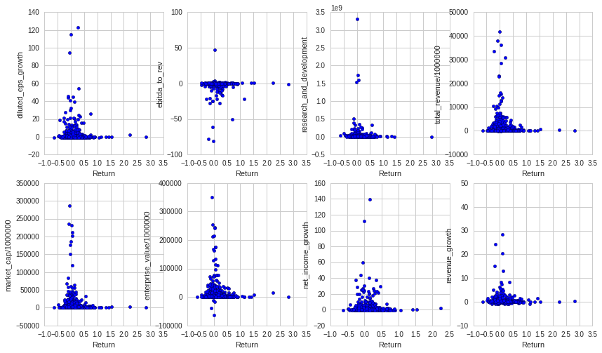


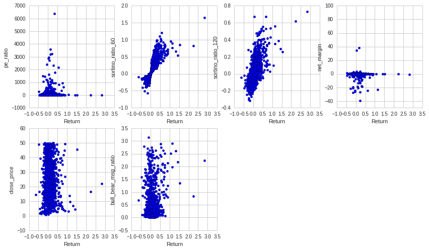


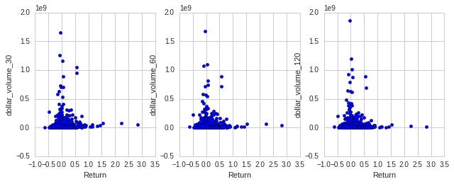


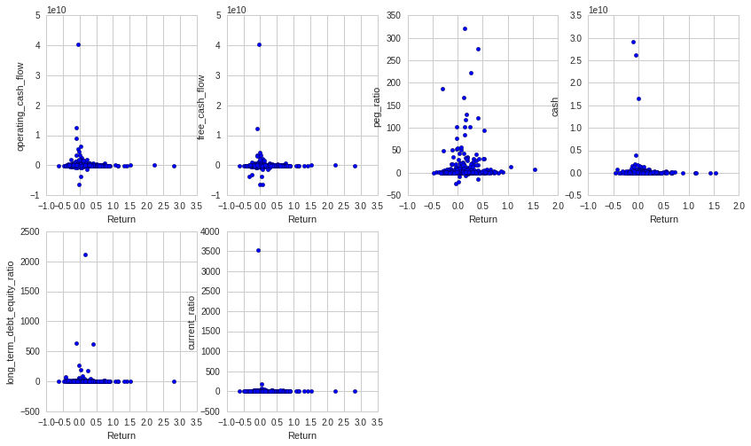


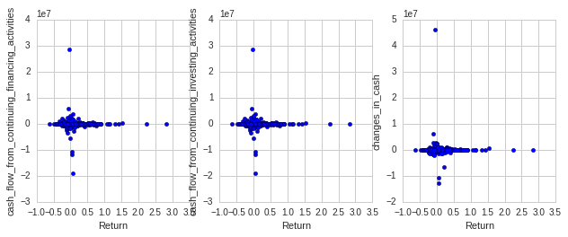


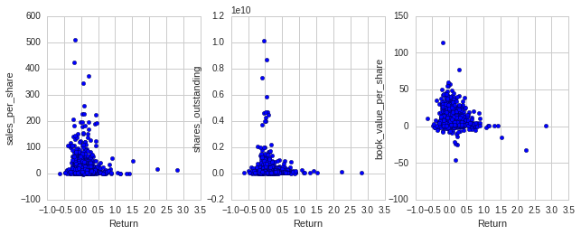


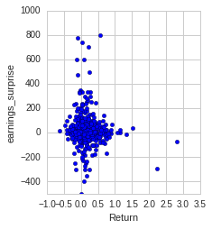


```python
plt.figure()
scatter_axes = plt.subplot2grid((3, 3), (1, 0), rowspan=2, colspan=2)
x_hist_axes = plt.subplot2grid((3, 3), (0, 0), colspan=2,
                               sharex=scatter_axes)
y_hist_axes = plt.subplot2grid((3, 3), (1, 2), rowspan=2,
                               sharey=scatter_axes)

scatter_axes.plot(x, y, '.')
x_hist_axes.hist(x, bins=40)
y_hist_axes.hist(y, orientation='horizontal', bins=40);
```


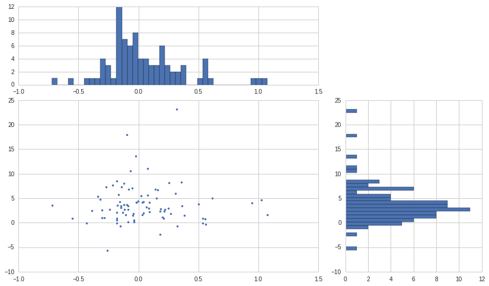


```python
q1_pipeline_output.sort_values('return_3m', ascending=False)
```


```python
# q1_pipeline_output.reset_index(inplace=True)
symbols = q1_pipeline_output.level_1

q1_pipeline_output
```


<div>
<table border="1" class="dataframe">
  <thead>
    <tr style="text-align: right;">
      <th></th>
      <th>index</th>
      <th>level_0</th>
      <th>level_1</th>
      <th>bull_bear_msg_ratio</th>
      <th>close_price</th>
      <th>diluted_eps_growth</th>
      <th>ebitda</th>
      <th>enterprise_value</th>
      <th>financial_health_grade</th>
      <th>industry</th>
      <th>...</th>
      <th>research_and_development</th>
      <th>return_1m</th>
      <th>return_1w</th>
      <th>return_3m</th>
      <th>revenue_growth</th>
      <th>sector</th>
      <th>sortino_ratio_120</th>
      <th>sortino_ratio_240</th>
      <th>sortino_ratio_60</th>
      <th>total_revenue</th>
    </tr>
  </thead>
  <tbody>
    <tr>
      <th>0</th>
      <td>0</td>
      <td>2018-04-02 00:00:00+00:00</td>
      <td>Equity(301 [ALKS])</td>
      <td>0.252777</td>
      <td>57.950</td>
      <td>0.000000</td>
      <td>0.142339</td>
      <td>8.898059e+09</td>
      <td>B</td>
      <td>20635084.0</td>
      <td>...</td>
      <td>0.379453</td>
      <td>-0.034971</td>
      <td>-0.005662</td>
      <td>0.036951</td>
      <td>0.289711</td>
      <td>206.0</td>
      <td>0.077450</td>
      <td>0.029479</td>
      <td>0.056947</td>
      <td>2.753700e+08</td>
    </tr>
    <tr>
      <th>1</th>
      <td>1</td>
      <td>2018-04-02 00:00:00+00:00</td>
      <td>Equity(368 [AMGN])</td>
      <td>2.557798</td>
      <td>170.460</td>
      <td>0.029851</td>
      <td>0.624267</td>
      <td>1.165055e+11</td>
      <td>A</td>
      <td>20635084.0</td>
      <td>...</td>
      <td>0.179766</td>
      <td>-0.078794</td>
      <td>0.006079</td>
      <td>-0.047587</td>
      <td>-0.027326</td>
      <td>206.0</td>
      <td>-0.052940</td>
      <td>0.053775</td>
      <td>-0.053778</td>
      <td>5.802000e+09</td>
    </tr>
    <tr>
      <th>2</th>
      <td>2</td>
      <td>2018-04-02 00:00:00+00:00</td>
      <td>Equity(659 [AMAG])</td>
      <td>0.549538</td>
      <td>20.100</td>
      <td>-0.965398</td>
      <td>0.370669</td>
      <td>1.092868e+09</td>
      <td>C</td>
      <td>20635084.0</td>
      <td>...</td>
      <td>0.075762</td>
      <td>-0.040573</td>
      <td>0.044156</td>
      <td>0.318033</td>
      <td>0.044508</td>
      <td>206.0</td>
      <td>0.065351</td>
      <td>0.009737</td>
      <td>0.355841</td>
      <td>1.583380e+08</td>
    </tr>
    <tr>
      <th>3</th>
      <td>3</td>
      <td>2018-04-02 00:00:00+00:00</td>
      <td>Equity(1297 [CBM])</td>
      <td>0.097223</td>
      <td>52.300</td>
      <td>0.061947</td>
      <td>0.354965</td>
      <td>1.613299e+09</td>
      <td>B</td>
      <td>20635084.0</td>
      <td>...</td>
      <td>0.023651</td>
      <td>0.000000</td>
      <td>0.015534</td>
      <td>0.024486</td>
      <td>0.024800</td>
      <td>206.0</td>
      <td>-0.025346</td>
      <td>-0.002522</td>
      <td>0.053705</td>
      <td>1.822770e+08</td>
    </tr>
    <tr>
      <th>4</th>
      <td>4</td>
      <td>2018-04-02 00:00:00+00:00</td>
      <td>Equity(1406 [CELG])</td>
      <td>2.782189</td>
      <td>89.210</td>
      <td>4.761905</td>
      <td>0.398794</td>
      <td>7.089759e+10</td>
      <td>B</td>
      <td>20635084.0</td>
      <td>...</td>
      <td>0.786104</td>
      <td>-0.001232</td>
      <td>0.049529</td>
      <td>-0.182385</td>
      <td>0.168792</td>
      <td>206.0</td>
      <td>-0.163519</td>
      <td>-0.071306</td>
      <td>-0.207168</td>
      <td>3.483000e+09</td>
    </tr>
    <tr>
      <th>5</th>
      <td>5</td>
      <td>2018-04-02 00:00:00+00:00</td>
      <td>Equity(3150 [INO])</td>
      <td>1.776683</td>
      <td>4.710</td>
      <td>0.000000</td>
      <td>-2.550672</td>
      <td>2.997755e+08</td>
      <td>C</td>
      <td>20635084.0</td>
      <td>...</td>
      <td>2.804196</td>
      <td>0.118765</td>
      <td>-0.014644</td>
      <td>0.031763</td>
      <td>0.032098</td>
      <td>206.0</td>
      <td>-0.091284</td>
      <td>-0.018529</td>
      <td>0.068198</td>
      <td>8.787234e+06</td>
    </tr>
    <tr>
      <th>6</th>
      <td>6</td>
      <td>2018-04-02 00:00:00+00:00</td>
      <td>Equity(3212 [GILD])</td>
      <td>2.619297</td>
      <td>75.390</td>
      <td>-0.172691</td>
      <td>0.474029</td>
      <td>1.063293e+11</td>
      <td>B</td>
      <td>20635084.0</td>
      <td>...</td>
      <td>0.193310</td>
      <td>-0.035034</td>
      <td>0.034866</td>
      <td>0.017128</td>
      <td>-0.187295</td>
      <td>206.0</td>
      <td>-0.046051</td>
      <td>0.093594</td>
      <td>0.040862</td>
      <td>5.949000e+09</td>
    </tr>
    <tr>
      <th>7</th>
      <td>7</td>
      <td>2018-04-02 00:00:00+00:00</td>
      <td>Equity(3806 [BIIB])</td>
      <td>2.267571</td>
      <td>273.850</td>
      <td>0.229299</td>
      <td>0.484306</td>
      <td>6.017929e+10</td>
      <td>B</td>
      <td>20635084.0</td>
      <td>...</td>
      <td>0.177684</td>
      <td>-0.045686</td>
      <td>0.052986</td>
      <td>-0.194037</td>
      <td>0.151462</td>
      <td>206.0</td>
      <td>-0.110386</td>
      <td>0.017357</td>
      <td>-0.238107</td>
      <td>3.307000e+09</td>
    </tr>
    <tr>
      <th>8</th>
      <td>8</td>
      <td>2018-04-02 00:00:00+00:00</td>
      <td>Equity(3885 [IMGN])</td>
      <td>1.612183</td>
      <td>10.510</td>
      <td>3.000000</td>
      <td>-0.208198</td>
      <td>1.132489e+09</td>
      <td>C</td>
      <td>20635084.0</td>
      <td>...</td>
      <td>1.010013</td>
      <td>-0.071555</td>
      <td>-0.131405</td>
      <td>0.536550</td>
      <td>1.849054</td>
      <td>206.0</td>
      <td>0.173482</td>
      <td>0.233140</td>
      <td>0.293916</td>
      <td>3.944800e+07</td>
    </tr>
    <tr>
      <th>9</th>
      <td>9</td>
      <td>2018-04-02 00:00:00+00:00</td>
      <td>Equity(3891 [IMMU])</td>
      <td>1.325086</td>
      <td>14.610</td>
      <td>0.000000</td>
      <td>-3.077456</td>
      <td>2.301895e+09</td>
      <td>C</td>
      <td>20635084.0</td>
      <td>...</td>
      <td>42.685784</td>
      <td>-0.138053</td>
      <td>-0.020777</td>
      <td>-0.088584</td>
      <td>0.554739</td>
      <td>206.0</td>
      <td>0.116490</td>
      <td>0.186395</td>
      <td>-0.067707</td>
      <td>5.972840e+05</td>
    </tr>
    <tr>
      <th>10</th>
      <td>10</td>
      <td>2018-04-02 00:00:00+00:00</td>
      <td>Equity(4031 [IONS])</td>
      <td>1.255910</td>
      <td>44.080</td>
      <td>-0.714286</td>
      <td>-0.000250</td>
      <td>5.112536e+09</td>
      <td>C</td>
      <td>20635084.0</td>
      <td>...</td>
      <td>0.744555</td>
      <td>-0.099305</td>
      <td>-0.076859</td>
      <td>-0.118752</td>
      <td>0.074532</td>
      <td>206.0</td>
      <td>-0.071681</td>
      <td>0.029977</td>
      <td>-0.099864</td>
      <td>1.722990e+08</td>
    </tr>
    <tr>
      <th>11</th>
      <td>11</td>
      <td>2018-04-02 00:00:00+00:00</td>
      <td>Equity(5847 [PDLI])</td>
      <td>0.397222</td>
      <td>2.950</td>
      <td>0.071429</td>
      <td>0.657564</td>
      <td>1.635750e+08</td>
      <td>C</td>
      <td>20635084.0</td>
      <td>...</td>
      <td>0.010715</td>
      <td>0.163708</td>
      <td>0.015491</td>
      <td>0.022530</td>
      <td>0.023221</td>
      <td>206.0</td>
      <td>-0.038653</td>
      <td>0.121064</td>
      <td>0.050989</td>
      <td>6.803600e+07</td>
    </tr>
    <tr>
      <th>12</th>
      <td>12</td>
      <td>2018-04-02 00:00:00+00:00</td>
      <td>Equity(6413 [REGN])</td>
      <td>2.010546</td>
      <td>344.440</td>
      <td>-0.315068</td>
      <td>0.377489</td>
      <td>3.638034e+10</td>
      <td>A</td>
      <td>20635084.0</td>
      <td>...</td>
      <td>0.333650</td>
      <td>0.042431</td>
      <td>0.072053</td>
      <td>-0.125520</td>
      <td>0.289870</td>
      <td>206.0</td>
      <td>-0.204968</td>
      <td>-0.006342</td>
      <td>-0.137696</td>
      <td>1.582447e+09</td>
    </tr>
    <tr>
      <th>13</th>
      <td>13</td>
      <td>2018-04-02 00:00:00+00:00</td>
      <td>Equity(6449 [RGEN])</td>
      <td>0.081250</td>
      <td>36.180</td>
      <td>1.071429</td>
      <td>0.175887</td>
      <td>1.502522e+09</td>
      <td>B</td>
      <td>20635084.0</td>
      <td>...</td>
      <td>0.073753</td>
      <td>0.049000</td>
      <td>0.050828</td>
      <td>-0.022558</td>
      <td>0.625532</td>
      <td>206.0</td>
      <td>-0.017886</td>
      <td>0.021440</td>
      <td>-0.005602</td>
      <td>4.161200e+07</td>
    </tr>
    <tr>
      <th>14</th>
      <td>14</td>
      <td>2018-04-02 00:00:00+00:00</td>
      <td>Equity(7373 [TECH])</td>
      <td>0.125000</td>
      <td>151.040</td>
      <td>5.450000</td>
      <td>0.257387</td>
      <td>5.860190e+09</td>
      <td>A</td>
      <td>20635084.0</td>
      <td>...</td>
      <td>0.090242</td>
      <td>0.076474</td>
      <td>0.044176</td>
      <td>0.125525</td>
      <td>0.169536</td>
      <td>206.0</td>
      <td>0.273240</td>
      <td>0.309805</td>
      <td>0.274017</td>
      <td>1.541530e+08</td>
    </tr>
    <tr>
      <th>15</th>
      <td>15</td>
      <td>2018-04-02 00:00:00+00:00</td>
      <td>Equity(8045 [VRTX])</td>
      <td>1.153237</td>
      <td>162.990</td>
      <td>2.076923</td>
      <td>0.218173</td>
      <td>3.989708e+10</td>
      <td>B</td>
      <td>20635084.0</td>
      <td>...</td>
      <td>0.470608</td>
      <td>-0.041574</td>
      <td>0.012801</td>
      <td>0.072232</td>
      <td>0.420592</td>
      <td>206.0</td>
      <td>0.053674</td>
      <td>0.170451</td>
      <td>0.108201</td>
      <td>6.516340e+08</td>
    </tr>
    <tr>
      <th>16</th>
      <td>16</td>
      <td>2018-04-02 00:00:00+00:00</td>
      <td>Equity(8910 [ANIK])</td>
      <td>0.083333</td>
      <td>49.630</td>
      <td>-0.018519</td>
      <td>0.367293</td>
      <td>5.733261e+08</td>
      <td>A</td>
      <td>20635084.0</td>
      <td>...</td>
      <td>0.145161</td>
      <td>-0.043369</td>
      <td>-0.001408</td>
      <td>-0.098947</td>
      <td>0.023045</td>
      <td>206.0</td>
      <td>-0.093688</td>
      <td>0.053350</td>
      <td>-0.083999</td>
      <td>2.938800e+07</td>
    </tr>
    <tr>
      <th>17</th>
      <td>17</td>
      <td>2018-04-02 00:00:00+00:00</td>
      <td>Equity(10187 [INCY])</td>
      <td>1.294062</td>
      <td>83.330</td>
      <td>-0.105263</td>
      <td>-0.304049</td>
      <td>1.650354e+10</td>
      <td>A</td>
      <td>20635084.0</td>
      <td>...</td>
      <td>1.006264</td>
      <td>-0.037871</td>
      <td>0.003009</td>
      <td>-0.174787</td>
      <td>0.360364</td>
      <td>206.0</td>
      <td>-0.183893</td>
      <td>-0.111931</td>
      <td>-0.217720</td>
      <td>4.441560e+08</td>
    </tr>
    <tr>
      <th>18</th>
      <td>18</td>
      <td>2018-04-02 00:00:00+00:00</td>
      <td>Equity(10417 [ARWR])</td>
      <td>1.650428</td>
      <td>7.205</td>
      <td>0.000000</td>
      <td>-3.610490</td>
      <td>5.775204e+08</td>
      <td>C</td>
      <td>20635084.0</td>
      <td>...</td>
      <td>2.402374</td>
      <td>0.081832</td>
      <td>0.067407</td>
      <td>0.554477</td>
      <td>-0.196009</td>
      <td>206.0</td>
      <td>0.252359</td>
      <td>0.327718</td>
      <td>0.440042</td>
      <td>3.509821e+06</td>
    </tr>
    <tr>
      <th>19</th>
      <td>19</td>
      <td>2018-04-02 00:00:00+00:00</td>
      <td>Equity(10905 [BCRX])</td>
      <td>0.425231</td>
      <td>4.760</td>
      <td>0.000000</td>
      <td>-4.403599</td>
      <td>3.822439e+08</td>
      <td>C</td>
      <td>20635084.0</td>
      <td>...</td>
      <td>4.350643</td>
      <td>-0.053678</td>
      <td>-0.086372</td>
      <td>-0.179310</td>
      <td>-0.566960</td>
      <td>206.0</td>
      <td>-0.015235</td>
      <td>-0.023901</td>
      <td>-0.163194</td>
      <td>3.890000e+06</td>
    </tr>
    <tr>
      <th>20</th>
      <td>20</td>
      <td>2018-04-02 00:00:00+00:00</td>
      <td>Equity(11512 [LJPC])</td>
      <td>0.819465</td>
      <td>29.800</td>
      <td>0.000000</td>
      <td>-inf</td>
      <td>5.758982e+08</td>
      <td>C</td>
      <td>20635084.0</td>
      <td>...</td>
      <td>inf</td>
      <td>-0.028683</td>
      <td>0.047452</td>
      <td>-0.119125</td>
      <td>0.000000</td>
      <td>206.0</td>
      <td>-0.028498</td>
      <td>0.052849</td>
      <td>-0.044191</td>
      <td>0.000000e+00</td>
    </tr>
    <tr>
      <th>21</th>
      <td>21</td>
      <td>2018-04-02 00:00:00+00:00</td>
      <td>Equity(12200 [LGND])</td>
      <td>0.518612</td>
      <td>165.130</td>
      <td>6.200000</td>
      <td>0.643687</td>
      <td>3.524964e+09</td>
      <td>A</td>
      <td>20635084.0</td>
      <td>...</td>
      <td>0.171072</td>
      <td>0.038488</td>
      <td>0.023872</td>
      <td>0.168235</td>
      <td>0.321531</td>
      <td>206.0</td>
      <td>0.134638</td>
      <td>0.218886</td>
      <td>0.267620</td>
      <td>5.046400e+07</td>
    </tr>
    <tr>
      <th>22</th>
      <td>22</td>
      <td>2018-04-02 00:00:00+00:00</td>
      <td>Equity(13984 [TGTX])</td>
      <td>2.376243</td>
      <td>14.150</td>
      <td>0.000000</td>
      <td>-814.132695</td>
      <td>9.886439e+08</td>
      <td>C</td>
      <td>20635084.0</td>
      <td>...</td>
      <td>682.402100</td>
      <td>-0.053512</td>
      <td>-0.053512</td>
      <td>0.538043</td>
      <td>0.000000</td>
      <td>206.0</td>
      <td>0.093386</td>
      <td>0.105994</td>
      <td>0.473979</td>
      <td>3.809500e+04</td>
    </tr>
    <tr>
      <th>23</th>
      <td>23</td>
      <td>2018-04-02 00:00:00+00:00</td>
      <td>Equity(14112 [NVAX])</td>
      <td>3.099822</td>
      <td>2.090</td>
      <td>0.000000</td>
      <td>-4.340953</td>
      <td>8.823184e+08</td>
      <td>D</td>
      <td>20635084.0</td>
      <td>...</td>
      <td>4.769113</td>
      <td>-0.018779</td>
      <td>0.042394</td>
      <td>0.559701</td>
      <td>0.928505</td>
      <td>206.0</td>
      <td>0.221182</td>
      <td>0.181178</td>
      <td>0.375960</td>
      <td>1.041200e+07</td>
    </tr>
    <tr>
      <th>24</th>
      <td>24</td>
      <td>2018-04-02 00:00:00+00:00</td>
      <td>Equity(14328 [ALXN])</td>
      <td>1.278315</td>
      <td>111.460</td>
      <td>-0.658537</td>
      <td>0.330623</td>
      <td>2.654096e+10</td>
      <td>B</td>
      <td>20635084.0</td>
      <td>...</td>
      <td>0.291616</td>
      <td>-0.054783</td>
      <td>0.006411</td>
      <td>-0.107963</td>
      <td>0.095055</td>
      <td>206.0</td>
      <td>-0.123217</td>
      <td>-0.000041</td>
      <td>-0.108711</td>
      <td>9.101000e+08</td>
    </tr>
    <tr>
      <th>25</th>
      <td>25</td>
      <td>2018-04-02 00:00:00+00:00</td>
      <td>Equity(14972 [NBIX])</td>
      <td>0.657276</td>
      <td>82.920</td>
      <td>0.000000</td>
      <td>0.158903</td>
      <td>7.257143e+09</td>
      <td>B</td>
      <td>20635084.0</td>
      <td>...</td>
      <td>0.270999</td>
      <td>-0.036486</td>
      <td>0.017423</td>
      <td>-0.001205</td>
      <td>0.555221</td>
      <td>206.0</td>
      <td>0.209505</td>
      <td>0.172150</td>
      <td>0.018032</td>
      <td>9.451700e+07</td>
    </tr>
    <tr>
      <th>26</th>
      <td>26</td>
      <td>2018-04-02 00:00:00+00:00</td>
      <td>Equity(16999 [SRPT])</td>
      <td>2.033070</td>
      <td>74.080</td>
      <td>4.833345</td>
      <td>1.881523</td>
      <td>4.166238e+09</td>
      <td>C</td>
      <td>20635084.0</td>
      <td>...</td>
      <td>0.775896</td>
      <td>0.090374</td>
      <td>-0.047448</td>
      <td>0.265892</td>
      <td>9.565763</td>
      <td>206.0</td>
      <td>0.244535</td>
      <td>0.276983</td>
      <td>0.278956</td>
      <td>5.727700e+07</td>
    </tr>
    <tr>
      <th>27</th>
      <td>27</td>
      <td>2018-04-02 00:00:00+00:00</td>
      <td>Equity(17908 [PGNX])</td>
      <td>2.062874</td>
      <td>7.450</td>
      <td>0.000000</td>
      <td>-3.340962</td>
      <td>5.011034e+08</td>
      <td>C</td>
      <td>20635084.0</td>
      <td>...</td>
      <td>2.815120</td>
      <td>0.112771</td>
      <td>-0.011936</td>
      <td>0.211382</td>
      <td>-0.164015</td>
      <td>206.0</td>
      <td>0.035927</td>
      <td>0.010972</td>
      <td>0.194834</td>
      <td>3.889000e+06</td>
    </tr>
    <tr>
      <th>28</th>
      <td>28</td>
      <td>2018-04-02 00:00:00+00:00</td>
      <td>Equity(20306 [UTHR])</td>
      <td>0.306945</td>
      <td>112.300</td>
      <td>-0.807229</td>
      <td>0.327523</td>
      <td>4.181015e+09</td>
      <td>B</td>
      <td>20635084.0</td>
      <td>...</td>
      <td>0.244459</td>
      <td>-0.013094</td>
      <td>0.045526</td>
      <td>-0.251383</td>
      <td>0.136186</td>
      <td>206.0</td>
      <td>-0.039500</td>
      <td>-0.007773</td>
      <td>-0.258652</td>
      <td>4.647000e+08</td>
    </tr>
    <tr>
      <th>29</th>
      <td>29</td>
      <td>2018-04-02 00:00:00+00:00</td>
      <td>Equity(20330 [BMRN])</td>
      <td>0.804325</td>
      <td>81.050</td>
      <td>23.000000</td>
      <td>0.174784</td>
      <td>1.405268e+10</td>
      <td>A</td>
      <td>20635084.0</td>
      <td>...</td>
      <td>0.470571</td>
      <td>0.015028</td>
      <td>0.027901</td>
      <td>-0.119787</td>
      <td>0.193988</td>
      <td>206.0</td>
      <td>-0.100174</td>
      <td>-0.028597</td>
      <td>-0.152505</td>
      <td>3.583050e+08</td>
    </tr>
    <tr>
      <th>...</th>
      <td>...</td>
      <td>...</td>
      <td>...</td>
      <td>...</td>
      <td>...</td>
      <td>...</td>
      <td>...</td>
      <td>...</td>
      <td>...</td>
      <td>...</td>
      <td>...</td>
      <td>...</td>
      <td>...</td>
      <td>...</td>
      <td>...</td>
      <td>...</td>
      <td>...</td>
      <td>...</td>
      <td>...</td>
      <td>...</td>
      <td>...</td>
    </tr>
    <tr>
      <th>94</th>
      <td>94</td>
      <td>2018-04-02 00:00:00+00:00</td>
      <td>Equity(46932 [TBPH])</td>
      <td>0.141667</td>
      <td>24.245</td>
      <td>0.000000</td>
      <td>-17.005094</td>
      <td>1.204015e+09</td>
      <td>C</td>
      <td>20635084.0</td>
      <td>...</td>
      <td>11.307198</td>
      <td>-0.162811</td>
      <td>-0.070717</td>
      <td>-0.131937</td>
      <td>-0.206781</td>
      <td>206.0</td>
      <td>-0.152675</td>
      <td>-0.061582</td>
      <td>-0.085467</td>
      <td>4.515000e+06</td>
    </tr>
    <tr>
      <th>95</th>
      <td>95</td>
      <td>2018-04-02 00:00:00+00:00</td>
      <td>Equity(47332 [SAGE])</td>
      <td>0.619376</td>
      <td>160.950</td>
      <td>NaN</td>
      <td>-inf</td>
      <td>6.854605e+09</td>
      <td>C</td>
      <td>20635084.0</td>
      <td>...</td>
      <td>inf</td>
      <td>-0.014391</td>
      <td>0.030212</td>
      <td>-0.054181</td>
      <td>0.000000</td>
      <td>206.0</td>
      <td>0.601881</td>
      <td>0.274019</td>
      <td>-0.025766</td>
      <td>0.000000e+00</td>
    </tr>
    <tr>
      <th>96</th>
      <td>96</td>
      <td>2018-04-02 00:00:00+00:00</td>
      <td>Equity(47377 [PIRS])</td>
      <td>2.057261</td>
      <td>6.820</td>
      <td>0.000000</td>
      <td>0.362952</td>
      <td>2.946646e+08</td>
      <td>C</td>
      <td>20635084.0</td>
      <td>...</td>
      <td>0.290335</td>
      <td>-0.183234</td>
      <td>-0.054092</td>
      <td>-0.039437</td>
      <td>5.657519</td>
      <td>206.0</td>
      <td>0.074470</td>
      <td>0.287914</td>
      <td>0.009833</td>
      <td>1.815164e+07</td>
    </tr>
    <tr>
      <th>97</th>
      <td>97</td>
      <td>2018-04-02 00:00:00+00:00</td>
      <td>Equity(47432 [LOXO])</td>
      <td>0.416310</td>
      <td>115.290</td>
      <td>NaN</td>
      <td>-inf</td>
      <td>2.838843e+09</td>
      <td>C</td>
      <td>20635084.0</td>
      <td>...</td>
      <td>inf</td>
      <td>-0.038449</td>
      <td>0.037154</td>
      <td>0.361479</td>
      <td>0.000000</td>
      <td>206.0</td>
      <td>0.170560</td>
      <td>0.305010</td>
      <td>0.331308</td>
      <td>0.000000e+00</td>
    </tr>
    <tr>
      <th>98</th>
      <td>98</td>
      <td>2018-04-02 00:00:00+00:00</td>
      <td>Equity(47621 [AUPH])</td>
      <td>2.564577</td>
      <td>5.195</td>
      <td>0.000000</td>
      <td>-379.935484</td>
      <td>2.702089e+08</td>
      <td>B</td>
      <td>20635084.0</td>
      <td>...</td>
      <td>280.354839</td>
      <td>-0.014231</td>
      <td>-0.010476</td>
      <td>0.043173</td>
      <td>0.033333</td>
      <td>206.0</td>
      <td>-0.095464</td>
      <td>-0.040932</td>
      <td>0.071353</td>
      <td>3.100000e+04</td>
    </tr>
    <tr>
      <th>99</th>
      <td>99</td>
      <td>2018-04-02 00:00:00+00:00</td>
      <td>Equity(47845 [DERM])</td>
      <td>0.446848</td>
      <td>7.980</td>
      <td>NaN</td>
      <td>-38.696203</td>
      <td>6.255360e+07</td>
      <td>D</td>
      <td>20635084.0</td>
      <td>...</td>
      <td>20.687267</td>
      <td>-0.682451</td>
      <td>-0.042017</td>
      <td>-0.721951</td>
      <td>-0.940221</td>
      <td>206.0</td>
      <td>-0.101554</td>
      <td>-0.082691</td>
      <td>-0.163772</td>
      <td>1.343000e+06</td>
    </tr>
    <tr>
      <th>100</th>
      <td>100</td>
      <td>2018-04-02 00:00:00+00:00</td>
      <td>Equity(47901 [ATRA])</td>
      <td>0.404482</td>
      <td>39.000</td>
      <td>NaN</td>
      <td>-inf</td>
      <td>1.348112e+09</td>
      <td>C</td>
      <td>20635084.0</td>
      <td>...</td>
      <td>inf</td>
      <td>-0.010152</td>
      <td>-0.017632</td>
      <td>1.025974</td>
      <td>0.000000</td>
      <td>206.0</td>
      <td>0.378059</td>
      <td>0.189592</td>
      <td>0.527000</td>
      <td>0.000000e+00</td>
    </tr>
    <tr>
      <th>101</th>
      <td>101</td>
      <td>2018-04-02 00:00:00+00:00</td>
      <td>Equity(47955 [CRBP])</td>
      <td>1.910025</td>
      <td>6.050</td>
      <td>0.000000</td>
      <td>-inf</td>
      <td>2.863169e+08</td>
      <td>B</td>
      <td>20635084.0</td>
      <td>...</td>
      <td>inf</td>
      <td>-0.141844</td>
      <td>-0.032000</td>
      <td>-0.284024</td>
      <td>0.072390</td>
      <td>206.0</td>
      <td>-0.044027</td>
      <td>0.005040</td>
      <td>-0.189027</td>
      <td>0.000000e+00</td>
    </tr>
    <tr>
      <th>102</th>
      <td>102</td>
      <td>2018-04-02 00:00:00+00:00</td>
      <td>Equity(48026 [CHRS])</td>
      <td>0.137500</td>
      <td>11.000</td>
      <td>NaN</td>
      <td>-inf</td>
      <td>6.394942e+08</td>
      <td>C</td>
      <td>20635084.0</td>
      <td>...</td>
      <td>inf</td>
      <td>0.100000</td>
      <td>-0.013453</td>
      <td>-0.039301</td>
      <td>0.000000</td>
      <td>206.0</td>
      <td>-0.017832</td>
      <td>-0.042553</td>
      <td>0.034273</td>
      <td>0.000000e+00</td>
    </tr>
    <tr>
      <th>103</th>
      <td>103</td>
      <td>2018-04-02 00:00:00+00:00</td>
      <td>Equity(48088 [FGEN])</td>
      <td>0.397362</td>
      <td>46.150</td>
      <td>-0.578313</td>
      <td>-0.438623</td>
      <td>3.181259e+09</td>
      <td>C</td>
      <td>20635084.0</td>
      <td>...</td>
      <td>1.234309</td>
      <td>-0.166215</td>
      <td>-0.011777</td>
      <td>-0.081592</td>
      <td>0.332038</td>
      <td>206.0</td>
      <td>-0.056555</td>
      <td>0.181477</td>
      <td>-0.045349</td>
      <td>4.250800e+07</td>
    </tr>
    <tr>
      <th>104</th>
      <td>104</td>
      <td>2018-04-02 00:00:00+00:00</td>
      <td>Equity(48547 [ONCE])</td>
      <td>1.485048</td>
      <td>66.550</td>
      <td>NaN</td>
      <td>-8.294471</td>
      <td>1.959370e+09</td>
      <td>C</td>
      <td>20635084.0</td>
      <td>...</td>
      <td>4.114420</td>
      <td>0.012321</td>
      <td>0.054508</td>
      <td>0.193508</td>
      <td>-0.545577</td>
      <td>206.0</td>
      <td>-0.029335</td>
      <td>0.066772</td>
      <td>0.186081</td>
      <td>7.408369e+06</td>
    </tr>
    <tr>
      <th>105</th>
      <td>105</td>
      <td>2018-04-02 00:00:00+00:00</td>
      <td>Equity(48925 [ADRO])</td>
      <td>0.192361</td>
      <td>9.200</td>
      <td>20.000000</td>
      <td>-7.202343</td>
      <td>4.272573e+08</td>
      <td>C</td>
      <td>20635084.0</td>
      <td>...</td>
      <td>6.101704</td>
      <td>0.437500</td>
      <td>0.057471</td>
      <td>0.251701</td>
      <td>-0.031460</td>
      <td>206.0</td>
      <td>-0.024152</td>
      <td>0.022501</td>
      <td>0.233335</td>
      <td>3.756000e+06</td>
    </tr>
    <tr>
      <th>106</th>
      <td>106</td>
      <td>2018-04-02 00:00:00+00:00</td>
      <td>Equity(49000 [BPMC])</td>
      <td>0.219444</td>
      <td>91.630</td>
      <td>NaN</td>
      <td>-29.848280</td>
      <td>3.352153e+09</td>
      <td>B</td>
      <td>20635084.0</td>
      <td>...</td>
      <td>26.799140</td>
      <td>-0.038510</td>
      <td>-0.031191</td>
      <td>0.090833</td>
      <td>-0.788324</td>
      <td>206.0</td>
      <td>0.180215</td>
      <td>0.190274</td>
      <td>0.107461</td>
      <td>1.628000e+06</td>
    </tr>
    <tr>
      <th>107</th>
      <td>107</td>
      <td>2018-04-02 00:00:00+00:00</td>
      <td>Equity(49323 [AIMT])</td>
      <td>0.731604</td>
      <td>31.820</td>
      <td>NaN</td>
      <td>-inf</td>
      <td>1.658954e+09</td>
      <td>B</td>
      <td>20635084.0</td>
      <td>...</td>
      <td>inf</td>
      <td>-0.065766</td>
      <td>0.050512</td>
      <td>-0.146459</td>
      <td>0.000000</td>
      <td>206.0</td>
      <td>0.151589</td>
      <td>0.160183</td>
      <td>-0.104336</td>
      <td>0.000000e+00</td>
    </tr>
    <tr>
      <th>108</th>
      <td>108</td>
      <td>2018-04-02 00:00:00+00:00</td>
      <td>Equity(49335 [GBT])</td>
      <td>1.614079</td>
      <td>48.250</td>
      <td>0.000000</td>
      <td>-inf</td>
      <td>1.958358e+09</td>
      <td>B</td>
      <td>20635084.0</td>
      <td>...</td>
      <td>inf</td>
      <td>-0.207718</td>
      <td>0.002077</td>
      <td>0.139988</td>
      <td>0.000000</td>
      <td>206.0</td>
      <td>0.189244</td>
      <td>0.136666</td>
      <td>0.155899</td>
      <td>0.000000e+00</td>
    </tr>
    <tr>
      <th>109</th>
      <td>109</td>
      <td>2018-04-02 00:00:00+00:00</td>
      <td>Equity(49409 [RGNX])</td>
      <td>0.224999</td>
      <td>29.800</td>
      <td>NaN</td>
      <td>-6.450490</td>
      <td>7.841265e+08</td>
      <td>B</td>
      <td>20635084.0</td>
      <td>...</td>
      <td>6.946078</td>
      <td>0.015332</td>
      <td>0.018803</td>
      <td>-0.166434</td>
      <td>0.202830</td>
      <td>206.0</td>
      <td>0.003597</td>
      <td>0.094625</td>
      <td>-0.043782</td>
      <td>2.040000e+06</td>
    </tr>
    <tr>
      <th>110</th>
      <td>110</td>
      <td>2018-04-02 00:00:00+00:00</td>
      <td>Equity(49465 [ACRS])</td>
      <td>0.249802</td>
      <td>17.510</td>
      <td>NaN</td>
      <td>-25.286286</td>
      <td>3.476791e+08</td>
      <td>B</td>
      <td>20635084.0</td>
      <td>...</td>
      <td>13.202202</td>
      <td>-0.143765</td>
      <td>-0.009055</td>
      <td>-0.267670</td>
      <td>0.460526</td>
      <td>206.0</td>
      <td>-0.199242</td>
      <td>-0.119011</td>
      <td>-0.284813</td>
      <td>9.990000e+05</td>
    </tr>
    <tr>
      <th>111</th>
      <td>111</td>
      <td>2018-04-02 00:00:00+00:00</td>
      <td>Equity(49470 [CTMX])</td>
      <td>0.166667</td>
      <td>28.440</td>
      <td>NaN</td>
      <td>-0.031138</td>
      <td>7.243774e+08</td>
      <td>C</td>
      <td>20635084.0</td>
      <td>...</td>
      <td>0.764747</td>
      <td>-0.139225</td>
      <td>-0.099145</td>
      <td>0.270777</td>
      <td>3.316486</td>
      <td>206.0</td>
      <td>0.194035</td>
      <td>0.189889</td>
      <td>0.287431</td>
      <td>2.707300e+07</td>
    </tr>
    <tr>
      <th>112</th>
      <td>112</td>
      <td>2018-04-02 00:00:00+00:00</td>
      <td>Equity(49535 [MYOK])</td>
      <td>0.379524</td>
      <td>48.800</td>
      <td>NaN</td>
      <td>-1.379200</td>
      <td>1.496569e+09</td>
      <td>C</td>
      <td>20635084.0</td>
      <td>...</td>
      <td>1.452267</td>
      <td>-0.201309</td>
      <td>-0.025948</td>
      <td>0.161905</td>
      <td>-0.802977</td>
      <td>206.0</td>
      <td>0.117255</td>
      <td>0.426092</td>
      <td>0.174623</td>
      <td>5.625000e+06</td>
    </tr>
    <tr>
      <th>113</th>
      <td>113</td>
      <td>2018-04-02 00:00:00+00:00</td>
      <td>Equity(49572 [KURA])</td>
      <td>0.125000</td>
      <td>18.800</td>
      <td>0.000000</td>
      <td>-inf</td>
      <td>5.393369e+08</td>
      <td>C</td>
      <td>20635084.0</td>
      <td>...</td>
      <td>inf</td>
      <td>-0.196581</td>
      <td>0.018970</td>
      <td>0.212903</td>
      <td>0.000000</td>
      <td>206.0</td>
      <td>0.173291</td>
      <td>0.161879</td>
      <td>0.217449</td>
      <td>0.000000e+00</td>
    </tr>
    <tr>
      <th>114</th>
      <td>114</td>
      <td>2018-04-02 00:00:00+00:00</td>
      <td>Equity(49579 [VYGR])</td>
      <td>0.474285</td>
      <td>18.780</td>
      <td>NaN</td>
      <td>-10.376307</td>
      <td>4.361135e+08</td>
      <td>C</td>
      <td>20635084.0</td>
      <td>...</td>
      <td>11.608885</td>
      <td>-0.375665</td>
      <td>-0.038895</td>
      <td>0.033572</td>
      <td>-0.652963</td>
      <td>206.0</td>
      <td>0.027297</td>
      <td>0.113375</td>
      <td>0.071760</td>
      <td>1.148000e+06</td>
    </tr>
    <tr>
      <th>115</th>
      <td>115</td>
      <td>2018-04-02 00:00:00+00:00</td>
      <td>Equity(49585 [WVE])</td>
      <td>0.041667</td>
      <td>40.050</td>
      <td>NaN</td>
      <td>-17.715394</td>
      <td>9.800020e+08</td>
      <td>B</td>
      <td>20635084.0</td>
      <td>...</td>
      <td>15.136635</td>
      <td>-0.159496</td>
      <td>0.007547</td>
      <td>0.149211</td>
      <td>1.479290</td>
      <td>206.0</td>
      <td>0.284459</td>
      <td>0.186310</td>
      <td>0.178322</td>
      <td>1.676000e+06</td>
    </tr>
    <tr>
      <th>116</th>
      <td>116</td>
      <td>2018-04-02 00:00:00+00:00</td>
      <td>Equity(49736 [EDIT])</td>
      <td>2.033391</td>
      <td>33.150</td>
      <td>NaN</td>
      <td>-9.742296</td>
      <td>1.266025e+09</td>
      <td>C</td>
      <td>20635084.0</td>
      <td>...</td>
      <td>7.205890</td>
      <td>-0.126252</td>
      <td>-0.125561</td>
      <td>-0.004505</td>
      <td>3.083519</td>
      <td>206.0</td>
      <td>0.136556</td>
      <td>0.132915</td>
      <td>0.038434</td>
      <td>3.667000e+06</td>
    </tr>
    <tr>
      <th>117</th>
      <td>117</td>
      <td>2018-04-02 00:00:00+00:00</td>
      <td>Equity(49751 [AVXS])</td>
      <td>0.460278</td>
      <td>123.530</td>
      <td>NaN</td>
      <td>-inf</td>
      <td>4.214408e+09</td>
      <td>A</td>
      <td>20635084.0</td>
      <td>...</td>
      <td>inf</td>
      <td>-0.050719</td>
      <td>-0.011918</td>
      <td>0.159253</td>
      <td>0.000000</td>
      <td>206.0</td>
      <td>0.111632</td>
      <td>0.151578</td>
      <td>0.150246</td>
      <td>0.000000e+00</td>
    </tr>
    <tr>
      <th>118</th>
      <td>118</td>
      <td>2018-04-02 00:00:00+00:00</td>
      <td>Equity(49934 [NTLA])</td>
      <td>1.188465</td>
      <td>21.070</td>
      <td>NaN</td>
      <td>-3.581584</td>
      <td>5.532730e+08</td>
      <td>C</td>
      <td>20635084.0</td>
      <td>...</td>
      <td>3.174865</td>
      <td>-0.232981</td>
      <td>-0.108337</td>
      <td>-0.051755</td>
      <td>0.185001</td>
      <td>206.0</td>
      <td>-0.047817</td>
      <td>0.096888</td>
      <td>0.018676</td>
      <td>6.668000e+06</td>
    </tr>
    <tr>
      <th>119</th>
      <td>119</td>
      <td>2018-04-02 00:00:00+00:00</td>
      <td>Equity(49995 [RETA])</td>
      <td>0.061111</td>
      <td>20.500</td>
      <td>NaN</td>
      <td>-1.613609</td>
      <td>4.262771e+08</td>
      <td>C</td>
      <td>20635084.0</td>
      <td>...</td>
      <td>2.051686</td>
      <td>-0.063071</td>
      <td>-0.008704</td>
      <td>-0.261261</td>
      <td>-0.202944</td>
      <td>206.0</td>
      <td>-0.140365</td>
      <td>0.027633</td>
      <td>-0.192128</td>
      <td>9.964000e+06</td>
    </tr>
    <tr>
      <th>120</th>
      <td>120</td>
      <td>2018-04-02 00:00:00+00:00</td>
      <td>Equity(50135 [BOLD])</td>
      <td>0.107500</td>
      <td>30.030</td>
      <td>NaN</td>
      <td>-inf</td>
      <td>9.684555e+08</td>
      <td>B</td>
      <td>20635084.0</td>
      <td>...</td>
      <td>inf</td>
      <td>-0.168605</td>
      <td>0.028073</td>
      <td>-0.154799</td>
      <td>NaN</td>
      <td>206.0</td>
      <td>0.082154</td>
      <td>0.157226</td>
      <td>-0.059384</td>
      <td>0.000000e+00</td>
    </tr>
    <tr>
      <th>121</th>
      <td>121</td>
      <td>2018-04-02 00:00:00+00:00</td>
      <td>Equity(50400 [CRSP])</td>
      <td>1.314983</td>
      <td>45.680</td>
      <td>-0.976771</td>
      <td>0.042258</td>
      <td>1.907515e+09</td>
      <td>C</td>
      <td>20635084.0</td>
      <td>...</td>
      <td>0.619644</td>
      <td>-0.087477</td>
      <td>-0.139250</td>
      <td>0.947974</td>
      <td>12.790529</td>
      <td>206.0</td>
      <td>0.355446</td>
      <td>0.208905</td>
      <td>0.454565</td>
      <td>3.232500e+07</td>
    </tr>
    <tr>
      <th>122</th>
      <td>122</td>
      <td>2018-04-02 00:00:00+00:00</td>
      <td>Equity(50616 [ANAB])</td>
      <td>0.491862</td>
      <td>104.070</td>
      <td>NaN</td>
      <td>-2.119333</td>
      <td>2.244157e+09</td>
      <td>C</td>
      <td>20635084.0</td>
      <td>...</td>
      <td>2.535333</td>
      <td>-0.191250</td>
      <td>-0.058531</td>
      <td>0.031111</td>
      <td>0.089325</td>
      <td>206.0</td>
      <td>0.749511</td>
      <td>0.407334</td>
      <td>0.059388</td>
      <td>3.000000e+06</td>
    </tr>
    <tr>
      <th>123</th>
      <td>123</td>
      <td>2018-04-02 00:00:00+00:00</td>
      <td>Equity(50839 [BHVN])</td>
      <td>0.130159</td>
      <td>25.760</td>
      <td>NaN</td>
      <td>NaN</td>
      <td>8.096606e+08</td>
      <td>B</td>
      <td>20635084.0</td>
      <td>...</td>
      <td>NaN</td>
      <td>-0.241907</td>
      <td>0.040388</td>
      <td>-0.094233</td>
      <td>NaN</td>
      <td>206.0</td>
      <td>-0.050841</td>
      <td>0.111583</td>
      <td>-0.032359</td>
      <td>NaN</td>
    </tr>
  </tbody>
</table>
<p>124 rows  25 columns</p>
</div>


```python

IOVA = get_pricing(symbols, start_date='2018-01-01', end_date=q1_period_end, symbol_reference_date=None, frequency='daily', fields=None, handle_missing='raise', start_offset=0)
# IOVA.close_price.pct_change()[1:].plot()

plt.matshow(IOVA.close_price.pct_change()[1:].corr(method='spearman'))

IOVA.close_price.pct_change()[1:].corr(method='spearman')
```


<div>
<table border="1" class="dataframe">
  <thead>
    <tr style="text-align: right;">
      <th></th>
      <th>Equity(301 [ALKS])</th>
      <th>Equity(368 [AMGN])</th>
      <th>Equity(659 [AMAG])</th>
      <th>Equity(1297 [CBM])</th>
      <th>Equity(1406 [CELG])</th>
      <th>Equity(3150 [INO])</th>
      <th>Equity(3212 [GILD])</th>
      <th>Equity(3806 [BIIB])</th>
      <th>Equity(3885 [IMGN])</th>
      <th>Equity(3891 [IMMU])</th>
      <th>...</th>
      <th>Equity(49579 [VYGR])</th>
      <th>Equity(49585 [WVE])</th>
      <th>Equity(49736 [EDIT])</th>
      <th>Equity(49751 [AVXS])</th>
      <th>Equity(49934 [NTLA])</th>
      <th>Equity(49995 [RETA])</th>
      <th>Equity(50135 [BOLD])</th>
      <th>Equity(50400 [CRSP])</th>
      <th>Equity(50616 [ANAB])</th>
      <th>Equity(50839 [BHVN])</th>
    </tr>
  </thead>
  <tbody>
    <tr>
      <th>Equity(301 [ALKS])</th>
      <td>1.000000</td>
      <td>0.424896</td>
      <td>0.256297</td>
      <td>0.142478</td>
      <td>0.466518</td>
      <td>0.233565</td>
      <td>0.279355</td>
      <td>0.289858</td>
      <td>0.489080</td>
      <td>0.353992</td>
      <td>...</td>
      <td>0.263462</td>
      <td>0.143429</td>
      <td>0.166491</td>
      <td>0.152265</td>
      <td>0.214226</td>
      <td>0.118700</td>
      <td>0.262851</td>
      <td>0.125813</td>
      <td>0.413615</td>
      <td>-0.074021</td>
    </tr>
    <tr>
      <th>Equity(368 [AMGN])</th>
      <td>0.424896</td>
      <td>1.000000</td>
      <td>0.292863</td>
      <td>0.292237</td>
      <td>0.561767</td>
      <td>0.168602</td>
      <td>0.652237</td>
      <td>0.520256</td>
      <td>0.335482</td>
      <td>0.580114</td>
      <td>...</td>
      <td>0.473243</td>
      <td>0.154654</td>
      <td>0.444957</td>
      <td>0.326368</td>
      <td>0.482134</td>
      <td>0.339261</td>
      <td>0.283634</td>
      <td>0.242567</td>
      <td>0.357988</td>
      <td>0.199222</td>
    </tr>
    <tr>
      <th>Equity(659 [AMAG])</th>
      <td>0.256297</td>
      <td>0.292863</td>
      <td>1.000000</td>
      <td>0.124805</td>
      <td>0.394504</td>
      <td>0.271885</td>
      <td>0.182136</td>
      <td>0.211173</td>
      <td>0.149766</td>
      <td>0.281280</td>
      <td>...</td>
      <td>0.315536</td>
      <td>0.199114</td>
      <td>0.118257</td>
      <td>0.025396</td>
      <td>0.196085</td>
      <td>-0.007697</td>
      <td>0.112477</td>
      <td>0.122258</td>
      <td>0.118173</td>
      <td>0.245738</td>
    </tr>
    <tr>
      <th>Equity(1297 [CBM])</th>
      <td>0.142478</td>
      <td>0.292237</td>
      <td>0.124805</td>
      <td>1.000000</td>
      <td>0.301630</td>
      <td>0.231905</td>
      <td>0.647501</td>
      <td>0.539677</td>
      <td>0.321138</td>
      <td>0.231131</td>
      <td>...</td>
      <td>0.167100</td>
      <td>0.040295</td>
      <td>0.191249</td>
      <td>0.307660</td>
      <td>0.205672</td>
      <td>0.085731</td>
      <td>0.226514</td>
      <td>0.193695</td>
      <td>0.311134</td>
      <td>0.230571</td>
    </tr>
    <tr>
      <th>Equity(1406 [CELG])</th>
      <td>0.466518</td>
      <td>0.561767</td>
      <td>0.394504</td>
      <td>0.301630</td>
      <td>1.000000</td>
      <td>0.304640</td>
      <td>0.468019</td>
      <td>0.519200</td>
      <td>0.171826</td>
      <td>0.444602</td>
      <td>...</td>
      <td>0.363934</td>
      <td>0.250625</td>
      <td>0.391275</td>
      <td>0.404335</td>
      <td>0.405446</td>
      <td>0.298027</td>
      <td>0.478855</td>
      <td>0.141428</td>
      <td>0.291970</td>
      <td>0.226396</td>
    </tr>
    <tr>
      <th>Equity(3150 [INO])</th>
      <td>0.233565</td>
      <td>0.168602</td>
      <td>0.271885</td>
      <td>0.231905</td>
      <td>0.304640</td>
      <td>1.000000</td>
      <td>0.251792</td>
      <td>0.121978</td>
      <td>0.145540</td>
      <td>0.396505</td>
      <td>...</td>
      <td>0.285357</td>
      <td>0.153765</td>
      <td>0.335927</td>
      <td>0.033454</td>
      <td>0.243679</td>
      <td>0.152487</td>
      <td>0.184885</td>
      <td>0.347930</td>
      <td>0.153098</td>
      <td>0.092026</td>
    </tr>
    <tr>
      <th>Equity(3212 [GILD])</th>
      <td>0.279355</td>
      <td>0.652237</td>
      <td>0.182136</td>
      <td>0.647501</td>
      <td>0.468019</td>
      <td>0.251792</td>
      <td>1.000000</td>
      <td>0.531981</td>
      <td>0.308141</td>
      <td>0.437294</td>
      <td>...</td>
      <td>0.435788</td>
      <td>0.110975</td>
      <td>0.503362</td>
      <td>0.364712</td>
      <td>0.578383</td>
      <td>0.228341</td>
      <td>0.309864</td>
      <td>0.340261</td>
      <td>0.443012</td>
      <td>0.117144</td>
    </tr>
    <tr>
      <th>Equity(3806 [BIIB])</th>
      <td>0.289858</td>
      <td>0.520256</td>
      <td>0.211173</td>
      <td>0.539677</td>
      <td>0.519200</td>
      <td>0.121978</td>
      <td>0.531981</td>
      <td>1.000000</td>
      <td>0.250236</td>
      <td>0.293725</td>
      <td>...</td>
      <td>0.372604</td>
      <td>0.060850</td>
      <td>0.240456</td>
      <td>0.195443</td>
      <td>0.253959</td>
      <td>0.125257</td>
      <td>0.342095</td>
      <td>0.122756</td>
      <td>0.091637</td>
      <td>0.269408</td>
    </tr>
    <tr>
      <th>Equity(3885 [IMGN])</th>
      <td>0.489080</td>
      <td>0.335482</td>
      <td>0.149766</td>
      <td>0.321138</td>
      <td>0.171826</td>
      <td>0.145540</td>
      <td>0.308141</td>
      <td>0.250236</td>
      <td>1.000000</td>
      <td>0.384862</td>
      <td>...</td>
      <td>0.222173</td>
      <td>0.194721</td>
      <td>0.137371</td>
      <td>0.109364</td>
      <td>0.212615</td>
      <td>0.214004</td>
      <td>0.212559</td>
      <td>-0.006780</td>
      <td>0.309253</td>
      <td>-0.065407</td>
    </tr>
    <tr>
      <th>Equity(3891 [IMMU])</th>
      <td>0.353992</td>
      <td>0.580114</td>
      <td>0.281280</td>
      <td>0.231131</td>
      <td>0.444602</td>
      <td>0.396505</td>
      <td>0.437294</td>
      <td>0.293725</td>
      <td>0.384862</td>
      <td>1.000000</td>
      <td>...</td>
      <td>0.443685</td>
      <td>0.167688</td>
      <td>0.477945</td>
      <td>0.345601</td>
      <td>0.513428</td>
      <td>0.324261</td>
      <td>0.278387</td>
      <td>0.371775</td>
      <td>0.416427</td>
      <td>0.258242</td>
    </tr>
    <tr>
      <th>Equity(4031 [IONS])</th>
      <td>0.245457</td>
      <td>0.410392</td>
      <td>0.292391</td>
      <td>0.294849</td>
      <td>0.343818</td>
      <td>0.231009</td>
      <td>0.407947</td>
      <td>0.198777</td>
      <td>0.377938</td>
      <td>0.576363</td>
      <td>...</td>
      <td>0.184496</td>
      <td>0.111976</td>
      <td>0.259294</td>
      <td>0.074243</td>
      <td>0.210336</td>
      <td>0.369103</td>
      <td>0.002223</td>
      <td>0.124090</td>
      <td>0.262073</td>
      <td>0.027285</td>
    </tr>
    <tr>
      <th>Equity(5847 [PDLI])</th>
      <td>0.210178</td>
      <td>0.256665</td>
      <td>0.190147</td>
      <td>0.288747</td>
      <td>0.432638</td>
      <td>0.378982</td>
      <td>0.493463</td>
      <td>0.122734</td>
      <td>0.049988</td>
      <td>0.233522</td>
      <td>...</td>
      <td>0.288009</td>
      <td>0.023424</td>
      <td>0.508607</td>
      <td>0.244078</td>
      <td>0.552677</td>
      <td>0.055240</td>
      <td>0.475068</td>
      <td>0.413160</td>
      <td>0.353474</td>
      <td>0.021618</td>
    </tr>
    <tr>
      <th>Equity(6413 [REGN])</th>
      <td>0.508975</td>
      <td>0.433954</td>
      <td>0.342405</td>
      <td>0.311106</td>
      <td>0.532981</td>
      <td>0.268686</td>
      <td>0.459016</td>
      <td>0.437566</td>
      <td>0.237455</td>
      <td>0.117395</td>
      <td>...</td>
      <td>0.390831</td>
      <td>0.203168</td>
      <td>0.182995</td>
      <td>0.121700</td>
      <td>0.263407</td>
      <td>0.078133</td>
      <td>0.364490</td>
      <td>0.235510</td>
      <td>0.208614</td>
      <td>0.143040</td>
    </tr>
    <tr>
      <th>Equity(6449 [RGEN])</th>
      <td>0.220006</td>
      <td>0.504418</td>
      <td>0.334181</td>
      <td>0.419708</td>
      <td>0.571270</td>
      <td>0.485857</td>
      <td>0.491914</td>
      <td>0.386774</td>
      <td>0.181884</td>
      <td>0.465108</td>
      <td>...</td>
      <td>0.397388</td>
      <td>0.223340</td>
      <td>0.540984</td>
      <td>0.333926</td>
      <td>0.458294</td>
      <td>0.250847</td>
      <td>0.425785</td>
      <td>0.401056</td>
      <td>0.425674</td>
      <td>0.284801</td>
    </tr>
    <tr>
      <th>Equity(7373 [TECH])</th>
      <td>0.258016</td>
      <td>0.607335</td>
      <td>0.372386</td>
      <td>0.393586</td>
      <td>0.591831</td>
      <td>0.319644</td>
      <td>0.570659</td>
      <td>0.555599</td>
      <td>0.312087</td>
      <td>0.456411</td>
      <td>...</td>
      <td>0.413893</td>
      <td>0.248791</td>
      <td>0.258405</td>
      <td>0.145707</td>
      <td>0.316088</td>
      <td>0.361878</td>
      <td>0.382995</td>
      <td>0.158711</td>
      <td>0.285802</td>
      <td>0.226619</td>
    </tr>
    <tr>
      <th>Equity(8045 [VRTX])</th>
      <td>0.343595</td>
      <td>0.473520</td>
      <td>0.381667</td>
      <td>0.255666</td>
      <td>0.492526</td>
      <td>0.344429</td>
      <td>0.410892</td>
      <td>0.396054</td>
      <td>0.266129</td>
      <td>0.539018</td>
      <td>...</td>
      <td>0.335427</td>
      <td>0.405946</td>
      <td>0.397555</td>
      <td>0.275688</td>
      <td>0.457238</td>
      <td>0.425729</td>
      <td>0.246013</td>
      <td>0.333426</td>
      <td>0.196555</td>
      <td>0.172437</td>
    </tr>
    <tr>
      <th>Equity(8910 [ANIK])</th>
      <td>0.196999</td>
      <td>0.244512</td>
      <td>0.165409</td>
      <td>0.224541</td>
      <td>0.237399</td>
      <td>0.019672</td>
      <td>0.393387</td>
      <td>0.190164</td>
      <td>0.169769</td>
      <td>0.123230</td>
      <td>...</td>
      <td>0.129925</td>
      <td>0.195943</td>
      <td>0.170158</td>
      <td>0.056794</td>
      <td>0.292748</td>
      <td>0.237177</td>
      <td>0.286357</td>
      <td>0.128036</td>
      <td>0.155099</td>
      <td>0.070631</td>
    </tr>
    <tr>
      <th>Equity(10187 [INCY])</th>
      <td>0.140483</td>
      <td>0.417505</td>
      <td>0.297781</td>
      <td>0.458420</td>
      <td>0.425340</td>
      <td>0.247180</td>
      <td>0.363045</td>
      <td>0.321589</td>
      <td>0.188941</td>
      <td>0.420539</td>
      <td>...</td>
      <td>0.223673</td>
      <td>0.155265</td>
      <td>0.247124</td>
      <td>0.252904</td>
      <td>0.382884</td>
      <td>0.195332</td>
      <td>0.112365</td>
      <td>0.224007</td>
      <td>0.294415</td>
      <td>0.281467</td>
    </tr>
    <tr>
      <th>Equity(10417 [ARWR])</th>
      <td>0.214115</td>
      <td>0.461851</td>
      <td>0.223760</td>
      <td>0.138226</td>
      <td>0.358433</td>
      <td>0.366602</td>
      <td>0.346874</td>
      <td>0.304918</td>
      <td>0.255071</td>
      <td>0.392114</td>
      <td>...</td>
      <td>0.342262</td>
      <td>0.174493</td>
      <td>0.405724</td>
      <td>-0.001556</td>
      <td>0.387497</td>
      <td>0.211336</td>
      <td>0.389942</td>
      <td>0.243123</td>
      <td>0.121034</td>
      <td>0.133370</td>
    </tr>
    <tr>
      <th>Equity(10905 [BCRX])</th>
      <td>0.178135</td>
      <td>0.180886</td>
      <td>0.078107</td>
      <td>0.087997</td>
      <td>0.171939</td>
      <td>0.361856</td>
      <td>0.230678</td>
      <td>0.012309</td>
      <td>0.089943</td>
      <td>0.182722</td>
      <td>...</td>
      <td>0.179664</td>
      <td>0.287723</td>
      <td>0.273719</td>
      <td>0.154684</td>
      <td>0.287250</td>
      <td>0.184665</td>
      <td>0.222204</td>
      <td>0.203532</td>
      <td>0.225760</td>
      <td>-0.071049</td>
    </tr>
    <tr>
      <th>Equity(11512 [LJPC])</th>
      <td>0.427508</td>
      <td>0.275188</td>
      <td>0.147849</td>
      <td>0.152121</td>
      <td>0.425229</td>
      <td>0.335315</td>
      <td>0.055293</td>
      <td>0.151598</td>
      <td>0.166880</td>
      <td>0.387641</td>
      <td>...</td>
      <td>0.290581</td>
      <td>0.085024</td>
      <td>0.198777</td>
      <td>0.134982</td>
      <td>0.240511</td>
      <td>0.161267</td>
      <td>0.298805</td>
      <td>0.201945</td>
      <td>-0.003668</td>
      <td>0.104640</td>
    </tr>
    <tr>
      <th>Equity(12200 [LGND])</th>
      <td>0.514754</td>
      <td>0.469186</td>
      <td>0.209117</td>
      <td>0.316025</td>
      <td>0.462073</td>
      <td>0.319089</td>
      <td>0.414837</td>
      <td>0.244957</td>
      <td>0.220395</td>
      <td>0.514900</td>
      <td>...</td>
      <td>0.375049</td>
      <td>0.101473</td>
      <td>0.417171</td>
      <td>0.339650</td>
      <td>0.455738</td>
      <td>0.319311</td>
      <td>0.470631</td>
      <td>0.337038</td>
      <td>0.314476</td>
      <td>-0.022173</td>
    </tr>
    <tr>
      <th>Equity(13984 [TGTX])</th>
      <td>0.347597</td>
      <td>0.389386</td>
      <td>0.158574</td>
      <td>0.055357</td>
      <td>0.439011</td>
      <td>0.159100</td>
      <td>0.321367</td>
      <td>0.344596</td>
      <td>0.224785</td>
      <td>0.275553</td>
      <td>...</td>
      <td>0.512198</td>
      <td>0.111031</td>
      <td>0.456571</td>
      <td>0.291359</td>
      <td>0.504196</td>
      <td>0.026952</td>
      <td>0.333482</td>
      <td>0.231286</td>
      <td>-0.050347</td>
      <td>-0.022062</td>
    </tr>
    <tr>
      <th>Equity(14112 [NVAX])</th>
      <td>0.319871</td>
      <td>0.320983</td>
      <td>0.311706</td>
      <td>0.228907</td>
      <td>0.248350</td>
      <td>0.102224</td>
      <td>0.274830</td>
      <td>0.079884</td>
      <td>0.231984</td>
      <td>0.257968</td>
      <td>...</td>
      <td>0.254102</td>
      <td>0.267773</td>
      <td>0.043735</td>
      <td>0.107226</td>
      <td>0.090943</td>
      <td>0.322844</td>
      <td>0.147710</td>
      <td>0.170661</td>
      <td>0.295781</td>
      <td>0.128899</td>
    </tr>
    <tr>
      <th>Equity(14328 [ALXN])</th>
      <td>0.456738</td>
      <td>0.595332</td>
      <td>0.275997</td>
      <td>0.364351</td>
      <td>0.567769</td>
      <td>0.457572</td>
      <td>0.646957</td>
      <td>0.495971</td>
      <td>0.280300</td>
      <td>0.421706</td>
      <td>...</td>
      <td>0.347096</td>
      <td>0.141706</td>
      <td>0.456905</td>
      <td>0.237066</td>
      <td>0.512642</td>
      <td>0.257238</td>
      <td>0.348208</td>
      <td>0.366991</td>
      <td>0.248569</td>
      <td>0.222673</td>
    </tr>
    <tr>
      <th>Equity(14972 [NBIX])</th>
      <td>0.342873</td>
      <td>0.588441</td>
      <td>0.233290</td>
      <td>0.296155</td>
      <td>0.508919</td>
      <td>0.133426</td>
      <td>0.411837</td>
      <td>0.423006</td>
      <td>0.097638</td>
      <td>0.461218</td>
      <td>...</td>
      <td>0.404779</td>
      <td>0.107974</td>
      <td>0.443012</td>
      <td>0.329758</td>
      <td>0.490525</td>
      <td>0.172548</td>
      <td>0.247847</td>
      <td>0.314198</td>
      <td>0.314143</td>
      <td>0.240345</td>
    </tr>
    <tr>
      <th>Equity(16999 [SRPT])</th>
      <td>0.507974</td>
      <td>0.474076</td>
      <td>0.310896</td>
      <td>0.330559</td>
      <td>0.502862</td>
      <td>0.335816</td>
      <td>0.362156</td>
      <td>0.373826</td>
      <td>0.454626</td>
      <td>0.636575</td>
      <td>...</td>
      <td>0.438288</td>
      <td>0.226230</td>
      <td>0.423896</td>
      <td>0.414671</td>
      <td>0.450736</td>
      <td>0.380161</td>
      <td>0.385829</td>
      <td>0.398166</td>
      <td>0.341206</td>
      <td>0.159100</td>
    </tr>
    <tr>
      <th>Equity(17908 [PGNX])</th>
      <td>0.259961</td>
      <td>0.316199</td>
      <td>0.349269</td>
      <td>0.223874</td>
      <td>0.211336</td>
      <td>0.550542</td>
      <td>0.274021</td>
      <td>0.235399</td>
      <td>0.052737</td>
      <td>0.324984</td>
      <td>...</td>
      <td>0.245124</td>
      <td>0.227563</td>
      <td>0.378438</td>
      <td>0.008280</td>
      <td>0.271020</td>
      <td>0.053070</td>
      <td>0.103640</td>
      <td>0.351209</td>
      <td>0.215393</td>
      <td>0.193165</td>
    </tr>
    <tr>
      <th>Equity(20306 [UTHR])</th>
      <td>0.373326</td>
      <td>0.350208</td>
      <td>0.428681</td>
      <td>0.375828</td>
      <td>0.286135</td>
      <td>0.353154</td>
      <td>0.496305</td>
      <td>0.259906</td>
      <td>0.201445</td>
      <td>0.318259</td>
      <td>...</td>
      <td>0.162934</td>
      <td>-0.036121</td>
      <td>0.283245</td>
      <td>0.111420</td>
      <td>0.273131</td>
      <td>0.119144</td>
      <td>0.250014</td>
      <td>0.324090</td>
      <td>0.253015</td>
      <td>0.103584</td>
    </tr>
    <tr>
      <th>Equity(20330 [BMRN])</th>
      <td>0.315477</td>
      <td>0.476077</td>
      <td>0.285361</td>
      <td>0.308772</td>
      <td>0.486357</td>
      <td>0.234676</td>
      <td>0.484579</td>
      <td>0.303584</td>
      <td>0.381217</td>
      <td>0.375971</td>
      <td>...</td>
      <td>0.292248</td>
      <td>0.193776</td>
      <td>0.391775</td>
      <td>0.117088</td>
      <td>0.453293</td>
      <td>0.352153</td>
      <td>0.398722</td>
      <td>0.292581</td>
      <td>0.236343</td>
      <td>0.212726</td>
    </tr>
    <tr>
      <th>...</th>
      <td>...</td>
      <td>...</td>
      <td>...</td>
      <td>...</td>
      <td>...</td>
      <td>...</td>
      <td>...</td>
      <td>...</td>
      <td>...</td>
      <td>...</td>
      <td>...</td>
      <td>...</td>
      <td>...</td>
      <td>...</td>
      <td>...</td>
      <td>...</td>
      <td>...</td>
      <td>...</td>
      <td>...</td>
      <td>...</td>
      <td>...</td>
    </tr>
    <tr>
      <th>Equity(46932 [TBPH])</th>
      <td>0.375221</td>
      <td>0.444991</td>
      <td>0.250021</td>
      <td>0.299327</td>
      <td>0.446075</td>
      <td>0.515789</td>
      <td>0.524653</td>
      <td>0.176413</td>
      <td>0.226900</td>
      <td>0.522465</td>
      <td>...</td>
      <td>0.351352</td>
      <td>0.206060</td>
      <td>0.404924</td>
      <td>0.308312</td>
      <td>0.418678</td>
      <td>0.340655</td>
      <td>0.327790</td>
      <td>0.389558</td>
      <td>0.284805</td>
      <td>0.199975</td>
    </tr>
    <tr>
      <th>Equity(47332 [SAGE])</th>
      <td>0.394943</td>
      <td>0.478133</td>
      <td>0.353770</td>
      <td>0.279982</td>
      <td>0.505640</td>
      <td>0.271075</td>
      <td>0.446179</td>
      <td>0.348875</td>
      <td>0.298250</td>
      <td>0.503063</td>
      <td>...</td>
      <td>0.523145</td>
      <td>0.053293</td>
      <td>0.274743</td>
      <td>0.167269</td>
      <td>0.428508</td>
      <td>0.193109</td>
      <td>0.266852</td>
      <td>0.259850</td>
      <td>0.324201</td>
      <td>0.243290</td>
    </tr>
    <tr>
      <th>Equity(47377 [PIRS])</th>
      <td>0.188886</td>
      <td>0.093859</td>
      <td>0.087887</td>
      <td>0.214481</td>
      <td>0.070019</td>
      <td>0.030175</td>
      <td>0.104640</td>
      <td>0.185996</td>
      <td>0.131370</td>
      <td>0.207449</td>
      <td>...</td>
      <td>0.153376</td>
      <td>0.190108</td>
      <td>0.113587</td>
      <td>0.186996</td>
      <td>-0.013670</td>
      <td>0.146207</td>
      <td>0.149597</td>
      <td>0.115754</td>
      <td>0.155599</td>
      <td>0.230453</td>
    </tr>
    <tr>
      <th>Equity(47432 [LOXO])</th>
      <td>0.223451</td>
      <td>0.491748</td>
      <td>0.217980</td>
      <td>0.404174</td>
      <td>0.439178</td>
      <td>0.341706</td>
      <td>0.393665</td>
      <td>0.358322</td>
      <td>0.281245</td>
      <td>0.499646</td>
      <td>...</td>
      <td>0.498861</td>
      <td>0.227674</td>
      <td>0.441234</td>
      <td>0.438789</td>
      <td>0.326091</td>
      <td>0.187274</td>
      <td>0.331092</td>
      <td>0.268852</td>
      <td>0.353043</td>
      <td>0.183829</td>
    </tr>
    <tr>
      <th>Equity(47621 [AUPH])</th>
      <td>0.242849</td>
      <td>0.387613</td>
      <td>0.215038</td>
      <td>0.289795</td>
      <td>0.357910</td>
      <td>0.571528</td>
      <td>0.422345</td>
      <td>0.367663</td>
      <td>0.291252</td>
      <td>0.369432</td>
      <td>...</td>
      <td>0.386196</td>
      <td>0.290029</td>
      <td>0.357104</td>
      <td>-0.018755</td>
      <td>0.341711</td>
      <td>0.290085</td>
      <td>0.376165</td>
      <td>0.253935</td>
      <td>0.278665</td>
      <td>0.127343</td>
    </tr>
    <tr>
      <th>Equity(47845 [DERM])</th>
      <td>0.175892</td>
      <td>0.333278</td>
      <td>0.367072</td>
      <td>0.494185</td>
      <td>0.508558</td>
      <td>0.236801</td>
      <td>0.447038</td>
      <td>0.358119</td>
      <td>0.114594</td>
      <td>0.279041</td>
      <td>...</td>
      <td>0.247527</td>
      <td>0.188674</td>
      <td>0.277370</td>
      <td>0.195510</td>
      <td>0.317106</td>
      <td>0.232022</td>
      <td>0.383683</td>
      <td>0.293320</td>
      <td>0.299211</td>
      <td>0.292097</td>
    </tr>
    <tr>
      <th>Equity(47901 [ATRA])</th>
      <td>0.235430</td>
      <td>0.425902</td>
      <td>0.248020</td>
      <td>0.157751</td>
      <td>0.461357</td>
      <td>0.338654</td>
      <td>0.407869</td>
      <td>0.315898</td>
      <td>-0.001778</td>
      <td>0.434438</td>
      <td>...</td>
      <td>0.335181</td>
      <td>0.255269</td>
      <td>0.397310</td>
      <td>0.309479</td>
      <td>0.446797</td>
      <td>0.203976</td>
      <td>0.190306</td>
      <td>0.214729</td>
      <td>0.174829</td>
      <td>0.093972</td>
    </tr>
    <tr>
      <th>Equity(47955 [CRBP])</th>
      <td>0.311298</td>
      <td>0.492497</td>
      <td>0.339840</td>
      <td>0.207101</td>
      <td>0.416667</td>
      <td>0.279121</td>
      <td>0.437368</td>
      <td>0.282566</td>
      <td>0.236718</td>
      <td>0.380076</td>
      <td>...</td>
      <td>0.396910</td>
      <td>0.403996</td>
      <td>0.438646</td>
      <td>0.338252</td>
      <td>0.336334</td>
      <td>0.385073</td>
      <td>0.317439</td>
      <td>0.276731</td>
      <td>0.383239</td>
      <td>0.079221</td>
    </tr>
    <tr>
      <th>Equity(48026 [CHRS])</th>
      <td>0.288438</td>
      <td>0.373708</td>
      <td>0.254395</td>
      <td>0.136402</td>
      <td>0.397387</td>
      <td>0.374653</td>
      <td>0.347526</td>
      <td>0.383491</td>
      <td>0.188772</td>
      <td>0.253089</td>
      <td>...</td>
      <td>0.388271</td>
      <td>0.204058</td>
      <td>0.381823</td>
      <td>0.152752</td>
      <td>0.468483</td>
      <td>0.151306</td>
      <td>0.350695</td>
      <td>0.275486</td>
      <td>0.142635</td>
      <td>0.191162</td>
    </tr>
    <tr>
      <th>Equity(48088 [FGEN])</th>
      <td>0.422012</td>
      <td>0.527737</td>
      <td>0.261497</td>
      <td>0.322365</td>
      <td>0.592367</td>
      <td>0.315981</td>
      <td>0.553189</td>
      <td>0.309701</td>
      <td>0.317176</td>
      <td>0.560838</td>
      <td>...</td>
      <td>0.522263</td>
      <td>0.332458</td>
      <td>0.611123</td>
      <td>0.557996</td>
      <td>0.590394</td>
      <td>0.365162</td>
      <td>0.525931</td>
      <td>0.494783</td>
      <td>0.509788</td>
      <td>0.301921</td>
    </tr>
    <tr>
      <th>Equity(48547 [ONCE])</th>
      <td>0.413948</td>
      <td>0.350320</td>
      <td>0.240792</td>
      <td>0.335811</td>
      <td>0.494304</td>
      <td>0.174326</td>
      <td>0.418950</td>
      <td>0.345818</td>
      <td>0.198722</td>
      <td>0.222148</td>
      <td>...</td>
      <td>0.354710</td>
      <td>0.160711</td>
      <td>0.355599</td>
      <td>0.443457</td>
      <td>0.259739</td>
      <td>0.117755</td>
      <td>0.428452</td>
      <td>0.191664</td>
      <td>0.399722</td>
      <td>0.082356</td>
    </tr>
    <tr>
      <th>Equity(48925 [ADRO])</th>
      <td>0.185505</td>
      <td>0.309185</td>
      <td>0.186022</td>
      <td>0.299279</td>
      <td>0.249833</td>
      <td>0.523213</td>
      <td>0.270933</td>
      <td>0.130907</td>
      <td>0.061798</td>
      <td>0.390476</td>
      <td>...</td>
      <td>0.144140</td>
      <td>-0.059352</td>
      <td>0.387774</td>
      <td>0.280051</td>
      <td>0.272601</td>
      <td>0.159596</td>
      <td>0.127627</td>
      <td>0.421828</td>
      <td>0.272434</td>
      <td>0.188675</td>
    </tr>
    <tr>
      <th>Equity(49000 [BPMC])</th>
      <td>0.336705</td>
      <td>0.493081</td>
      <td>0.216146</td>
      <td>0.135003</td>
      <td>0.544929</td>
      <td>0.438122</td>
      <td>0.414448</td>
      <td>0.272854</td>
      <td>0.188497</td>
      <td>0.619236</td>
      <td>...</td>
      <td>0.517699</td>
      <td>0.168380</td>
      <td>0.574493</td>
      <td>0.371437</td>
      <td>0.539316</td>
      <td>0.161267</td>
      <td>0.394165</td>
      <td>0.374493</td>
      <td>0.314365</td>
      <td>0.169325</td>
    </tr>
    <tr>
      <th>Equity(49323 [AIMT])</th>
      <td>0.429619</td>
      <td>0.234121</td>
      <td>0.019478</td>
      <td>0.129278</td>
      <td>0.307308</td>
      <td>-0.187774</td>
      <td>0.160934</td>
      <td>0.333093</td>
      <td>0.140206</td>
      <td>0.131677</td>
      <td>...</td>
      <td>0.064407</td>
      <td>0.068186</td>
      <td>0.185051</td>
      <td>0.255349</td>
      <td>0.130203</td>
      <td>0.017783</td>
      <td>0.145040</td>
      <td>0.121589</td>
      <td>0.281023</td>
      <td>0.044735</td>
    </tr>
    <tr>
      <th>Equity(49335 [GBT])</th>
      <td>0.449236</td>
      <td>0.505029</td>
      <td>0.274775</td>
      <td>0.105379</td>
      <td>0.289469</td>
      <td>0.214893</td>
      <td>0.364990</td>
      <td>0.254515</td>
      <td>0.195165</td>
      <td>0.464691</td>
      <td>...</td>
      <td>0.526591</td>
      <td>0.049625</td>
      <td>0.364657</td>
      <td>0.197333</td>
      <td>0.376660</td>
      <td>-0.018839</td>
      <td>0.283134</td>
      <td>0.411948</td>
      <td>0.343095</td>
      <td>0.157988</td>
    </tr>
    <tr>
      <th>Equity(49409 [RGNX])</th>
      <td>0.296749</td>
      <td>0.342706</td>
      <td>0.244682</td>
      <td>0.183579</td>
      <td>0.504473</td>
      <td>0.297972</td>
      <td>0.427341</td>
      <td>0.315143</td>
      <td>0.171770</td>
      <td>0.426347</td>
      <td>...</td>
      <td>0.596054</td>
      <td>0.351487</td>
      <td>0.572103</td>
      <td>0.469019</td>
      <td>0.576882</td>
      <td>0.110642</td>
      <td>0.580995</td>
      <td>0.454849</td>
      <td>0.490358</td>
      <td>0.114087</td>
    </tr>
    <tr>
      <th>Equity(49465 [ACRS])</th>
      <td>0.138596</td>
      <td>0.269078</td>
      <td>0.079747</td>
      <td>0.233576</td>
      <td>0.224149</td>
      <td>0.281971</td>
      <td>0.310868</td>
      <td>0.223704</td>
      <td>0.078134</td>
      <td>0.354942</td>
      <td>...</td>
      <td>0.161575</td>
      <td>0.044152</td>
      <td>0.447380</td>
      <td>0.218786</td>
      <td>0.324233</td>
      <td>0.037928</td>
      <td>0.248573</td>
      <td>0.492866</td>
      <td>0.344350</td>
      <td>0.256436</td>
    </tr>
    <tr>
      <th>Equity(49470 [CTMX])</th>
      <td>0.233176</td>
      <td>0.437510</td>
      <td>0.161547</td>
      <td>0.273479</td>
      <td>0.212170</td>
      <td>0.268241</td>
      <td>0.480578</td>
      <td>0.233843</td>
      <td>0.352765</td>
      <td>0.396643</td>
      <td>...</td>
      <td>0.312698</td>
      <td>0.156043</td>
      <td>0.534704</td>
      <td>0.285357</td>
      <td>0.453404</td>
      <td>0.226063</td>
      <td>0.396944</td>
      <td>0.412670</td>
      <td>0.433620</td>
      <td>0.187108</td>
    </tr>
    <tr>
      <th>Equity(49535 [MYOK])</th>
      <td>0.470408</td>
      <td>0.397277</td>
      <td>0.131900</td>
      <td>0.048715</td>
      <td>0.345985</td>
      <td>0.158766</td>
      <td>0.230508</td>
      <td>0.179772</td>
      <td>0.300806</td>
      <td>0.395754</td>
      <td>...</td>
      <td>0.449403</td>
      <td>0.211225</td>
      <td>0.437177</td>
      <td>0.380217</td>
      <td>0.347930</td>
      <td>0.243734</td>
      <td>0.551820</td>
      <td>0.354543</td>
      <td>0.465796</td>
      <td>0.189275</td>
    </tr>
    <tr>
      <th>Equity(49572 [KURA])</th>
      <td>0.341739</td>
      <td>0.283083</td>
      <td>0.186752</td>
      <td>0.356617</td>
      <td>0.395671</td>
      <td>0.138485</td>
      <td>0.330735</td>
      <td>0.203643</td>
      <td>0.399283</td>
      <td>0.321098</td>
      <td>...</td>
      <td>0.228317</td>
      <td>0.363523</td>
      <td>0.202142</td>
      <td>0.091193</td>
      <td>0.155934</td>
      <td>0.226260</td>
      <td>0.278831</td>
      <td>-0.015560</td>
      <td>0.268523</td>
      <td>0.095194</td>
    </tr>
    <tr>
      <th>Equity(49579 [VYGR])</th>
      <td>0.263462</td>
      <td>0.473243</td>
      <td>0.315536</td>
      <td>0.167100</td>
      <td>0.363934</td>
      <td>0.285357</td>
      <td>0.435788</td>
      <td>0.372604</td>
      <td>0.222173</td>
      <td>0.443685</td>
      <td>...</td>
      <td>1.000000</td>
      <td>0.215449</td>
      <td>0.436010</td>
      <td>0.349264</td>
      <td>0.485690</td>
      <td>0.010281</td>
      <td>0.370492</td>
      <td>0.411114</td>
      <td>0.249903</td>
      <td>0.216560</td>
    </tr>
    <tr>
      <th>Equity(49585 [WVE])</th>
      <td>0.143429</td>
      <td>0.154654</td>
      <td>0.199114</td>
      <td>0.040295</td>
      <td>0.250625</td>
      <td>0.153765</td>
      <td>0.110975</td>
      <td>0.060850</td>
      <td>0.194721</td>
      <td>0.167688</td>
      <td>...</td>
      <td>0.215449</td>
      <td>1.000000</td>
      <td>0.276910</td>
      <td>0.155988</td>
      <td>0.206113</td>
      <td>0.465185</td>
      <td>0.302139</td>
      <td>0.026730</td>
      <td>0.223562</td>
      <td>0.021339</td>
    </tr>
    <tr>
      <th>Equity(49736 [EDIT])</th>
      <td>0.166491</td>
      <td>0.444957</td>
      <td>0.118257</td>
      <td>0.191249</td>
      <td>0.391275</td>
      <td>0.335927</td>
      <td>0.503362</td>
      <td>0.240456</td>
      <td>0.137371</td>
      <td>0.477945</td>
      <td>...</td>
      <td>0.436010</td>
      <td>0.276910</td>
      <td>1.000000</td>
      <td>0.499917</td>
      <td>0.730481</td>
      <td>0.181773</td>
      <td>0.508252</td>
      <td>0.608336</td>
      <td>0.379828</td>
      <td>0.222395</td>
    </tr>
    <tr>
      <th>Equity(49751 [AVXS])</th>
      <td>0.152265</td>
      <td>0.326368</td>
      <td>0.025396</td>
      <td>0.307660</td>
      <td>0.404335</td>
      <td>0.033454</td>
      <td>0.364712</td>
      <td>0.195443</td>
      <td>0.109364</td>
      <td>0.345601</td>
      <td>...</td>
      <td>0.349264</td>
      <td>0.155988</td>
      <td>0.499917</td>
      <td>1.000000</td>
      <td>0.428008</td>
      <td>0.153765</td>
      <td>0.430286</td>
      <td>0.352487</td>
      <td>0.283857</td>
      <td>0.150097</td>
    </tr>
    <tr>
      <th>Equity(49934 [NTLA])</th>
      <td>0.214226</td>
      <td>0.482134</td>
      <td>0.196085</td>
      <td>0.205672</td>
      <td>0.405446</td>
      <td>0.243679</td>
      <td>0.578383</td>
      <td>0.253959</td>
      <td>0.212615</td>
      <td>0.513428</td>
      <td>...</td>
      <td>0.485690</td>
      <td>0.206113</td>
      <td>0.730481</td>
      <td>0.428008</td>
      <td>1.000000</td>
      <td>0.054126</td>
      <td>0.467741</td>
      <td>0.592387</td>
      <td>0.285579</td>
      <td>0.118755</td>
    </tr>
    <tr>
      <th>Equity(49995 [RETA])</th>
      <td>0.118700</td>
      <td>0.339261</td>
      <td>-0.007697</td>
      <td>0.085731</td>
      <td>0.298027</td>
      <td>0.152487</td>
      <td>0.228341</td>
      <td>0.125257</td>
      <td>0.214004</td>
      <td>0.324261</td>
      <td>...</td>
      <td>0.010281</td>
      <td>0.465185</td>
      <td>0.181773</td>
      <td>0.153765</td>
      <td>0.054126</td>
      <td>1.000000</td>
      <td>0.204557</td>
      <td>0.019450</td>
      <td>0.134037</td>
      <td>-0.018005</td>
    </tr>
    <tr>
      <th>Equity(50135 [BOLD])</th>
      <td>0.262851</td>
      <td>0.283634</td>
      <td>0.112477</td>
      <td>0.226514</td>
      <td>0.478855</td>
      <td>0.184885</td>
      <td>0.309864</td>
      <td>0.342095</td>
      <td>0.212559</td>
      <td>0.278387</td>
      <td>...</td>
      <td>0.370492</td>
      <td>0.302139</td>
      <td>0.508252</td>
      <td>0.430286</td>
      <td>0.467741</td>
      <td>0.204557</td>
      <td>1.000000</td>
      <td>0.365713</td>
      <td>0.321478</td>
      <td>0.211059</td>
    </tr>
    <tr>
      <th>Equity(50400 [CRSP])</th>
      <td>0.125813</td>
      <td>0.242567</td>
      <td>0.122258</td>
      <td>0.193695</td>
      <td>0.141428</td>
      <td>0.347930</td>
      <td>0.340261</td>
      <td>0.122756</td>
      <td>-0.006780</td>
      <td>0.371775</td>
      <td>...</td>
      <td>0.411114</td>
      <td>0.026730</td>
      <td>0.608336</td>
      <td>0.352487</td>
      <td>0.592387</td>
      <td>0.019450</td>
      <td>0.365713</td>
      <td>1.000000</td>
      <td>0.312309</td>
      <td>0.369214</td>
    </tr>
    <tr>
      <th>Equity(50616 [ANAB])</th>
      <td>0.413615</td>
      <td>0.357988</td>
      <td>0.118173</td>
      <td>0.311134</td>
      <td>0.291970</td>
      <td>0.153098</td>
      <td>0.443012</td>
      <td>0.091637</td>
      <td>0.309253</td>
      <td>0.416427</td>
      <td>...</td>
      <td>0.249903</td>
      <td>0.223562</td>
      <td>0.379828</td>
      <td>0.283857</td>
      <td>0.285579</td>
      <td>0.134037</td>
      <td>0.321478</td>
      <td>0.312309</td>
      <td>1.000000</td>
      <td>0.121311</td>
    </tr>
    <tr>
      <th>Equity(50839 [BHVN])</th>
      <td>-0.074021</td>
      <td>0.199222</td>
      <td>0.245738</td>
      <td>0.230571</td>
      <td>0.226396</td>
      <td>0.092026</td>
      <td>0.117144</td>
      <td>0.269408</td>
      <td>-0.065407</td>
      <td>0.258242</td>
      <td>...</td>
      <td>0.216560</td>
      <td>0.021339</td>
      <td>0.222395</td>
      <td>0.150097</td>
      <td>0.118755</td>
      <td>-0.018005</td>
      <td>0.211059</td>
      <td>0.369214</td>
      <td>0.121311</td>
      <td>1.000000</td>
    </tr>
  </tbody>
</table>
<p>124 rows  124 columns</p>
</div>


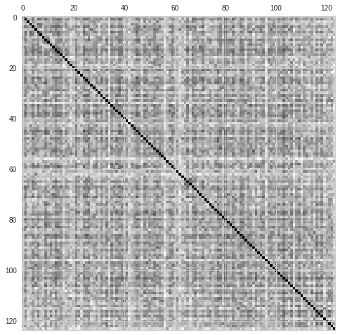


```python
import seaborn as sns
corr=IOVA.close_price.pct_change()[1:].corr(method='spearman')
sns.heatmap(corr, 
            xticklabels=corr.columns.values,
            yticklabels=corr.columns.values)
```


    <matplotlib.axes._subplots.AxesSubplot at 0x7f50f55f1690>


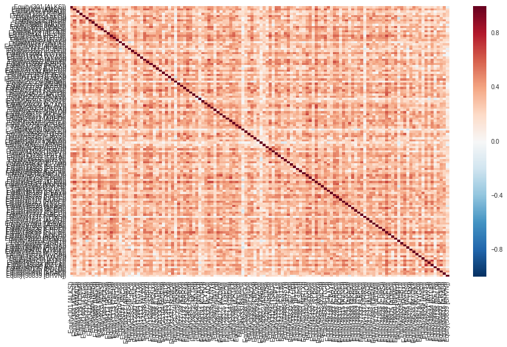


# Why are best performing stocks performing best?


```python
import numpy as np
import pandas as pd
import matplotlib.pyplot as plt
from collections import Counter
from quantopian.research import returns, symbols, run_pipeline, prices
from quantopian.pipeline import Pipeline, CustomFactor
from quantopian.pipeline.factors import Returns
from quantopian.pipeline.data import USEquityPricing, morningstar
from quantopian.pipeline.data.psychsignal import stocktwits
from quantopian.pipeline.experimental import QTradableStocksUS
from quantopian.pipeline.data.sentdex import sentiment_free
from quantopian.pipeline.data.psychsignal import stocktwits_free

import alphalens as al
```


```python
# Calculates the average impact of the sentiment over the window length
class AvgSentiment(CustomFactor):
    def compute(self, today, assets, out, impact):
        
        out[:] = np.mean(impact, axis=0, out=out)
        
class Industry(CustomFactor):
    inputs = [ morningstar.asset_classification.morningstar_industry_code ]
    window_length = 1
    def compute(self, today, assets, out, morningstar_industry_code):
        out[:] = morningstar_industry_code

class Industry_Group(CustomFactor):
    inputs = [ morningstar.asset_classification.morningstar_industry_group_code ]
    window_length = 1
    def compute(self, today, assets, out, morningstar_industry_group_code):
        out[:] = morningstar_industry_group_code
        
class Sector(CustomFactor):
    inputs = [ morningstar.asset_classification.morningstar_sector_code ]
    window_length = 1
    def compute(self, today, assets, out, sector):
        out[:] = sector
        
class SortinoRatio(CustomFactor):
    def compute(self, today, asset_ids, out, values):   
        prices= pd.DataFrame(data=values)
        daily_returns = prices.fillna(method='bfill').fillna(method='ffill').pct_change()[1:]
        # Negative daily returns
        daily_negative_returns = np.copy(daily_returns)
        daily_negative_returns[daily_negative_returns > 0] = 0
        # Mean
        mu = daily_returns.mean(axis=0)
        # Standard Deviation
        sigma = daily_negative_returns.std(axis=0)
        # Sortino Ratio
        sortino_ratio = mu / sigma
        sortino_ratio = sortino_ratio.replace(np.inf, np.nan)
        # sortino_ratio = np.where(sortino_ratio.isfinite(), sortino_ratio, np.nan)  
        # sortino_ratio = sortino_ratio.replace(np.nan, 0)

        out[:] = sortino_ratio

# Pipeline definition
def make_pipeline():

    pipe = Pipeline()
    
    base_universe = QTradableStocksUS()
    return_3m = Returns(window_length=60, mask=base_universe)
    return_1m = Returns(window_length=20, mask=base_universe)
    return_1w = Returns(window_length=5, mask=base_universe)

    sector = Sector()
    industry_group = Industry_Group()
    industry = Industry()
    
    universe = base_universe & (industry.eq(20635084)) & (return_3m > 0.25)
    universe = base_universe & (industry.eq(20635084))
    
    window_length = 120
    avg_sentiment = AvgSentiment(inputs=[stocktwits_free.bull_bear_msg_ratio], window_length=window_length)    
    
    sortino_ratio_60 = SortinoRatio(
        inputs=[USEquityPricing.close],
        window_length=60,
        mask=universe
    )
    
    pipe.add(sortino_ratio_60, 'sortino_ratio_60')    
    
    sortino_ratio_120 = SortinoRatio(
        inputs=[USEquityPricing.close],
        window_length=120,
        mask=universe
    )
    
    pipe.add(sortino_ratio_120, 'sortino_ratio_120') 
    
    sortino_ratio_240 = SortinoRatio(
        inputs=[USEquityPricing.close],
        window_length=240,
        mask=universe
    )
    
    pipe.add(sortino_ratio_240, 'sortino_ratio_240')

    pipe.add(USEquityPricing.close.latest, 'close_price')
    
    pipe.add(avg_sentiment, 'bull_bear_msg_ratio')
    pipe.add(return_3m, 'return_3m')
    pipe.add(return_1m, 'return_1m')
    pipe.add(return_1w, 'return_1w')
    pipe.add(sector, 'sector')
    pipe.add(industry_group, 'industry_group')
    pipe.add(industry, 'industry')
    
    m = morningstar
    
    # Income Statement Total
    pipe.add(m.income_statement.total_revenue.latest, 'total_revenue')

    # Ratios
    pipe.add(m.income_statement.ebitda.latest / m.income_statement.total_revenue.latest, 'ebitda')
    pipe.add(m.income_statement.research_and_development.latest / m.income_statement.total_revenue.latest, 'research_and_development')
    pipe.add(morningstar.operation_ratios.revenue_growth.latest, 'revenue_growth')
    pipe.add(morningstar.operation_ratios.net_income_growth.latest, 'net_income_growth')
    pipe.add(morningstar.valuation_ratios.pe_ratio.latest, 'pe_ratio')
    pipe.add(m.operation_ratios.net_margin.latest, 'net_margin')


    # General
    pipe.add(morningstar.valuation.enterprise_value.latest, 'enterprise_value')
    pipe.add(morningstar.valuation.market_cap.latest, 'market_cap')
    pipe.add(m.asset_classification.financial_health_grade.latest, 'financial_health_grade')
    pipe.add(m.earnings_ratios.diluted_eps_growth.latest, 'diluted_eps_growth') 

    
    # Operation Ratios
    operation_ratios = [
        'assets_turnover',
        'cash_conversion_cycle',
        'current_ratio'
    ]
    
#     for ratio in operation_ratio:
#         pipe.add(morningstar.operation_ratios.assets_turnover.latest, 'assets_turnover')

    
    pipe.set_screen(universe)
    
    return pipe
#     return Pipeline(
#         columns={
#             'bull_bear_msg_ratio': avg_sentiment,
#             'return_3m': return_3m,
#             'return_1m': return_1m,
#             'return_1w': return_1w,
#             'sector': sector,
#             'industry_group': industry_group,
#             'industry': industry,
#             'financial_health_grade': morningstar.asset_classification.financial_health_grade.latest,
#             'diluted_eps_growth': morningstar.earnings_ratios.diluted_eps_growth.latest
#         },
#         screen=universe
#     )
```


```python
# Select a time range to inspect
year = '2018'
q1_period_start = '{year}-03-31'.format(year=year)
q1_period_end = '{year}-03-31'.format(year=year)
q2_period_start = '{year}-06-30'.format(year=year)
q2_period_end = '{year}-06-30'.format(year=year)
q3_period_start = '{year}-09-30'.format(year=year)
q3_period_end = '{year}-09-30'.format(year=year)
q4_period_start = '{year}-12-31'.format(year=year)
q4_period_end = '{year}-12-31'.format(year=year)

# Pipeline execution
q1 = run_pipeline(make_pipeline() ,start_date=q1_period_start, end_date=q1_period_end)
# q2_pipeline_output = run_pipeline(make_pipeline() ,start_date=q2_period_start, end_date=q2_period_end)
# q3_pipeline_output = run_pipeline(make_pipeline() ,start_date=q3_period_start, end_date=q3_period_end)
# q4_pipeline_output = run_pipeline(make_pipeline() ,start_date=q4_period_start, end_date=q4_period_end)
```


```python
q1.sort_values(by='return_3m', ascending=False)
```


<div>
<table border="1" class="dataframe">
  <thead>
    <tr style="text-align: right;">
      <th></th>
      <th></th>
      <th>bull_bear_msg_ratio</th>
      <th>close_price</th>
      <th>diluted_eps_growth</th>
      <th>ebitda</th>
      <th>enterprise_value</th>
      <th>financial_health_grade</th>
      <th>industry</th>
      <th>industry_group</th>
      <th>market_cap</th>
      <th>net_income_growth</th>
      <th>...</th>
      <th>research_and_development</th>
      <th>return_1m</th>
      <th>return_1w</th>
      <th>return_3m</th>
      <th>revenue_growth</th>
      <th>sector</th>
      <th>sortino_ratio_120</th>
      <th>sortino_ratio_240</th>
      <th>sortino_ratio_60</th>
      <th>total_revenue</th>
    </tr>
  </thead>
  <tbody>
    <tr>
      <th rowspan="61" valign="top">2018-04-02 00:00:00+00:00</th>
      <th>Equity(36209 [IOVA])</th>
      <td>0.497879</td>
      <td>16.900</td>
      <td>0.000000</td>
      <td>-inf</td>
      <td>1.366267e+09</td>
      <td>B</td>
      <td>20635084.0</td>
      <td>20635.0</td>
      <td>1.511633e+09</td>
      <td>NaN</td>
      <td>...</td>
      <td>inf</td>
      <td>-0.098667</td>
      <td>-0.011696</td>
      <td>1.073620</td>
      <td>0.000000</td>
      <td>206.0</td>
      <td>0.366840</td>
      <td>0.234383</td>
      <td>0.613814</td>
      <td>0.000000e+00</td>
    </tr>
    <tr>
      <th>Equity(47901 [ATRA])</th>
      <td>0.404482</td>
      <td>39.000</td>
      <td>NaN</td>
      <td>-inf</td>
      <td>1.348112e+09</td>
      <td>C</td>
      <td>20635084.0</td>
      <td>20635.0</td>
      <td>1.514208e+09</td>
      <td>NaN</td>
      <td>...</td>
      <td>inf</td>
      <td>-0.010152</td>
      <td>-0.017632</td>
      <td>1.025974</td>
      <td>0.000000</td>
      <td>206.0</td>
      <td>0.378059</td>
      <td>0.189592</td>
      <td>0.527000</td>
      <td>0.000000e+00</td>
    </tr>
    <tr>
      <th>Equity(50400 [CRSP])</th>
      <td>1.314983</td>
      <td>45.680</td>
      <td>-0.976771</td>
      <td>0.042258</td>
      <td>1.907515e+09</td>
      <td>C</td>
      <td>20635084.0</td>
      <td>20635.0</td>
      <td>2.147273e+09</td>
      <td>-0.991754</td>
      <td>...</td>
      <td>0.619644</td>
      <td>-0.087477</td>
      <td>-0.139250</td>
      <td>0.947974</td>
      <td>12.790529</td>
      <td>206.0</td>
      <td>0.355446</td>
      <td>0.208905</td>
      <td>0.454565</td>
      <td>3.232500e+07</td>
    </tr>
    <tr>
      <th>Equity(24572 [NKTR])</th>
      <td>1.145984</td>
      <td>106.260</td>
      <td>0.976190</td>
      <td>-0.209677</td>
      <td>1.704874e+10</td>
      <td>B</td>
      <td>20635084.0</td>
      <td>20635.0</td>
      <td>1.709967e+10</td>
      <td>0.966601</td>
      <td>...</td>
      <td>0.852963</td>
      <td>0.033356</td>
      <td>0.031650</td>
      <td>0.836819</td>
      <td>1.549023</td>
      <td>206.0</td>
      <td>0.953540</td>
      <td>0.525131</td>
      <td>0.747142</td>
      <td>9.546600e+07</td>
    </tr>
    <tr>
      <th>Equity(45080 [MRTX])</th>
      <td>0.664368</td>
      <td>30.650</td>
      <td>0.000000</td>
      <td>-inf</td>
      <td>7.376259e+08</td>
      <td>C</td>
      <td>20635084.0</td>
      <td>20635.0</td>
      <td>8.884629e+08</td>
      <td>NaN</td>
      <td>...</td>
      <td>inf</td>
      <td>0.077329</td>
      <td>-0.055470</td>
      <td>0.617414</td>
      <td>0.000000</td>
      <td>206.0</td>
      <td>0.299987</td>
      <td>0.458413</td>
      <td>0.397745</td>
      <td>0.000000e+00</td>
    </tr>
    <tr>
      <th>Equity(14112 [NVAX])</th>
      <td>3.099822</td>
      <td>2.090</td>
      <td>0.000000</td>
      <td>-4.340953</td>
      <td>8.823184e+08</td>
      <td>D</td>
      <td>20635084.0</td>
      <td>20635.0</td>
      <td>7.218584e+08</td>
      <td>0.000000</td>
      <td>...</td>
      <td>4.769113</td>
      <td>-0.018779</td>
      <td>0.042394</td>
      <td>0.559701</td>
      <td>0.928505</td>
      <td>206.0</td>
      <td>0.221182</td>
      <td>0.181178</td>
      <td>0.375960</td>
      <td>1.041200e+07</td>
    </tr>
    <tr>
      <th>Equity(10417 [ARWR])</th>
      <td>1.650428</td>
      <td>7.205</td>
      <td>0.000000</td>
      <td>-3.610490</td>
      <td>5.775204e+08</td>
      <td>C</td>
      <td>20635084.0</td>
      <td>20635.0</td>
      <td>6.257384e+08</td>
      <td>NaN</td>
      <td>...</td>
      <td>2.402374</td>
      <td>0.081832</td>
      <td>0.067407</td>
      <td>0.554477</td>
      <td>-0.196009</td>
      <td>206.0</td>
      <td>0.252359</td>
      <td>0.327718</td>
      <td>0.440042</td>
      <td>3.509821e+06</td>
    </tr>
    <tr>
      <th>Equity(13984 [TGTX])</th>
      <td>2.376243</td>
      <td>14.150</td>
      <td>0.000000</td>
      <td>-814.132695</td>
      <td>9.886439e+08</td>
      <td>C</td>
      <td>20635084.0</td>
      <td>20635.0</td>
      <td>1.073233e+09</td>
      <td>9.493039</td>
      <td>...</td>
      <td>682.402100</td>
      <td>-0.053512</td>
      <td>-0.053512</td>
      <td>0.538043</td>
      <td>0.000000</td>
      <td>206.0</td>
      <td>0.093386</td>
      <td>0.105994</td>
      <td>0.473979</td>
      <td>3.809500e+04</td>
    </tr>
    <tr>
      <th>Equity(3885 [IMGN])</th>
      <td>1.612183</td>
      <td>10.510</td>
      <td>3.000000</td>
      <td>-0.208198</td>
      <td>1.132489e+09</td>
      <td>C</td>
      <td>20635084.0</td>
      <td>20635.0</td>
      <td>1.397546e+09</td>
      <td>2.575924</td>
      <td>...</td>
      <td>1.010013</td>
      <td>-0.071555</td>
      <td>-0.131405</td>
      <td>0.536550</td>
      <td>1.849054</td>
      <td>206.0</td>
      <td>0.173482</td>
      <td>0.233140</td>
      <td>0.293916</td>
      <td>3.944800e+07</td>
    </tr>
    <tr>
      <th>Equity(44955 [PTCT])</th>
      <td>0.675612</td>
      <td>27.030</td>
      <td>0.000000</td>
      <td>0.145957</td>
      <td>1.084716e+09</td>
      <td>C</td>
      <td>20635084.0</td>
      <td>20635.0</td>
      <td>1.130991e+09</td>
      <td>NaN</td>
      <td>...</td>
      <td>0.374651</td>
      <td>0.050933</td>
      <td>-0.155312</td>
      <td>0.500833</td>
      <td>2.097535</td>
      <td>206.0</td>
      <td>0.156922</td>
      <td>0.199214</td>
      <td>0.312382</td>
      <td>7.803000e+07</td>
    </tr>
    <tr>
      <th>Equity(46189 [CBAY])</th>
      <td>1.325654</td>
      <td>12.990</td>
      <td>0.000000</td>
      <td>-0.921836</td>
      <td>6.688263e+08</td>
      <td>C</td>
      <td>20635084.0</td>
      <td>20635.0</td>
      <td>7.599383e+08</td>
      <td>NaN</td>
      <td>...</td>
      <td>1.280776</td>
      <td>-0.143140</td>
      <td>0.069136</td>
      <td>0.381915</td>
      <td>0.000000</td>
      <td>206.0</td>
      <td>0.253433</td>
      <td>0.332576</td>
      <td>0.335514</td>
      <td>5.207000e+06</td>
    </tr>
    <tr>
      <th>Equity(44332 [ENTA])</th>
      <td>0.230555</td>
      <td>80.890</td>
      <td>-0.689474</td>
      <td>0.418090</td>
      <td>1.330206e+09</td>
      <td>A</td>
      <td>20635084.0</td>
      <td>20635.0</td>
      <td>1.550290e+09</td>
      <td>-0.679714</td>
      <td>...</td>
      <td>0.471332</td>
      <td>0.037983</td>
      <td>0.002479</td>
      <td>0.378964</td>
      <td>2.658347</td>
      <td>206.0</td>
      <td>0.250576</td>
      <td>0.286979</td>
      <td>0.256521</td>
      <td>3.810900e+07</td>
    </tr>
    <tr>
      <th>Equity(44830 [EPZM])</th>
      <td>0.300000</td>
      <td>17.700</td>
      <td>-0.100000</td>
      <td>-inf</td>
      <td>9.562360e+08</td>
      <td>C</td>
      <td>20635084.0</td>
      <td>20635.0</td>
      <td>1.232565e+09</td>
      <td>-0.084020</td>
      <td>...</td>
      <td>inf</td>
      <td>0.000000</td>
      <td>-0.045822</td>
      <td>0.361538</td>
      <td>0.000000</td>
      <td>206.0</td>
      <td>0.016161</td>
      <td>0.073402</td>
      <td>0.288951</td>
      <td>0.000000e+00</td>
    </tr>
    <tr>
      <th>Equity(47432 [LOXO])</th>
      <td>0.416310</td>
      <td>115.290</td>
      <td>NaN</td>
      <td>-inf</td>
      <td>2.838843e+09</td>
      <td>C</td>
      <td>20635084.0</td>
      <td>20635.0</td>
      <td>3.465043e+09</td>
      <td>NaN</td>
      <td>...</td>
      <td>inf</td>
      <td>-0.038449</td>
      <td>0.037154</td>
      <td>0.361479</td>
      <td>0.000000</td>
      <td>206.0</td>
      <td>0.170560</td>
      <td>0.305010</td>
      <td>0.331308</td>
      <td>0.000000e+00</td>
    </tr>
    <tr>
      <th>Equity(46053 [ITCI])</th>
      <td>0.280556</td>
      <td>21.050</td>
      <td>NaN</td>
      <td>-6173.795648</td>
      <td>6.866925e+08</td>
      <td>B</td>
      <td>20635084.0</td>
      <td>20635.0</td>
      <td>1.151024e+09</td>
      <td>NaN</td>
      <td>...</td>
      <td>5327.208902</td>
      <td>-0.034404</td>
      <td>-0.025914</td>
      <td>0.360698</td>
      <td>-0.948363</td>
      <td>206.0</td>
      <td>0.177109</td>
      <td>0.120195</td>
      <td>0.354172</td>
      <td>5.055000e+03</td>
    </tr>
    <tr>
      <th>Equity(21104 [AGEN])</th>
      <td>1.471355</td>
      <td>4.700</td>
      <td>0.000000</td>
      <td>-3.417061</td>
      <td>5.858810e+08</td>
      <td>C</td>
      <td>20635084.0</td>
      <td>20635.0</td>
      <td>4.830425e+08</td>
      <td>-0.410745</td>
      <td>...</td>
      <td>3.815075</td>
      <td>-0.168142</td>
      <td>-0.061876</td>
      <td>0.323944</td>
      <td>0.498263</td>
      <td>206.0</td>
      <td>0.029938</td>
      <td>0.103623</td>
      <td>0.389606</td>
      <td>8.354271e+06</td>
    </tr>
    <tr>
      <th>Equity(659 [AMAG])</th>
      <td>0.549538</td>
      <td>20.100</td>
      <td>-0.965398</td>
      <td>0.370669</td>
      <td>1.092868e+09</td>
      <td>C</td>
      <td>20635084.0</td>
      <td>20635.0</td>
      <td>6.868920e+08</td>
      <td>-0.949646</td>
      <td>...</td>
      <td>0.075762</td>
      <td>-0.040573</td>
      <td>0.044156</td>
      <td>0.318033</td>
      <td>0.044508</td>
      <td>206.0</td>
      <td>0.065351</td>
      <td>0.009737</td>
      <td>0.355841</td>
      <td>1.583380e+08</td>
    </tr>
    <tr>
      <th>Equity(45143 [AGIO])</th>
      <td>0.604860</td>
      <td>81.770</td>
      <td>NaN</td>
      <td>-9.029085</td>
      <td>4.264245e+09</td>
      <td>B</td>
      <td>20635084.0</td>
      <td>20635.0</td>
      <td>4.688181e+09</td>
      <td>NaN</td>
      <td>...</td>
      <td>7.879988</td>
      <td>0.010130</td>
      <td>0.002698</td>
      <td>0.311678</td>
      <td>-0.567335</td>
      <td>206.0</td>
      <td>0.101621</td>
      <td>0.150824</td>
      <td>0.308279</td>
      <td>9.799000e+06</td>
    </tr>
    <tr>
      <th>Equity(45942 [XNCR])</th>
      <td>0.304167</td>
      <td>29.980</td>
      <td>NaN</td>
      <td>-1.125594</td>
      <td>1.185228e+09</td>
      <td>B</td>
      <td>20635084.0</td>
      <td>20635.0</td>
      <td>1.409359e+09</td>
      <td>NaN</td>
      <td>...</td>
      <td>1.864351</td>
      <td>0.016961</td>
      <td>-0.015435</td>
      <td>0.308028</td>
      <td>0.698758</td>
      <td>206.0</td>
      <td>0.122140</td>
      <td>0.098073</td>
      <td>0.277069</td>
      <td>1.094000e+07</td>
    </tr>
    <tr>
      <th>Equity(49470 [CTMX])</th>
      <td>0.166667</td>
      <td>28.440</td>
      <td>NaN</td>
      <td>-0.031138</td>
      <td>7.243774e+08</td>
      <td>C</td>
      <td>20635084.0</td>
      <td>20635.0</td>
      <td>1.098487e+09</td>
      <td>NaN</td>
      <td>...</td>
      <td>0.764747</td>
      <td>-0.139225</td>
      <td>-0.099145</td>
      <td>0.270777</td>
      <td>3.316486</td>
      <td>206.0</td>
      <td>0.194035</td>
      <td>0.189889</td>
      <td>0.287431</td>
      <td>2.707300e+07</td>
    </tr>
    <tr>
      <th>Equity(16999 [SRPT])</th>
      <td>2.033070</td>
      <td>74.080</td>
      <td>4.833345</td>
      <td>1.881523</td>
      <td>4.166238e+09</td>
      <td>C</td>
      <td>20635084.0</td>
      <td>20635.0</td>
      <td>4.814247e+09</td>
      <td>5.284597</td>
      <td>...</td>
      <td>0.775896</td>
      <td>0.090374</td>
      <td>-0.047448</td>
      <td>0.265892</td>
      <td>9.565763</td>
      <td>206.0</td>
      <td>0.244535</td>
      <td>0.276983</td>
      <td>0.278956</td>
      <td>5.727700e+07</td>
    </tr>
    <tr>
      <th>Equity(45643 [MGNX])</th>
      <td>0.265104</td>
      <td>25.150</td>
      <td>-0.917315</td>
      <td>0.697766</td>
      <td>6.237573e+08</td>
      <td>C</td>
      <td>20635084.0</td>
      <td>20635.0</td>
      <td>9.288783e+08</td>
      <td>1.539498</td>
      <td>...</td>
      <td>0.255882</td>
      <td>-0.130660</td>
      <td>-0.101144</td>
      <td>0.255617</td>
      <td>28.839209</td>
      <td>206.0</td>
      <td>0.168848</td>
      <td>0.089979</td>
      <td>0.178367</td>
      <td>1.523590e+08</td>
    </tr>
    <tr>
      <th>Equity(48925 [ADRO])</th>
      <td>0.192361</td>
      <td>9.200</td>
      <td>20.000000</td>
      <td>-7.202343</td>
      <td>4.272573e+08</td>
      <td>C</td>
      <td>20635084.0</td>
      <td>20635.0</td>
      <td>7.533603e+08</td>
      <td>4.467372</td>
      <td>...</td>
      <td>6.101704</td>
      <td>0.437500</td>
      <td>0.057471</td>
      <td>0.251701</td>
      <td>-0.031460</td>
      <td>206.0</td>
      <td>-0.024152</td>
      <td>0.022501</td>
      <td>0.233335</td>
      <td>3.756000e+06</td>
    </tr>
    <tr>
      <th>Equity(46528 [AKAO])</th>
      <td>1.972325</td>
      <td>12.940</td>
      <td>NaN</td>
      <td>-18.841627</td>
      <td>4.363595e+08</td>
      <td>C</td>
      <td>20635084.0</td>
      <td>20635.0</td>
      <td>5.791935e+08</td>
      <td>NaN</td>
      <td>...</td>
      <td>15.775816</td>
      <td>0.235912</td>
      <td>0.003801</td>
      <td>0.220755</td>
      <td>-0.825880</td>
      <td>206.0</td>
      <td>-0.023968</td>
      <td>-0.060174</td>
      <td>0.222680</td>
      <td>1.869000e+06</td>
    </tr>
    <tr>
      <th>Equity(49572 [KURA])</th>
      <td>0.125000</td>
      <td>18.800</td>
      <td>0.000000</td>
      <td>-inf</td>
      <td>5.393369e+08</td>
      <td>C</td>
      <td>20635084.0</td>
      <td>20635.0</td>
      <td>6.253839e+08</td>
      <td>NaN</td>
      <td>...</td>
      <td>inf</td>
      <td>-0.196581</td>
      <td>0.018970</td>
      <td>0.212903</td>
      <td>0.000000</td>
      <td>206.0</td>
      <td>0.173291</td>
      <td>0.161879</td>
      <td>0.217449</td>
      <td>0.000000e+00</td>
    </tr>
    <tr>
      <th>Equity(17908 [PGNX])</th>
      <td>2.062874</td>
      <td>7.450</td>
      <td>0.000000</td>
      <td>-3.340962</td>
      <td>5.011034e+08</td>
      <td>C</td>
      <td>20635084.0</td>
      <td>20635.0</td>
      <td>5.420584e+08</td>
      <td>10.383986</td>
      <td>...</td>
      <td>2.815120</td>
      <td>0.112771</td>
      <td>-0.011936</td>
      <td>0.211382</td>
      <td>-0.164015</td>
      <td>206.0</td>
      <td>0.035927</td>
      <td>0.010972</td>
      <td>0.194834</td>
      <td>3.889000e+06</td>
    </tr>
    <tr>
      <th>Equity(22192 [ARRY])</th>
      <td>2.089149</td>
      <td>16.309</td>
      <td>0.000000</td>
      <td>-0.726207</td>
      <td>3.075322e+09</td>
      <td>C</td>
      <td>20635084.0</td>
      <td>20635.0</td>
      <td>3.388630e+09</td>
      <td>NaN</td>
      <td>...</td>
      <td>1.009356</td>
      <td>-0.091421</td>
      <td>-0.011576</td>
      <td>0.200957</td>
      <td>-0.051771</td>
      <td>206.0</td>
      <td>0.192940</td>
      <td>0.204986</td>
      <td>0.222176</td>
      <td>4.221800e+07</td>
    </tr>
    <tr>
      <th>Equity(48547 [ONCE])</th>
      <td>1.485048</td>
      <td>66.550</td>
      <td>NaN</td>
      <td>-8.294471</td>
      <td>1.959370e+09</td>
      <td>C</td>
      <td>20635084.0</td>
      <td>20635.0</td>
      <td>2.478313e+09</td>
      <td>NaN</td>
      <td>...</td>
      <td>4.114420</td>
      <td>0.012321</td>
      <td>0.054508</td>
      <td>0.193508</td>
      <td>-0.545577</td>
      <td>206.0</td>
      <td>-0.029335</td>
      <td>0.066772</td>
      <td>0.186081</td>
      <td>7.408369e+06</td>
    </tr>
    <tr>
      <th>Equity(46310 [QURE])</th>
      <td>0.702014</td>
      <td>23.500</td>
      <td>0.000000</td>
      <td>-9.673375</td>
      <td>6.059937e+08</td>
      <td>C</td>
      <td>20635084.0</td>
      <td>20635.0</td>
      <td>7.445737e+08</td>
      <td>NaN</td>
      <td>...</td>
      <td>-14.019350</td>
      <td>-0.116209</td>
      <td>0.017316</td>
      <td>0.186270</td>
      <td>-0.717008</td>
      <td>206.0</td>
      <td>0.344543</td>
      <td>0.347427</td>
      <td>0.181305</td>
      <td>2.584000e+06</td>
    </tr>
    <tr>
      <th>Equity(33298 [MDGL])</th>
      <td>0.812131</td>
      <td>116.790</td>
      <td>0.000000</td>
      <td>-inf</td>
      <td>1.470118e+09</td>
      <td>C</td>
      <td>20635084.0</td>
      <td>20635.0</td>
      <td>1.661645e+09</td>
      <td>0.000000</td>
      <td>...</td>
      <td>inf</td>
      <td>-0.107922</td>
      <td>0.014947</td>
      <td>0.182085</td>
      <td>0.000000</td>
      <td>206.0</td>
      <td>0.466153</td>
      <td>0.562407</td>
      <td>0.150147</td>
      <td>0.000000e+00</td>
    </tr>
    <tr>
      <th>...</th>
      <td>...</td>
      <td>...</td>
      <td>...</td>
      <td>...</td>
      <td>...</td>
      <td>...</td>
      <td>...</td>
      <td>...</td>
      <td>...</td>
      <td>...</td>
      <td>...</td>
      <td>...</td>
      <td>...</td>
      <td>...</td>
      <td>...</td>
      <td>...</td>
      <td>...</td>
      <td>...</td>
      <td>...</td>
      <td>...</td>
      <td>...</td>
    </tr>
    <tr>
      <th>Equity(31341 [ZIOP])</th>
      <td>1.288864</td>
      <td>3.910</td>
      <td>0.000000</td>
      <td>-8.344396</td>
      <td>4.872578e+08</td>
      <td>C</td>
      <td>20635084.0</td>
      <td>20635.0</td>
      <td>5.582038e+08</td>
      <td>0.000000</td>
      <td>...</td>
      <td>7.001252</td>
      <td>-0.029777</td>
      <td>-0.040491</td>
      <td>-0.150923</td>
      <td>0.000000</td>
      <td>206.0</td>
      <td>-0.145306</td>
      <td>-0.087955</td>
      <td>-0.076045</td>
      <td>1.597000e+06</td>
    </tr>
    <tr>
      <th>Equity(50135 [BOLD])</th>
      <td>0.107500</td>
      <td>30.030</td>
      <td>NaN</td>
      <td>-inf</td>
      <td>9.684555e+08</td>
      <td>B</td>
      <td>20635084.0</td>
      <td>20635.0</td>
      <td>1.102061e+09</td>
      <td>NaN</td>
      <td>...</td>
      <td>inf</td>
      <td>-0.168605</td>
      <td>0.028073</td>
      <td>-0.154799</td>
      <td>NaN</td>
      <td>206.0</td>
      <td>0.082154</td>
      <td>0.157226</td>
      <td>-0.059384</td>
      <td>0.000000e+00</td>
    </tr>
    <tr>
      <th>Equity(49409 [RGNX])</th>
      <td>0.224999</td>
      <td>29.800</td>
      <td>NaN</td>
      <td>-6.450490</td>
      <td>7.841265e+08</td>
      <td>B</td>
      <td>20635084.0</td>
      <td>20635.0</td>
      <td>9.449045e+08</td>
      <td>NaN</td>
      <td>...</td>
      <td>6.946078</td>
      <td>0.015332</td>
      <td>0.018803</td>
      <td>-0.166434</td>
      <td>0.202830</td>
      <td>206.0</td>
      <td>0.003597</td>
      <td>0.094625</td>
      <td>-0.043782</td>
      <td>2.040000e+06</td>
    </tr>
    <tr>
      <th>Equity(28471 [ABEO])</th>
      <td>1.179057</td>
      <td>14.250</td>
      <td>0.000000</td>
      <td>-38.618605</td>
      <td>5.399566e+08</td>
      <td>C</td>
      <td>20635084.0</td>
      <td>20635.0</td>
      <td>6.777066e+08</td>
      <td>-0.607939</td>
      <td>...</td>
      <td>26.539535</td>
      <td>-0.074675</td>
      <td>0.010638</td>
      <td>-0.173913</td>
      <td>-0.160156</td>
      <td>206.0</td>
      <td>-0.012899</td>
      <td>0.225751</td>
      <td>-0.050946</td>
      <td>2.150000e+05</td>
    </tr>
    <tr>
      <th>Equity(10187 [INCY])</th>
      <td>1.294062</td>
      <td>83.330</td>
      <td>-0.105263</td>
      <td>-0.304049</td>
      <td>1.650354e+10</td>
      <td>A</td>
      <td>20635084.0</td>
      <td>20635.0</td>
      <td>1.764919e+10</td>
      <td>-0.022317</td>
      <td>...</td>
      <td>1.006264</td>
      <td>-0.037871</td>
      <td>0.003009</td>
      <td>-0.174787</td>
      <td>0.360364</td>
      <td>206.0</td>
      <td>-0.183893</td>
      <td>-0.111931</td>
      <td>-0.217720</td>
      <td>4.441560e+08</td>
    </tr>
    <tr>
      <th>Equity(25565 [ANIP])</th>
      <td>0.112863</td>
      <td>58.210</td>
      <td>0.818182</td>
      <td>0.304551</td>
      <td>8.493331e+08</td>
      <td>C</td>
      <td>20635084.0</td>
      <td>20635.0</td>
      <td>6.789701e+08</td>
      <td>0.856076</td>
      <td>...</td>
      <td>0.056063</td>
      <td>-0.071907</td>
      <td>-0.007502</td>
      <td>-0.176545</td>
      <td>0.237691</td>
      <td>206.0</td>
      <td>0.068851</td>
      <td>0.062578</td>
      <td>-0.182911</td>
      <td>4.728600e+07</td>
    </tr>
    <tr>
      <th>Equity(46367 [CNCE])</th>
      <td>0.287752</td>
      <td>22.900</td>
      <td>0.000000</td>
      <td>-690.250000</td>
      <td>3.288770e+08</td>
      <td>B</td>
      <td>20635084.0</td>
      <td>20635.0</td>
      <td>5.320420e+08</td>
      <td>NaN</td>
      <td>...</td>
      <td>630.416667</td>
      <td>0.014172</td>
      <td>0.025986</td>
      <td>-0.178623</td>
      <td>-0.428571</td>
      <td>206.0</td>
      <td>0.152651</td>
      <td>0.093685</td>
      <td>-0.059372</td>
      <td>1.200000e+04</td>
    </tr>
    <tr>
      <th>Equity(10905 [BCRX])</th>
      <td>0.425231</td>
      <td>4.760</td>
      <td>0.000000</td>
      <td>-4.403599</td>
      <td>3.822439e+08</td>
      <td>C</td>
      <td>20635084.0</td>
      <td>20635.0</td>
      <td>4.706009e+08</td>
      <td>0.504550</td>
      <td>...</td>
      <td>4.350643</td>
      <td>-0.053678</td>
      <td>-0.086372</td>
      <td>-0.179310</td>
      <td>-0.566960</td>
      <td>206.0</td>
      <td>-0.015235</td>
      <td>-0.023901</td>
      <td>-0.163194</td>
      <td>3.890000e+06</td>
    </tr>
    <tr>
      <th>Equity(21789 [KERX])</th>
      <td>1.302220</td>
      <td>4.070</td>
      <td>-0.965517</td>
      <td>-1.646719</td>
      <td>5.189020e+08</td>
      <td>C</td>
      <td>20635084.0</td>
      <td>20635.0</td>
      <td>4.874280e+08</td>
      <td>-0.960374</td>
      <td>...</td>
      <td>0.675945</td>
      <td>-0.139535</td>
      <td>0.000000</td>
      <td>-0.179435</td>
      <td>0.959719</td>
      <td>206.0</td>
      <td>-0.190861</td>
      <td>-0.046323</td>
      <td>-0.150944</td>
      <td>1.868200e+07</td>
    </tr>
    <tr>
      <th>Equity(26232 [CYTK])</th>
      <td>0.188668</td>
      <td>7.200</td>
      <td>0.000000</td>
      <td>1952.388889</td>
      <td>1.517444e+08</td>
      <td>C</td>
      <td>20635084.0</td>
      <td>20635.0</td>
      <td>3.888584e+08</td>
      <td>-0.729294</td>
      <td>...</td>
      <td>-1458.388889</td>
      <td>-0.091483</td>
      <td>-0.127273</td>
      <td>-0.181818</td>
      <td>-0.895338</td>
      <td>206.0</td>
      <td>-0.176947</td>
      <td>-0.069914</td>
      <td>-0.159653</td>
      <td>-1.800000e+04</td>
    </tr>
    <tr>
      <th>Equity(21413 [LXRX])</th>
      <td>0.444306</td>
      <td>8.580</td>
      <td>0.000000</td>
      <td>-0.886616</td>
      <td>8.398040e+08</td>
      <td>C</td>
      <td>20635084.0</td>
      <td>20635.0</td>
      <td>9.049220e+08</td>
      <td>NaN</td>
      <td>...</td>
      <td>1.427058</td>
      <td>0.003509</td>
      <td>0.064516</td>
      <td>-0.182078</td>
      <td>0.434518</td>
      <td>206.0</td>
      <td>-0.100128</td>
      <td>-0.103994</td>
      <td>-0.111789</td>
      <td>3.304700e+07</td>
    </tr>
    <tr>
      <th>Equity(1406 [CELG])</th>
      <td>2.782189</td>
      <td>89.210</td>
      <td>4.761905</td>
      <td>0.398794</td>
      <td>7.089759e+10</td>
      <td>B</td>
      <td>20635084.0</td>
      <td>20635.0</td>
      <td>6.710159e+10</td>
      <td>4.777778</td>
      <td>...</td>
      <td>0.786104</td>
      <td>-0.001232</td>
      <td>0.049529</td>
      <td>-0.182385</td>
      <td>0.168792</td>
      <td>206.0</td>
      <td>-0.163519</td>
      <td>-0.071306</td>
      <td>-0.207168</td>
      <td>3.483000e+09</td>
    </tr>
    <tr>
      <th>Equity(3806 [BIIB])</th>
      <td>2.267571</td>
      <td>273.850</td>
      <td>0.229299</td>
      <td>0.484306</td>
      <td>6.017929e+10</td>
      <td>B</td>
      <td>20635084.0</td>
      <td>20635.0</td>
      <td>5.793009e+10</td>
      <td>0.187046</td>
      <td>...</td>
      <td>0.177684</td>
      <td>-0.045686</td>
      <td>0.052986</td>
      <td>-0.194037</td>
      <td>0.151462</td>
      <td>206.0</td>
      <td>-0.110386</td>
      <td>0.017357</td>
      <td>-0.238107</td>
      <td>3.307000e+09</td>
    </tr>
    <tr>
      <th>Equity(42166 [CLVS])</th>
      <td>1.803337</td>
      <td>52.790</td>
      <td>NaN</td>
      <td>-2.912969</td>
      <td>2.388939e+09</td>
      <td>C</td>
      <td>20635084.0</td>
      <td>20635.0</td>
      <td>2.670264e+09</td>
      <td>NaN</td>
      <td>...</td>
      <td>2.231162</td>
      <td>-0.119433</td>
      <td>-0.078065</td>
      <td>-0.207714</td>
      <td>0.013924</td>
      <td>206.0</td>
      <td>-0.223970</td>
      <td>0.031423</td>
      <td>-0.197200</td>
      <td>1.704000e+07</td>
    </tr>
    <tr>
      <th>Equity(45430 [FPRX])</th>
      <td>0.941678</td>
      <td>17.180</td>
      <td>0.000000</td>
      <td>-2.205326</td>
      <td>3.062134e+08</td>
      <td>C</td>
      <td>20635084.0</td>
      <td>20635.0</td>
      <td>5.989034e+08</td>
      <td>NaN</td>
      <td>...</td>
      <td>2.471705</td>
      <td>-0.131007</td>
      <td>0.031832</td>
      <td>-0.215883</td>
      <td>0.599855</td>
      <td>206.0</td>
      <td>-0.117716</td>
      <td>-0.048253</td>
      <td>-0.132687</td>
      <td>1.321800e+07</td>
    </tr>
    <tr>
      <th>Equity(26322 [ACAD])</th>
      <td>1.671972</td>
      <td>22.460</td>
      <td>0.000000</td>
      <td>-1.564621</td>
      <td>2.460711e+09</td>
      <td>B</td>
      <td>20635084.0</td>
      <td>20635.0</td>
      <td>2.802053e+09</td>
      <td>0.000000</td>
      <td>...</td>
      <td>0.991208</td>
      <td>-0.051520</td>
      <td>-0.005314</td>
      <td>-0.238644</td>
      <td>2.641699</td>
      <td>206.0</td>
      <td>-0.150151</td>
      <td>-0.047009</td>
      <td>-0.118091</td>
      <td>4.356200e+07</td>
    </tr>
    <tr>
      <th>Equity(20306 [UTHR])</th>
      <td>0.306945</td>
      <td>112.300</td>
      <td>-0.807229</td>
      <td>0.327523</td>
      <td>4.181015e+09</td>
      <td>B</td>
      <td>20635084.0</td>
      <td>20635.0</td>
      <td>4.858415e+09</td>
      <td>-0.827743</td>
      <td>...</td>
      <td>0.244459</td>
      <td>-0.013094</td>
      <td>0.045526</td>
      <td>-0.251383</td>
      <td>0.136186</td>
      <td>206.0</td>
      <td>-0.039500</td>
      <td>-0.007773</td>
      <td>-0.258652</td>
      <td>4.647000e+08</td>
    </tr>
    <tr>
      <th>Equity(43124 [TSRO])</th>
      <td>1.355724</td>
      <td>57.050</td>
      <td>NaN</td>
      <td>-3.580201</td>
      <td>2.911792e+09</td>
      <td>C</td>
      <td>20635084.0</td>
      <td>20635.0</td>
      <td>3.117782e+09</td>
      <td>NaN</td>
      <td>...</td>
      <td>2.037191</td>
      <td>-0.009892</td>
      <td>-0.055307</td>
      <td>-0.252049</td>
      <td>8.758789</td>
      <td>206.0</td>
      <td>-0.260779</td>
      <td>-0.179087</td>
      <td>-0.201373</td>
      <td>4.802300e+07</td>
    </tr>
    <tr>
      <th>Equity(49995 [RETA])</th>
      <td>0.061111</td>
      <td>20.500</td>
      <td>NaN</td>
      <td>-1.613609</td>
      <td>4.262771e+08</td>
      <td>C</td>
      <td>20635084.0</td>
      <td>20635.0</td>
      <td>5.364431e+08</td>
      <td>NaN</td>
      <td>...</td>
      <td>2.051686</td>
      <td>-0.063071</td>
      <td>-0.008704</td>
      <td>-0.261261</td>
      <td>-0.202944</td>
      <td>206.0</td>
      <td>-0.140365</td>
      <td>0.027633</td>
      <td>-0.192128</td>
      <td>9.964000e+06</td>
    </tr>
    <tr>
      <th>Equity(49465 [ACRS])</th>
      <td>0.249802</td>
      <td>17.510</td>
      <td>NaN</td>
      <td>-25.286286</td>
      <td>3.476791e+08</td>
      <td>B</td>
      <td>20635084.0</td>
      <td>20635.0</td>
      <td>5.413941e+08</td>
      <td>NaN</td>
      <td>...</td>
      <td>13.202202</td>
      <td>-0.143765</td>
      <td>-0.009055</td>
      <td>-0.267670</td>
      <td>0.460526</td>
      <td>206.0</td>
      <td>-0.199242</td>
      <td>-0.119011</td>
      <td>-0.284813</td>
      <td>9.990000e+05</td>
    </tr>
    <tr>
      <th>Equity(47955 [CRBP])</th>
      <td>1.910025</td>
      <td>6.050</td>
      <td>0.000000</td>
      <td>-inf</td>
      <td>2.863169e+08</td>
      <td>B</td>
      <td>20635084.0</td>
      <td>20635.0</td>
      <td>3.485215e+08</td>
      <td>NaN</td>
      <td>...</td>
      <td>inf</td>
      <td>-0.141844</td>
      <td>-0.032000</td>
      <td>-0.284024</td>
      <td>0.072390</td>
      <td>206.0</td>
      <td>-0.044027</td>
      <td>0.005040</td>
      <td>-0.189027</td>
      <td>0.000000e+00</td>
    </tr>
    <tr>
      <th>Equity(42689 [PBYI])</th>
      <td>1.022762</td>
      <td>68.000</td>
      <td>0.000000</td>
      <td>-2.825389</td>
      <td>2.533606e+09</td>
      <td>C</td>
      <td>20635084.0</td>
      <td>20635.0</td>
      <td>2.566827e+09</td>
      <td>NaN</td>
      <td>...</td>
      <td>2.325713</td>
      <td>-0.042254</td>
      <td>-0.026485</td>
      <td>-0.292772</td>
      <td>2.555702</td>
      <td>206.0</td>
      <td>-0.105447</td>
      <td>0.135403</td>
      <td>-0.104364</td>
      <td>2.160800e+07</td>
    </tr>
    <tr>
      <th>Equity(21383 [EXEL])</th>
      <td>2.677574</td>
      <td>22.140</td>
      <td>-0.250000</td>
      <td>0.326995</td>
      <td>6.175435e+09</td>
      <td>B</td>
      <td>20635084.0</td>
      <td>20635.0</td>
      <td>6.563206e+09</td>
      <td>0.095835</td>
      <td>...</td>
      <td>0.268206</td>
      <td>-0.080183</td>
      <td>-0.025528</td>
      <td>-0.302897</td>
      <td>0.547699</td>
      <td>206.0</td>
      <td>-0.042131</td>
      <td>0.037898</td>
      <td>-0.256421</td>
      <td>1.200720e+08</td>
    </tr>
    <tr>
      <th>Equity(32095 [PRTK])</th>
      <td>0.507176</td>
      <td>13.000</td>
      <td>0.000000</td>
      <td>-3.980875</td>
      <td>4.325309e+08</td>
      <td>C</td>
      <td>20635084.0</td>
      <td>20635.0</td>
      <td>4.087609e+08</td>
      <td>0.000000</td>
      <td>...</td>
      <td>2.804614</td>
      <td>-0.007634</td>
      <td>-0.029851</td>
      <td>-0.306667</td>
      <td>173.896552</td>
      <td>206.0</td>
      <td>-0.288820</td>
      <td>-0.085514</td>
      <td>-0.278854</td>
      <td>5.072000e+06</td>
    </tr>
    <tr>
      <th>Equity(21778 [INSM])</th>
      <td>0.155555</td>
      <td>22.510</td>
      <td>0.000000</td>
      <td>-inf</td>
      <td>1.399838e+09</td>
      <td>C</td>
      <td>20635084.0</td>
      <td>20635.0</td>
      <td>1.725436e+09</td>
      <td>-0.998998</td>
      <td>...</td>
      <td>inf</td>
      <td>-0.073281</td>
      <td>0.037805</td>
      <td>-0.317258</td>
      <td>0.000000</td>
      <td>206.0</td>
      <td>-0.112004</td>
      <td>0.167170</td>
      <td>-0.249112</td>
      <td>0.000000e+00</td>
    </tr>
    <tr>
      <th>Equity(44770 [PTLA])</th>
      <td>1.024650</td>
      <td>32.659</td>
      <td>NaN</td>
      <td>-8.778945</td>
      <td>1.777372e+09</td>
      <td>C</td>
      <td>20635084.0</td>
      <td>20635.0</td>
      <td>2.135713e+09</td>
      <td>NaN</td>
      <td>...</td>
      <td>6.986739</td>
      <td>-0.046453</td>
      <td>0.068335</td>
      <td>-0.339020</td>
      <td>-0.284087</td>
      <td>206.0</td>
      <td>-0.123017</td>
      <td>0.013968</td>
      <td>-0.155476</td>
      <td>9.803000e+06</td>
    </tr>
    <tr>
      <th>Equity(46583 [AKBA])</th>
      <td>0.072917</td>
      <td>9.510</td>
      <td>NaN</td>
      <td>0.132438</td>
      <td>1.429470e+08</td>
      <td>C</td>
      <td>20635084.0</td>
      <td>20635.0</td>
      <td>4.607390e+08</td>
      <td>NaN</td>
      <td>...</td>
      <td>0.783155</td>
      <td>-0.341413</td>
      <td>-0.094286</td>
      <td>-0.386056</td>
      <td>55.883388</td>
      <td>206.0</td>
      <td>-0.259177</td>
      <td>0.045354</td>
      <td>-0.373472</td>
      <td>8.731600e+07</td>
    </tr>
    <tr>
      <th>Equity(38827 [OMER])</th>
      <td>1.888109</td>
      <td>11.170</td>
      <td>0.000000</td>
      <td>-0.982193</td>
      <td>5.402124e+08</td>
      <td>C</td>
      <td>20635084.0</td>
      <td>20635.0</td>
      <td>5.393544e+08</td>
      <td>NaN</td>
      <td>...</td>
      <td>1.118323</td>
      <td>0.115884</td>
      <td>-0.206958</td>
      <td>-0.434430</td>
      <td>0.066176</td>
      <td>206.0</td>
      <td>-0.103421</td>
      <td>-0.004641</td>
      <td>-0.190450</td>
      <td>1.375900e+07</td>
    </tr>
    <tr>
      <th>Equity(44665 [INSY])</th>
      <td>1.977142</td>
      <td>6.030</td>
      <td>-0.954545</td>
      <td>-0.598031</td>
      <td>3.283489e+08</td>
      <td>D</td>
      <td>20635084.0</td>
      <td>20635.0</td>
      <td>4.455369e+08</td>
      <td>-0.963164</td>
      <td>...</td>
      <td>0.519771</td>
      <td>-0.223338</td>
      <td>0.048696</td>
      <td>-0.549327</td>
      <td>-0.426085</td>
      <td>206.0</td>
      <td>-0.039415</td>
      <td>-0.038786</td>
      <td>-0.315557</td>
      <td>3.148500e+07</td>
    </tr>
    <tr>
      <th>Equity(47845 [DERM])</th>
      <td>0.446848</td>
      <td>7.980</td>
      <td>NaN</td>
      <td>-38.696203</td>
      <td>6.255360e+07</td>
      <td>D</td>
      <td>20635084.0</td>
      <td>20635.0</td>
      <td>3.341576e+08</td>
      <td>NaN</td>
      <td>...</td>
      <td>20.687267</td>
      <td>-0.682451</td>
      <td>-0.042017</td>
      <td>-0.721951</td>
      <td>-0.940221</td>
      <td>206.0</td>
      <td>-0.101554</td>
      <td>-0.082691</td>
      <td>-0.163772</td>
      <td>1.343000e+06</td>
    </tr>
  </tbody>
</table>
<p>124 rows  22 columns</p>
</div>


```python
q1.close_price.hist(bins=30)
q1.close_price.describe()
```


    count    124.000000
    mean      47.827790
    std       53.779098
    min        2.090000
    25%       14.925000
    50%       27.735000
    75%       59.035000
    max      344.440000
    Name: close_price, dtype: float64


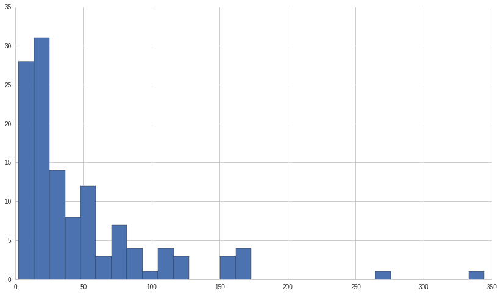


```python
plt.subplot(2, 4, 1)
y = q1.close_price
x = q1.return_3m
plt.scatter(x, y)
plt.xlabel('Return')
plt.ylabel('close_price')
```


    <matplotlib.text.Text at 0x7f3855b29910>


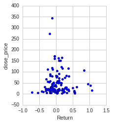


```python
tmp = q1.copy()
tmp.reset_index(inplace=True)
sym = tmp.level_1
```


```python
sym
```


    0        Equity(301 [ALKS])
    1        Equity(368 [AMGN])
    2        Equity(659 [AMAG])
    3        Equity(1297 [CBM])
    4       Equity(1406 [CELG])
    5        Equity(3150 [INO])
    6       Equity(3212 [GILD])
    7       Equity(3806 [BIIB])
    8       Equity(3885 [IMGN])
    9       Equity(3891 [IMMU])
    10      Equity(4031 [IONS])
    11      Equity(5847 [PDLI])
    12      Equity(6413 [REGN])
    13      Equity(6449 [RGEN])
    14      Equity(7373 [TECH])
    15      Equity(8045 [VRTX])
    16      Equity(8910 [ANIK])
    17     Equity(10187 [INCY])
    18     Equity(10417 [ARWR])
    19     Equity(10905 [BCRX])
    20     Equity(11512 [LJPC])
    21     Equity(12200 [LGND])
    22     Equity(13984 [TGTX])
    23     Equity(14112 [NVAX])
    24     Equity(14328 [ALXN])
    25     Equity(14972 [NBIX])
    26     Equity(16999 [SRPT])
    27     Equity(17908 [PGNX])
    28     Equity(20306 [UTHR])
    29     Equity(20330 [BMRN])
                   ...         
    94     Equity(46932 [TBPH])
    95     Equity(47332 [SAGE])
    96     Equity(47377 [PIRS])
    97     Equity(47432 [LOXO])
    98     Equity(47621 [AUPH])
    99     Equity(47845 [DERM])
    100    Equity(47901 [ATRA])
    101    Equity(47955 [CRBP])
    102    Equity(48026 [CHRS])
    103    Equity(48088 [FGEN])
    104    Equity(48547 [ONCE])
    105    Equity(48925 [ADRO])
    106    Equity(49000 [BPMC])
    107    Equity(49323 [AIMT])
    108     Equity(49335 [GBT])
    109    Equity(49409 [RGNX])
    110    Equity(49465 [ACRS])
    111    Equity(49470 [CTMX])
    112    Equity(49535 [MYOK])
    113    Equity(49572 [KURA])
    114    Equity(49579 [VYGR])
    115     Equity(49585 [WVE])
    116    Equity(49736 [EDIT])
    117    Equity(49751 [AVXS])
    118    Equity(49934 [NTLA])
    119    Equity(49995 [RETA])
    120    Equity(50135 [BOLD])
    121    Equity(50400 [CRSP])
    122    Equity(50616 [ANAB])
    123    Equity(50839 [BHVN])
    Name: level_1, dtype: object


```python
IOVA = get_pricing(sym, start_date='2018-01-01', end_date='2018-06-01', symbol_reference_date=None, frequency='daily', fields=None, handle_missing='raise', start_offset=0)
IOVA.close_price.pct_change()[1:].plot()

# plt.matshow(IOVA.close_price.pct_change()[1:].corr(method='spearman'))
```


    <matplotlib.axes._subplots.AxesSubplot at 0x7f384ca19c10>


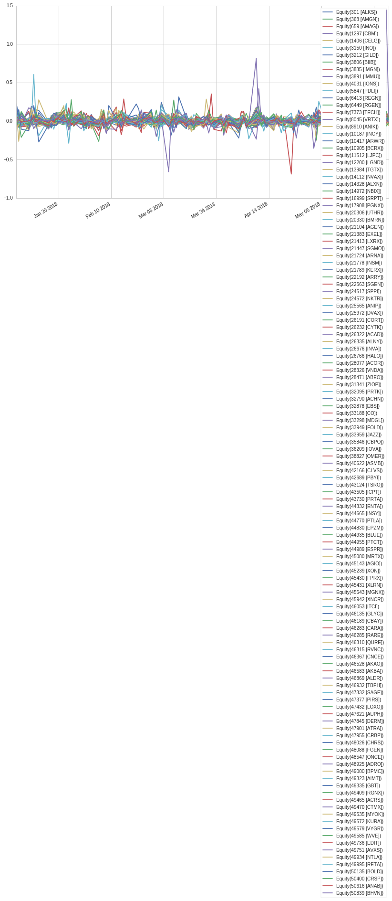


```python
price_change = IOVA.close_price.pct_change()[1:]
```


```python
price_change.describe().transpose().sort_values(by='max', ascending=False)
```

    /usr/local/lib/python2.7/dist-packages/numpy/lib/function_base.py:3834: RuntimeWarning: Invalid value encountered in percentile
      RuntimeWarning)


<div>
<table border="1" class="dataframe">
  <thead>
    <tr style="text-align: right;">
      <th></th>
      <th>count</th>
      <th>mean</th>
      <th>std</th>
      <th>min</th>
      <th>25%</th>
      <th>50%</th>
      <th>75%</th>
      <th>max</th>
    </tr>
  </thead>
  <tbody>
    <tr>
      <th>Equity(33298 [MDGL])</th>
      <td>104.0</td>
      <td>0.016224</td>
      <td>0.148237</td>
      <td>-0.108131</td>
      <td>-0.024854</td>
      <td>0.000997</td>
      <td>0.033853</td>
      <td>1.443676</td>
    </tr>
    <tr>
      <th>Equity(49751 [AVXS])</th>
      <td>91.0</td>
      <td>0.010212</td>
      <td>0.089236</td>
      <td>-0.103866</td>
      <td>NaN</td>
      <td>NaN</td>
      <td>NaN</td>
      <td>0.815249</td>
    </tr>
    <tr>
      <th>Equity(14112 [NVAX])</th>
      <td>104.0</td>
      <td>0.004193</td>
      <td>0.072398</td>
      <td>-0.189394</td>
      <td>-0.023256</td>
      <td>-0.005476</td>
      <td>0.023938</td>
      <td>0.606061</td>
    </tr>
    <tr>
      <th>Equity(46283 [CARA])</th>
      <td>104.0</td>
      <td>0.003045</td>
      <td>0.056178</td>
      <td>-0.084454</td>
      <td>-0.021855</td>
      <td>-0.004892</td>
      <td>0.019902</td>
      <td>0.428448</td>
    </tr>
    <tr>
      <th>Equity(24517 [SPPI])</th>
      <td>104.0</td>
      <td>0.001699</td>
      <td>0.056022</td>
      <td>-0.145567</td>
      <td>-0.023563</td>
      <td>-0.005166</td>
      <td>0.019874</td>
      <td>0.420855</td>
    </tr>
    <tr>
      <th>Equity(38827 [OMER])</th>
      <td>104.0</td>
      <td>0.002552</td>
      <td>0.068698</td>
      <td>-0.181669</td>
      <td>-0.027947</td>
      <td>-0.005120</td>
      <td>0.024089</td>
      <td>0.353952</td>
    </tr>
    <tr>
      <th>Equity(48026 [CHRS])</th>
      <td>104.0</td>
      <td>0.006141</td>
      <td>0.055222</td>
      <td>-0.090207</td>
      <td>-0.021267</td>
      <td>-0.004329</td>
      <td>0.024805</td>
      <td>0.314917</td>
    </tr>
    <tr>
      <th>Equity(659 [AMAG])</th>
      <td>104.0</td>
      <td>0.005757</td>
      <td>0.040403</td>
      <td>-0.070048</td>
      <td>-0.016074</td>
      <td>0.004349</td>
      <td>0.024481</td>
      <td>0.287770</td>
    </tr>
    <tr>
      <th>Equity(21724 [ARNA])</th>
      <td>104.0</td>
      <td>0.003706</td>
      <td>0.045747</td>
      <td>-0.106582</td>
      <td>-0.015657</td>
      <td>-0.001010</td>
      <td>0.022469</td>
      <td>0.286408</td>
    </tr>
    <tr>
      <th>Equity(36209 [IOVA])</th>
      <td>104.0</td>
      <td>0.006624</td>
      <td>0.046364</td>
      <td>-0.086387</td>
      <td>-0.016142</td>
      <td>0.005632</td>
      <td>0.029833</td>
      <td>0.278261</td>
    </tr>
    <tr>
      <th>Equity(47901 [ATRA])</th>
      <td>104.0</td>
      <td>0.011219</td>
      <td>0.055050</td>
      <td>-0.103261</td>
      <td>-0.025722</td>
      <td>0.003778</td>
      <td>0.038470</td>
      <td>0.277652</td>
    </tr>
    <tr>
      <th>Equity(49409 [RGNX])</th>
      <td>104.0</td>
      <td>0.005679</td>
      <td>0.055552</td>
      <td>-0.209929</td>
      <td>-0.022379</td>
      <td>0.001860</td>
      <td>0.028536</td>
      <td>0.274576</td>
    </tr>
    <tr>
      <th>Equity(44770 [PTLA])</th>
      <td>104.0</td>
      <td>-0.000610</td>
      <td>0.047028</td>
      <td>-0.254253</td>
      <td>-0.022113</td>
      <td>-0.001528</td>
      <td>0.017752</td>
      <td>0.256813</td>
    </tr>
    <tr>
      <th>Equity(45239 [XON])</th>
      <td>104.0</td>
      <td>0.003004</td>
      <td>0.046277</td>
      <td>-0.195489</td>
      <td>-0.019217</td>
      <td>-0.001559</td>
      <td>0.025337</td>
      <td>0.246434</td>
    </tr>
    <tr>
      <th>Equity(10417 [ARWR])</th>
      <td>104.0</td>
      <td>0.011651</td>
      <td>0.052011</td>
      <td>-0.076271</td>
      <td>-0.021554</td>
      <td>0.001415</td>
      <td>0.027309</td>
      <td>0.244295</td>
    </tr>
    <tr>
      <th>Equity(3150 [INO])</th>
      <td>104.0</td>
      <td>0.000637</td>
      <td>0.038244</td>
      <td>-0.102113</td>
      <td>-0.019469</td>
      <td>0.002247</td>
      <td>0.016885</td>
      <td>0.229437</td>
    </tr>
    <tr>
      <th>Equity(49579 [VYGR])</th>
      <td>104.0</td>
      <td>0.002612</td>
      <td>0.050036</td>
      <td>-0.118822</td>
      <td>-0.028922</td>
      <td>0.004198</td>
      <td>0.027770</td>
      <td>0.222969</td>
    </tr>
    <tr>
      <th>Equity(50135 [BOLD])</th>
      <td>104.0</td>
      <td>0.002239</td>
      <td>0.050057</td>
      <td>-0.124522</td>
      <td>-0.023236</td>
      <td>-0.003504</td>
      <td>0.023799</td>
      <td>0.220209</td>
    </tr>
    <tr>
      <th>Equity(24572 [NKTR])</th>
      <td>104.0</td>
      <td>0.005290</td>
      <td>0.045263</td>
      <td>-0.076250</td>
      <td>-0.021744</td>
      <td>0.000146</td>
      <td>0.019408</td>
      <td>0.216060</td>
    </tr>
    <tr>
      <th>Equity(46053 [ITCI])</th>
      <td>104.0</td>
      <td>0.004584</td>
      <td>0.039056</td>
      <td>-0.079335</td>
      <td>-0.015854</td>
      <td>0.000843</td>
      <td>0.020371</td>
      <td>0.208426</td>
    </tr>
    <tr>
      <th>Equity(47432 [LOXO])</th>
      <td>104.0</td>
      <td>0.008138</td>
      <td>0.038669</td>
      <td>-0.076006</td>
      <td>-0.011312</td>
      <td>0.003157</td>
      <td>0.028814</td>
      <td>0.204992</td>
    </tr>
    <tr>
      <th>Equity(47377 [PIRS])</th>
      <td>104.0</td>
      <td>-0.001989</td>
      <td>0.038314</td>
      <td>-0.085052</td>
      <td>-0.021850</td>
      <td>-0.001622</td>
      <td>0.014405</td>
      <td>0.203081</td>
    </tr>
    <tr>
      <th>Equity(44830 [EPZM])</th>
      <td>104.0</td>
      <td>0.003860</td>
      <td>0.046094</td>
      <td>-0.153595</td>
      <td>-0.019151</td>
      <td>0.004290</td>
      <td>0.028416</td>
      <td>0.201613</td>
    </tr>
    <tr>
      <th>Equity(31341 [ZIOP])</th>
      <td>104.0</td>
      <td>0.001774</td>
      <td>0.042698</td>
      <td>-0.076233</td>
      <td>-0.024300</td>
      <td>-0.002109</td>
      <td>0.019601</td>
      <td>0.201170</td>
    </tr>
    <tr>
      <th>Equity(49335 [GBT])</th>
      <td>104.0</td>
      <td>0.002552</td>
      <td>0.042177</td>
      <td>-0.083938</td>
      <td>-0.022232</td>
      <td>0.002004</td>
      <td>0.025826</td>
      <td>0.189394</td>
    </tr>
    <tr>
      <th>Equity(22192 [ARRY])</th>
      <td>104.0</td>
      <td>0.002862</td>
      <td>0.037843</td>
      <td>-0.083912</td>
      <td>-0.022516</td>
      <td>0.001615</td>
      <td>0.018435</td>
      <td>0.185976</td>
    </tr>
    <tr>
      <th>Equity(3885 [IMGN])</th>
      <td>104.0</td>
      <td>0.005734</td>
      <td>0.042799</td>
      <td>-0.149150</td>
      <td>-0.016672</td>
      <td>0.005956</td>
      <td>0.028485</td>
      <td>0.184063</td>
    </tr>
    <tr>
      <th>Equity(28471 [ABEO])</th>
      <td>104.0</td>
      <td>0.001692</td>
      <td>0.056063</td>
      <td>-0.151046</td>
      <td>-0.034057</td>
      <td>0.001075</td>
      <td>0.033879</td>
      <td>0.181495</td>
    </tr>
    <tr>
      <th>Equity(25972 [DVAX])</th>
      <td>104.0</td>
      <td>-0.000646</td>
      <td>0.039955</td>
      <td>-0.136951</td>
      <td>-0.026806</td>
      <td>0.000000</td>
      <td>0.023182</td>
      <td>0.174455</td>
    </tr>
    <tr>
      <th>Equity(46869 [ALDR])</th>
      <td>104.0</td>
      <td>0.004585</td>
      <td>0.041985</td>
      <td>-0.154412</td>
      <td>-0.020690</td>
      <td>0.000000</td>
      <td>0.025822</td>
      <td>0.173745</td>
    </tr>
    <tr>
      <th>...</th>
      <td>...</td>
      <td>...</td>
      <td>...</td>
      <td>...</td>
      <td>...</td>
      <td>...</td>
      <td>...</td>
      <td>...</td>
    </tr>
    <tr>
      <th>Equity(21383 [EXEL])</th>
      <td>104.0</td>
      <td>-0.003469</td>
      <td>0.034070</td>
      <td>-0.144767</td>
      <td>-0.019419</td>
      <td>-0.004390</td>
      <td>0.013758</td>
      <td>0.078080</td>
    </tr>
    <tr>
      <th>Equity(20306 [UTHR])</th>
      <td>104.0</td>
      <td>-0.003075</td>
      <td>0.024650</td>
      <td>-0.095362</td>
      <td>-0.017313</td>
      <td>-0.002223</td>
      <td>0.009150</td>
      <td>0.077732</td>
    </tr>
    <tr>
      <th>Equity(44332 [ENTA])</th>
      <td>104.0</td>
      <td>0.005567</td>
      <td>0.029135</td>
      <td>-0.160714</td>
      <td>-0.005442</td>
      <td>0.008614</td>
      <td>0.019035</td>
      <td>0.076961</td>
    </tr>
    <tr>
      <th>Equity(45942 [XNCR])</th>
      <td>104.0</td>
      <td>0.006160</td>
      <td>0.029764</td>
      <td>-0.081751</td>
      <td>-0.010680</td>
      <td>0.005757</td>
      <td>0.026019</td>
      <td>0.076845</td>
    </tr>
    <tr>
      <th>Equity(26191 [CORT])</th>
      <td>104.0</td>
      <td>0.001121</td>
      <td>0.041598</td>
      <td>-0.263853</td>
      <td>-0.020524</td>
      <td>0.007061</td>
      <td>0.027065</td>
      <td>0.075737</td>
    </tr>
    <tr>
      <th>Equity(46367 [CNCE])</th>
      <td>104.0</td>
      <td>-0.001935</td>
      <td>0.041913</td>
      <td>-0.270622</td>
      <td>-0.014821</td>
      <td>0.000000</td>
      <td>0.016598</td>
      <td>0.074215</td>
    </tr>
    <tr>
      <th>Equity(22563 [SGEN])</th>
      <td>104.0</td>
      <td>0.001210</td>
      <td>0.025052</td>
      <td>-0.053051</td>
      <td>-0.015685</td>
      <td>0.000077</td>
      <td>0.014165</td>
      <td>0.073614</td>
    </tr>
    <tr>
      <th>Equity(12200 [LGND])</th>
      <td>104.0</td>
      <td>0.003589</td>
      <td>0.021148</td>
      <td>-0.049233</td>
      <td>-0.009384</td>
      <td>0.004252</td>
      <td>0.018122</td>
      <td>0.073496</td>
    </tr>
    <tr>
      <th>Equity(4031 [IONS])</th>
      <td>103.0</td>
      <td>-0.000051</td>
      <td>0.031274</td>
      <td>-0.106016</td>
      <td>NaN</td>
      <td>NaN</td>
      <td>NaN</td>
      <td>0.073364</td>
    </tr>
    <tr>
      <th>Equity(26335 [ALNY])</th>
      <td>104.0</td>
      <td>-0.002180</td>
      <td>0.028464</td>
      <td>-0.151889</td>
      <td>-0.015847</td>
      <td>0.000320</td>
      <td>0.012400</td>
      <td>0.067278</td>
    </tr>
    <tr>
      <th>Equity(6413 [REGN])</th>
      <td>104.0</td>
      <td>-0.001897</td>
      <td>0.020635</td>
      <td>-0.057119</td>
      <td>-0.013422</td>
      <td>-0.001741</td>
      <td>0.011041</td>
      <td>0.062515</td>
    </tr>
    <tr>
      <th>Equity(33959 [JAZZ])</th>
      <td>104.0</td>
      <td>0.002244</td>
      <td>0.018009</td>
      <td>-0.037753</td>
      <td>-0.008341</td>
      <td>0.001470</td>
      <td>0.011050</td>
      <td>0.061702</td>
    </tr>
    <tr>
      <th>Equity(46583 [AKBA])</th>
      <td>104.0</td>
      <td>-0.003918</td>
      <td>0.028445</td>
      <td>-0.101796</td>
      <td>-0.024460</td>
      <td>-0.003555</td>
      <td>0.014092</td>
      <td>0.061100</td>
    </tr>
    <tr>
      <th>Equity(49323 [AIMT])</th>
      <td>104.0</td>
      <td>-0.000878</td>
      <td>0.029327</td>
      <td>-0.079201</td>
      <td>-0.017239</td>
      <td>0.002275</td>
      <td>0.017167</td>
      <td>0.059840</td>
    </tr>
    <tr>
      <th>Equity(25565 [ANIP])</th>
      <td>104.0</td>
      <td>-0.000633</td>
      <td>0.021736</td>
      <td>-0.091371</td>
      <td>-0.013786</td>
      <td>0.001972</td>
      <td>0.012258</td>
      <td>0.059742</td>
    </tr>
    <tr>
      <th>Equity(26766 [HALO])</th>
      <td>104.0</td>
      <td>-0.000435</td>
      <td>0.026924</td>
      <td>-0.090127</td>
      <td>-0.014789</td>
      <td>0.002019</td>
      <td>0.015522</td>
      <td>0.058445</td>
    </tr>
    <tr>
      <th>Equity(32878 [EBS])</th>
      <td>104.0</td>
      <td>0.000964</td>
      <td>0.019466</td>
      <td>-0.046521</td>
      <td>-0.013487</td>
      <td>0.001637</td>
      <td>0.012701</td>
      <td>0.058056</td>
    </tr>
    <tr>
      <th>Equity(45431 [XLRN])</th>
      <td>104.0</td>
      <td>-0.001345</td>
      <td>0.025668</td>
      <td>-0.074987</td>
      <td>-0.016449</td>
      <td>0.000000</td>
      <td>0.013296</td>
      <td>0.056725</td>
    </tr>
    <tr>
      <th>Equity(14972 [NBIX])</th>
      <td>104.0</td>
      <td>0.002382</td>
      <td>0.024306</td>
      <td>-0.065823</td>
      <td>-0.011059</td>
      <td>0.003823</td>
      <td>0.019461</td>
      <td>0.056045</td>
    </tr>
    <tr>
      <th>Equity(20330 [BMRN])</th>
      <td>104.0</td>
      <td>0.000301</td>
      <td>0.020489</td>
      <td>-0.054943</td>
      <td>-0.011720</td>
      <td>-0.000067</td>
      <td>0.012317</td>
      <td>0.055360</td>
    </tr>
    <tr>
      <th>Equity(46315 [RVNC])</th>
      <td>104.0</td>
      <td>-0.002194</td>
      <td>0.026974</td>
      <td>-0.100482</td>
      <td>-0.020522</td>
      <td>0.002215</td>
      <td>0.014015</td>
      <td>0.054889</td>
    </tr>
    <tr>
      <th>Equity(10187 [INCY])</th>
      <td>104.0</td>
      <td>-0.003267</td>
      <td>0.031340</td>
      <td>-0.229352</td>
      <td>-0.015238</td>
      <td>0.001148</td>
      <td>0.011588</td>
      <td>0.053243</td>
    </tr>
    <tr>
      <th>Equity(3212 [GILD])</th>
      <td>104.0</td>
      <td>-0.000537</td>
      <td>0.018703</td>
      <td>-0.078142</td>
      <td>-0.009146</td>
      <td>0.001752</td>
      <td>0.008462</td>
      <td>0.052723</td>
    </tr>
    <tr>
      <th>Equity(8045 [VRTX])</th>
      <td>104.0</td>
      <td>0.000130</td>
      <td>0.019142</td>
      <td>-0.065466</td>
      <td>-0.012307</td>
      <td>0.000808</td>
      <td>0.009778</td>
      <td>0.052658</td>
    </tr>
    <tr>
      <th>Equity(35846 [CBPO])</th>
      <td>104.0</td>
      <td>0.000915</td>
      <td>0.023252</td>
      <td>-0.101366</td>
      <td>-0.012314</td>
      <td>0.001557</td>
      <td>0.016167</td>
      <td>0.050929</td>
    </tr>
    <tr>
      <th>Equity(1297 [CBM])</th>
      <td>104.0</td>
      <td>-0.000949</td>
      <td>0.018610</td>
      <td>-0.105948</td>
      <td>-0.009215</td>
      <td>0.000000</td>
      <td>0.010487</td>
      <td>0.043762</td>
    </tr>
    <tr>
      <th>Equity(1406 [CELG])</th>
      <td>104.0</td>
      <td>-0.002627</td>
      <td>0.020078</td>
      <td>-0.090226</td>
      <td>-0.012218</td>
      <td>-0.002939</td>
      <td>0.009921</td>
      <td>0.041921</td>
    </tr>
    <tr>
      <th>Equity(7373 [TECH])</th>
      <td>104.0</td>
      <td>0.001448</td>
      <td>0.012952</td>
      <td>-0.041316</td>
      <td>-0.003311</td>
      <td>0.002101</td>
      <td>0.007464</td>
      <td>0.040595</td>
    </tr>
    <tr>
      <th>Equity(3806 [BIIB])</th>
      <td>104.0</td>
      <td>-0.000966</td>
      <td>0.018199</td>
      <td>-0.066562</td>
      <td>-0.009653</td>
      <td>-0.000056</td>
      <td>0.010632</td>
      <td>0.039863</td>
    </tr>
    <tr>
      <th>Equity(368 [AMGN])</th>
      <td>104.0</td>
      <td>0.000634</td>
      <td>0.016369</td>
      <td>-0.066037</td>
      <td>-0.005560</td>
      <td>0.001248</td>
      <td>0.010431</td>
      <td>0.033997</td>
    </tr>
  </tbody>
</table>
<p>124 rows  8 columns</p>
</div>


```python
price_change.hist(bins=50)
plt.subplots_adjust(left=None, bottom=0.9, right=None, top=2.9, wspace=None, hspace=None)
```


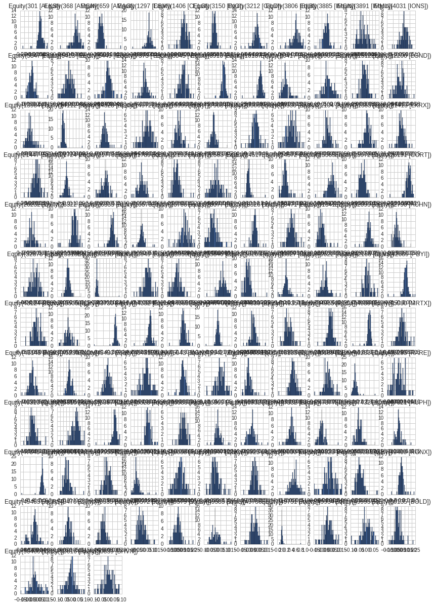


```python
price_change.loc[:, price_change.columns == symbols('SRPT')].plot()
```


    <matplotlib.axes._subplots.AxesSubplot at 0x7f384c97c350>


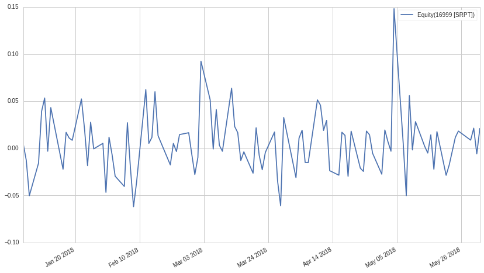


```python
# print(price_change[price_change > 0.1])
# index, row in df.iterrows():
# for index, row in price_change.iterrows():
#     print('Index', i)
#     print('Row', row[i])
    
for date, row in price_change[price_change > 0.1].T.iteritems():
#     print('Row', row)
    for i, v in row.iteritems(): 
        if v > 0.1:
#             print('Date', date)
#             print(i, v)
            
            plt.figure()
            plt.subplot(2,3,1)
            s = get_pricing(i, start_date=date, end_date=date, symbol_reference_date=None, frequency='minute', fields=None, handle_missing='raise', start_offset=0)
            s.index.tz = 'US/Eastern'
            s.close_price.plot()
            plt.title(v)
            
            plt.subplot(2,3,2)
            s.close_price.pct_change()[1:].plot()
            
            plt.subplot(2,3,3)
            change = (s.close_price[:] - s.close_price[0]) / s.close_price[0]
            change.plot()
```


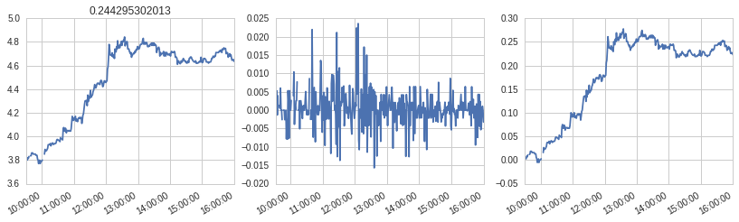


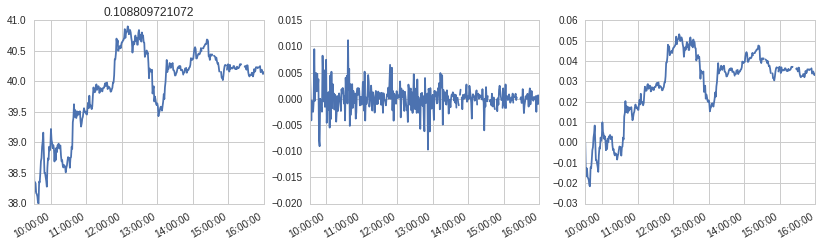


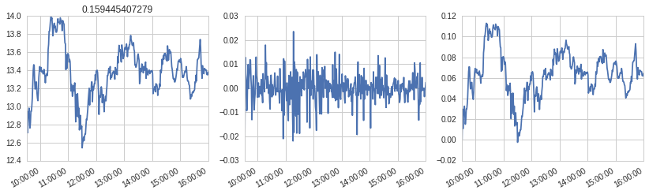


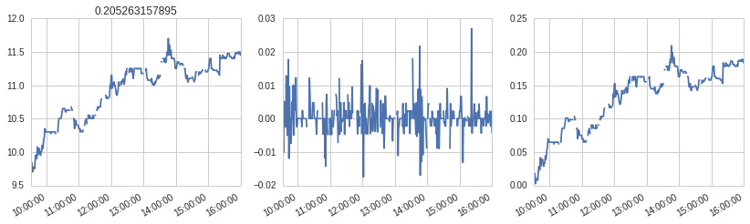


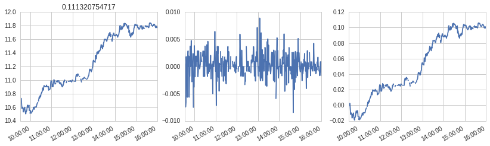


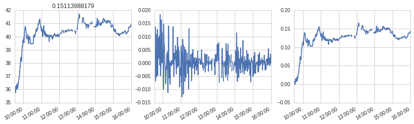


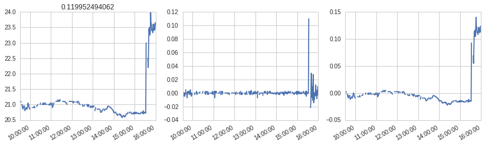


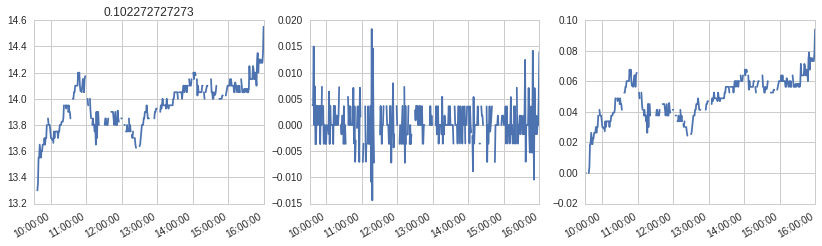


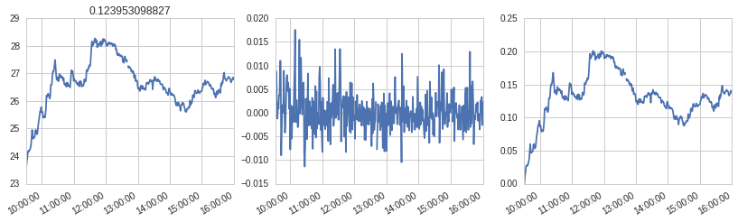


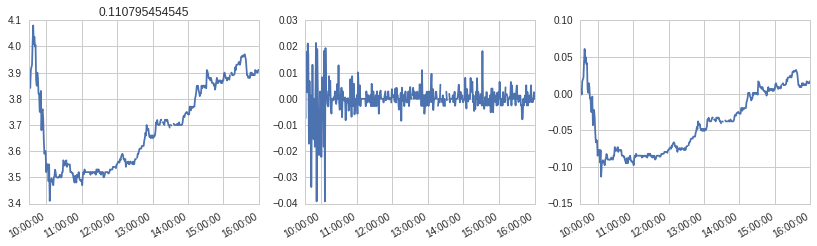


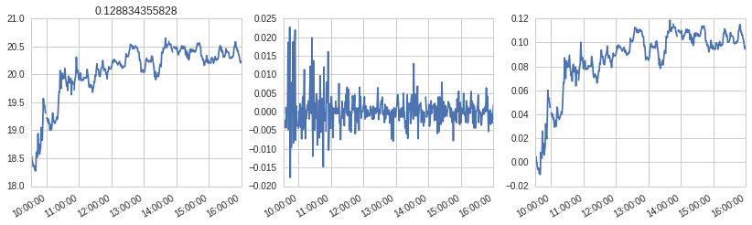


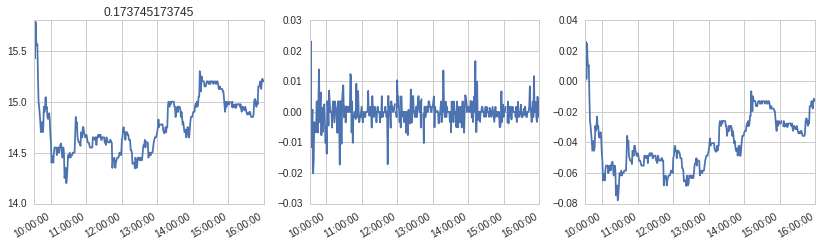


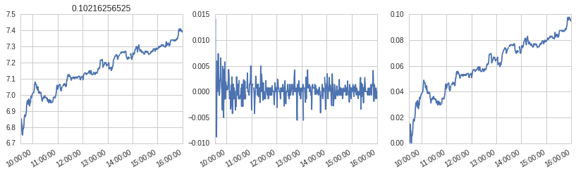


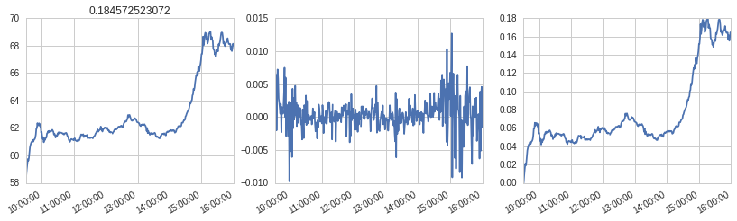


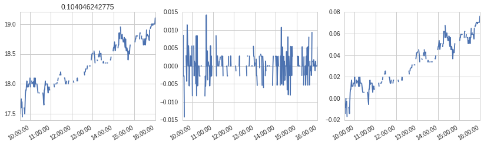


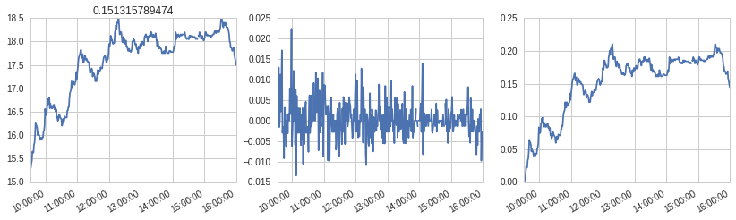


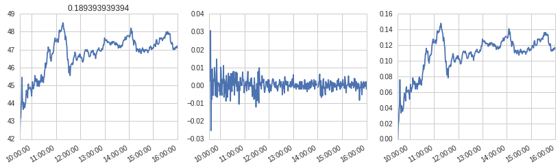


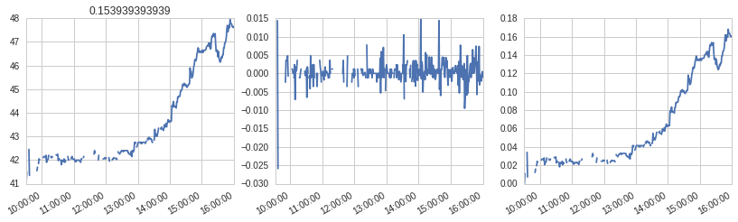


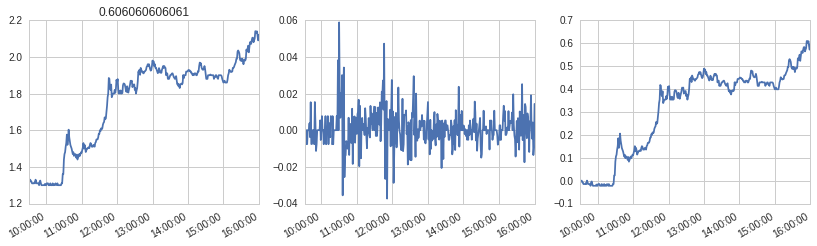


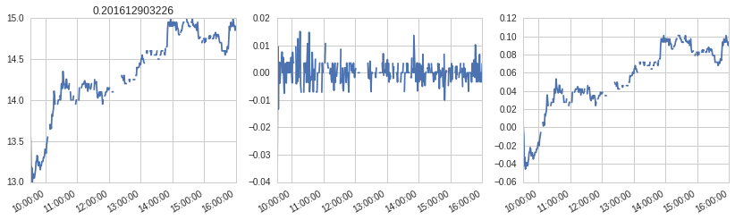


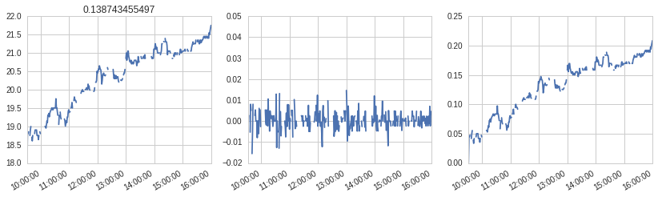


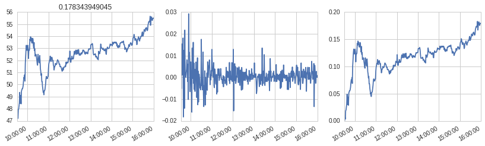


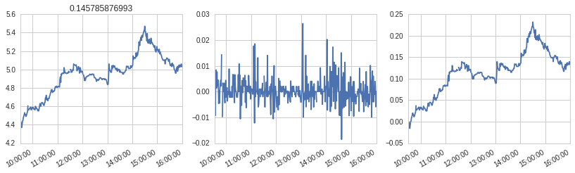


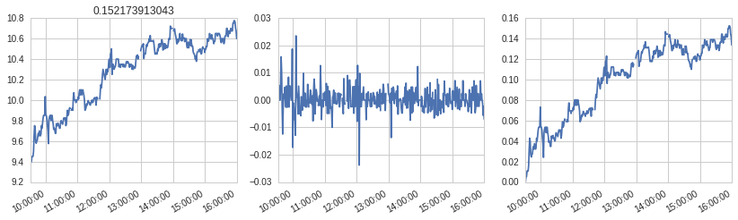


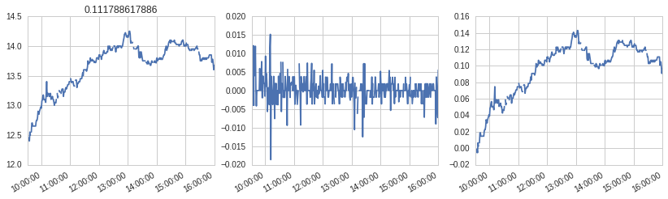


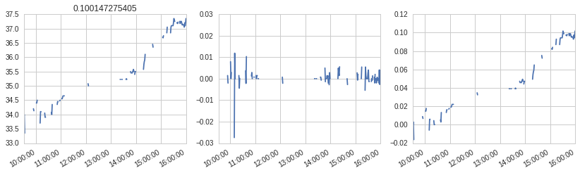


```python
ARWR = get_pricing('SRPT', start_date='2018-05-04', end_date='2018-05-05', symbol_reference_date=None, frequency='minute', fields=None, handle_missing='raise', start_offset=0)
ARWR.index.tz = 'US/Eastern'
ARWR.close_price.plot()
```


    <matplotlib.axes._subplots.AxesSubplot at 0x7f8c3cfc23d0>


```python
ARWR_price_change = ARWR.close_price.pct_change()[1:]
ARWR_price_change.plot()
```


    <matplotlib.axes._subplots.AxesSubplot at 0x7febc47d7650>


```python
ARWR_price_change.dropna().describe()
```


    count    259.000000
    mean       0.000102
    std        0.004410
    min       -0.017751
    25%        0.000000
    50%        0.000000
    75%        0.001445
    max        0.018072
    Name: close_price, dtype: float64


```python
prices = get_pricing('SRPT', start_date='2018-01-01', end_date='2018-05-30', symbol_reference_date=None, frequency='minute', fields=None, handle_missing='raise', start_offset=0)
prices.index.tz = 'US/Eastern'
prices.close_price.plot()
```


    <matplotlib.axes._subplots.AxesSubplot at 0x7f3834867f10>


```python
plt.subplot(2,3,1)
prices.close_price.plot()

plt.subplot(2,3,2)
prices.close_price.pct_change()[1:].plot()

plt.subplot(2,3,3)
change = (prices.close_price[:] - prices.close_price[0]) / prices.close_price[0]
change.plot()
```


    <matplotlib.axes._subplots.AxesSubplot at 0x7f3845bc9c10>


```python
prices
```


<div>
<table border="1" class="dataframe">
  <thead>
    <tr style="text-align: right;">
      <th></th>
      <th>open_price</th>
      <th>high</th>
      <th>low</th>
      <th>close_price</th>
      <th>volume</th>
      <th>price</th>
    </tr>
  </thead>
  <tbody>
    <tr>
      <th>2018-01-02 09:31:00-05:00</th>
      <td>55.870</td>
      <td>55.990</td>
      <td>55.630</td>
      <td>55.680</td>
      <td>11542.0</td>
      <td>55.680</td>
    </tr>
    <tr>
      <th>2018-01-02 09:32:00-05:00</th>
      <td>55.640</td>
      <td>55.640</td>
      <td>55.490</td>
      <td>55.510</td>
      <td>2000.0</td>
      <td>55.510</td>
    </tr>
    <tr>
      <th>2018-01-02 09:33:00-05:00</th>
      <td>55.485</td>
      <td>55.540</td>
      <td>55.472</td>
      <td>55.540</td>
      <td>2400.0</td>
      <td>55.540</td>
    </tr>
    <tr>
      <th>2018-01-02 09:34:00-05:00</th>
      <td>55.540</td>
      <td>55.710</td>
      <td>55.181</td>
      <td>55.410</td>
      <td>5643.0</td>
      <td>55.410</td>
    </tr>
    <tr>
      <th>2018-01-02 09:35:00-05:00</th>
      <td>55.195</td>
      <td>55.195</td>
      <td>55.120</td>
      <td>55.120</td>
      <td>50300.0</td>
      <td>55.120</td>
    </tr>
    <tr>
      <th>2018-01-02 09:36:00-05:00</th>
      <td>55.270</td>
      <td>55.280</td>
      <td>55.240</td>
      <td>55.280</td>
      <td>500.0</td>
      <td>55.280</td>
    </tr>
    <tr>
      <th>2018-01-02 09:37:00-05:00</th>
      <td>55.275</td>
      <td>55.560</td>
      <td>55.275</td>
      <td>55.550</td>
      <td>2700.0</td>
      <td>55.550</td>
    </tr>
    <tr>
      <th>2018-01-02 09:38:00-05:00</th>
      <td>55.640</td>
      <td>55.780</td>
      <td>55.510</td>
      <td>55.600</td>
      <td>6800.0</td>
      <td>55.600</td>
    </tr>
    <tr>
      <th>2018-01-02 09:39:00-05:00</th>
      <td>55.510</td>
      <td>55.510</td>
      <td>55.290</td>
      <td>55.319</td>
      <td>1700.0</td>
      <td>55.319</td>
    </tr>
    <tr>
      <th>2018-01-02 09:40:00-05:00</th>
      <td>55.300</td>
      <td>55.300</td>
      <td>55.290</td>
      <td>55.290</td>
      <td>1241.0</td>
      <td>55.290</td>
    </tr>
    <tr>
      <th>2018-01-02 09:41:00-05:00</th>
      <td>55.300</td>
      <td>55.440</td>
      <td>55.300</td>
      <td>55.440</td>
      <td>4100.0</td>
      <td>55.440</td>
    </tr>
    <tr>
      <th>2018-01-02 09:42:00-05:00</th>
      <td>55.530</td>
      <td>55.680</td>
      <td>55.530</td>
      <td>55.670</td>
      <td>9500.0</td>
      <td>55.670</td>
    </tr>
    <tr>
      <th>2018-01-02 09:43:00-05:00</th>
      <td>55.640</td>
      <td>55.730</td>
      <td>55.613</td>
      <td>55.650</td>
      <td>4600.0</td>
      <td>55.650</td>
    </tr>
    <tr>
      <th>2018-01-02 09:44:00-05:00</th>
      <td>55.641</td>
      <td>55.641</td>
      <td>55.580</td>
      <td>55.640</td>
      <td>1899.0</td>
      <td>55.640</td>
    </tr>
    <tr>
      <th>2018-01-02 09:45:00-05:00</th>
      <td>55.590</td>
      <td>55.630</td>
      <td>55.520</td>
      <td>55.520</td>
      <td>1900.0</td>
      <td>55.520</td>
    </tr>
    <tr>
      <th>2018-01-02 09:46:00-05:00</th>
      <td>55.500</td>
      <td>55.600</td>
      <td>55.500</td>
      <td>55.600</td>
      <td>3809.0</td>
      <td>55.600</td>
    </tr>
    <tr>
      <th>2018-01-02 09:47:00-05:00</th>
      <td>55.570</td>
      <td>55.600</td>
      <td>55.540</td>
      <td>55.540</td>
      <td>3900.0</td>
      <td>55.540</td>
    </tr>
    <tr>
      <th>2018-01-02 09:48:00-05:00</th>
      <td>55.500</td>
      <td>55.526</td>
      <td>55.500</td>
      <td>55.526</td>
      <td>310.0</td>
      <td>55.526</td>
    </tr>
    <tr>
      <th>2018-01-02 09:49:00-05:00</th>
      <td>55.500</td>
      <td>55.530</td>
      <td>55.445</td>
      <td>55.500</td>
      <td>17428.0</td>
      <td>55.500</td>
    </tr>
    <tr>
      <th>2018-01-02 09:50:00-05:00</th>
      <td>55.450</td>
      <td>55.450</td>
      <td>55.450</td>
      <td>55.450</td>
      <td>700.0</td>
      <td>55.450</td>
    </tr>
    <tr>
      <th>2018-01-02 09:51:00-05:00</th>
      <td>55.465</td>
      <td>55.530</td>
      <td>55.465</td>
      <td>55.500</td>
      <td>4200.0</td>
      <td>55.500</td>
    </tr>
    <tr>
      <th>2018-01-02 09:52:00-05:00</th>
      <td>55.500</td>
      <td>55.500</td>
      <td>55.500</td>
      <td>55.500</td>
      <td>300.0</td>
      <td>55.500</td>
    </tr>
    <tr>
      <th>2018-01-02 09:53:00-05:00</th>
      <td>55.500</td>
      <td>55.500</td>
      <td>55.500</td>
      <td>55.500</td>
      <td>700.0</td>
      <td>55.500</td>
    </tr>
    <tr>
      <th>2018-01-02 09:54:00-05:00</th>
      <td>55.460</td>
      <td>55.515</td>
      <td>55.430</td>
      <td>55.515</td>
      <td>6700.0</td>
      <td>55.515</td>
    </tr>
    <tr>
      <th>2018-01-02 09:55:00-05:00</th>
      <td>55.515</td>
      <td>55.515</td>
      <td>55.450</td>
      <td>55.455</td>
      <td>24100.0</td>
      <td>55.455</td>
    </tr>
    <tr>
      <th>2018-01-02 09:56:00-05:00</th>
      <td>55.450</td>
      <td>55.495</td>
      <td>55.440</td>
      <td>55.440</td>
      <td>24000.0</td>
      <td>55.440</td>
    </tr>
    <tr>
      <th>2018-01-02 09:57:00-05:00</th>
      <td>NaN</td>
      <td>NaN</td>
      <td>NaN</td>
      <td>NaN</td>
      <td>0.0</td>
      <td>55.440</td>
    </tr>
    <tr>
      <th>2018-01-02 09:58:00-05:00</th>
      <td>55.480</td>
      <td>55.560</td>
      <td>55.480</td>
      <td>55.540</td>
      <td>1300.0</td>
      <td>55.540</td>
    </tr>
    <tr>
      <th>2018-01-02 09:59:00-05:00</th>
      <td>55.570</td>
      <td>55.570</td>
      <td>55.430</td>
      <td>55.440</td>
      <td>2400.0</td>
      <td>55.440</td>
    </tr>
    <tr>
      <th>2018-01-02 10:00:00-05:00</th>
      <td>55.465</td>
      <td>55.495</td>
      <td>55.440</td>
      <td>55.495</td>
      <td>425.0</td>
      <td>55.495</td>
    </tr>
    <tr>
      <th>...</th>
      <td>...</td>
      <td>...</td>
      <td>...</td>
      <td>...</td>
      <td>...</td>
      <td>...</td>
    </tr>
    <tr>
      <th>2018-05-30 15:31:00-04:00</th>
      <td>94.540</td>
      <td>94.590</td>
      <td>94.518</td>
      <td>94.550</td>
      <td>1738.0</td>
      <td>94.550</td>
    </tr>
    <tr>
      <th>2018-05-30 15:32:00-04:00</th>
      <td>94.545</td>
      <td>94.550</td>
      <td>94.410</td>
      <td>94.550</td>
      <td>4025.0</td>
      <td>94.550</td>
    </tr>
    <tr>
      <th>2018-05-30 15:33:00-04:00</th>
      <td>94.507</td>
      <td>94.507</td>
      <td>94.500</td>
      <td>94.500</td>
      <td>300.0</td>
      <td>94.500</td>
    </tr>
    <tr>
      <th>2018-05-30 15:34:00-04:00</th>
      <td>94.530</td>
      <td>94.530</td>
      <td>94.480</td>
      <td>94.505</td>
      <td>4400.0</td>
      <td>94.505</td>
    </tr>
    <tr>
      <th>2018-05-30 15:35:00-04:00</th>
      <td>94.530</td>
      <td>94.540</td>
      <td>94.500</td>
      <td>94.530</td>
      <td>1461.0</td>
      <td>94.530</td>
    </tr>
    <tr>
      <th>2018-05-30 15:36:00-04:00</th>
      <td>94.520</td>
      <td>94.560</td>
      <td>94.480</td>
      <td>94.500</td>
      <td>2400.0</td>
      <td>94.500</td>
    </tr>
    <tr>
      <th>2018-05-30 15:37:00-04:00</th>
      <td>94.460</td>
      <td>94.540</td>
      <td>94.410</td>
      <td>94.500</td>
      <td>3950.0</td>
      <td>94.500</td>
    </tr>
    <tr>
      <th>2018-05-30 15:38:00-04:00</th>
      <td>94.490</td>
      <td>94.540</td>
      <td>94.490</td>
      <td>94.500</td>
      <td>2942.0</td>
      <td>94.500</td>
    </tr>
    <tr>
      <th>2018-05-30 15:39:00-04:00</th>
      <td>94.490</td>
      <td>94.520</td>
      <td>94.470</td>
      <td>94.485</td>
      <td>4562.0</td>
      <td>94.485</td>
    </tr>
    <tr>
      <th>2018-05-30 15:40:00-04:00</th>
      <td>94.490</td>
      <td>94.520</td>
      <td>94.450</td>
      <td>94.450</td>
      <td>2700.0</td>
      <td>94.450</td>
    </tr>
    <tr>
      <th>2018-05-30 15:41:00-04:00</th>
      <td>94.470</td>
      <td>94.490</td>
      <td>94.370</td>
      <td>94.370</td>
      <td>4000.0</td>
      <td>94.370</td>
    </tr>
    <tr>
      <th>2018-05-30 15:42:00-04:00</th>
      <td>94.410</td>
      <td>94.460</td>
      <td>94.410</td>
      <td>94.450</td>
      <td>1800.0</td>
      <td>94.450</td>
    </tr>
    <tr>
      <th>2018-05-30 15:43:00-04:00</th>
      <td>94.450</td>
      <td>94.480</td>
      <td>94.420</td>
      <td>94.435</td>
      <td>2500.0</td>
      <td>94.435</td>
    </tr>
    <tr>
      <th>2018-05-30 15:44:00-04:00</th>
      <td>94.430</td>
      <td>94.430</td>
      <td>94.330</td>
      <td>94.330</td>
      <td>1733.0</td>
      <td>94.330</td>
    </tr>
    <tr>
      <th>2018-05-30 15:45:00-04:00</th>
      <td>94.390</td>
      <td>94.410</td>
      <td>94.320</td>
      <td>94.320</td>
      <td>1700.0</td>
      <td>94.320</td>
    </tr>
    <tr>
      <th>2018-05-30 15:46:00-04:00</th>
      <td>94.300</td>
      <td>94.340</td>
      <td>94.280</td>
      <td>94.320</td>
      <td>1560.0</td>
      <td>94.320</td>
    </tr>
    <tr>
      <th>2018-05-30 15:47:00-04:00</th>
      <td>94.320</td>
      <td>94.320</td>
      <td>94.255</td>
      <td>94.255</td>
      <td>1500.0</td>
      <td>94.255</td>
    </tr>
    <tr>
      <th>2018-05-30 15:48:00-04:00</th>
      <td>94.255</td>
      <td>94.280</td>
      <td>94.160</td>
      <td>94.160</td>
      <td>3300.0</td>
      <td>94.160</td>
    </tr>
    <tr>
      <th>2018-05-30 15:49:00-04:00</th>
      <td>94.160</td>
      <td>94.220</td>
      <td>94.140</td>
      <td>94.140</td>
      <td>1700.0</td>
      <td>94.140</td>
    </tr>
    <tr>
      <th>2018-05-30 15:50:00-04:00</th>
      <td>94.140</td>
      <td>94.320</td>
      <td>94.140</td>
      <td>94.240</td>
      <td>3823.0</td>
      <td>94.240</td>
    </tr>
    <tr>
      <th>2018-05-30 15:51:00-04:00</th>
      <td>94.320</td>
      <td>94.430</td>
      <td>94.300</td>
      <td>94.350</td>
      <td>1650.0</td>
      <td>94.350</td>
    </tr>
    <tr>
      <th>2018-05-30 15:52:00-04:00</th>
      <td>94.350</td>
      <td>94.350</td>
      <td>94.200</td>
      <td>94.245</td>
      <td>3303.0</td>
      <td>94.245</td>
    </tr>
    <tr>
      <th>2018-05-30 15:53:00-04:00</th>
      <td>94.245</td>
      <td>94.300</td>
      <td>94.230</td>
      <td>94.300</td>
      <td>1638.0</td>
      <td>94.300</td>
    </tr>
    <tr>
      <th>2018-05-30 15:54:00-04:00</th>
      <td>94.300</td>
      <td>94.480</td>
      <td>94.280</td>
      <td>94.480</td>
      <td>3025.0</td>
      <td>94.480</td>
    </tr>
    <tr>
      <th>2018-05-30 15:55:00-04:00</th>
      <td>94.480</td>
      <td>94.480</td>
      <td>94.360</td>
      <td>94.370</td>
      <td>3740.0</td>
      <td>94.370</td>
    </tr>
    <tr>
      <th>2018-05-30 15:56:00-04:00</th>
      <td>94.390</td>
      <td>94.490</td>
      <td>94.340</td>
      <td>94.490</td>
      <td>4112.0</td>
      <td>94.490</td>
    </tr>
    <tr>
      <th>2018-05-30 15:57:00-04:00</th>
      <td>94.450</td>
      <td>94.460</td>
      <td>94.310</td>
      <td>94.310</td>
      <td>3100.0</td>
      <td>94.310</td>
    </tr>
    <tr>
      <th>2018-05-30 15:58:00-04:00</th>
      <td>94.311</td>
      <td>94.500</td>
      <td>94.311</td>
      <td>94.440</td>
      <td>4898.0</td>
      <td>94.440</td>
    </tr>
    <tr>
      <th>2018-05-30 15:59:00-04:00</th>
      <td>94.440</td>
      <td>94.520</td>
      <td>94.420</td>
      <td>94.490</td>
      <td>12141.0</td>
      <td>94.490</td>
    </tr>
    <tr>
      <th>2018-05-30 16:00:00-04:00</th>
      <td>94.500</td>
      <td>94.560</td>
      <td>94.430</td>
      <td>94.430</td>
      <td>11107.0</td>
      <td>94.430</td>
    </tr>
  </tbody>
</table>
<p>40170 rows  6 columns</p>
</div>


```python
for index, row in prices.iterrows():
    print index
```


    

    TypeErrorTraceback (most recent call last)

    <ipython-input-50-0247e3f2b3de> in <module>()
    ----> 1 for index, row in prices.iterrows():
          2     print index


    /usr/local/lib/python2.7/dist-packages/pandas/core/frame.pyc in iterrows(self)
        653         """
        654         columns = self.columns
    --> 655         for k, v in zip(self.index, self.values):
        656             s = Series(v, index=columns, name=k)
        657             yield k, s


    /usr/local/lib/python2.7/dist-packages/pandas/tseries/index.pyc in __iter__(self)
       1183             end_i = min((i + 1) * chunksize, l)
       1184             converted = tslib.ints_to_pydatetime(
    -> 1185                 data[start_i:end_i], tz=self.tz, offset=self.offset, box=True)
       1186             for v in converted:
       1187                 yield v


    pandas/tslib.pyx in pandas.tslib.ints_to_pydatetime (pandas/tslib.c:6711)()


    pandas/tslib.pyx in pandas.tslib.create_datetime_from_ts (pandas/tslib.c:6087)()


    TypeError: tzinfo argument must be None or of a tzinfo subclass, not type 'str'

