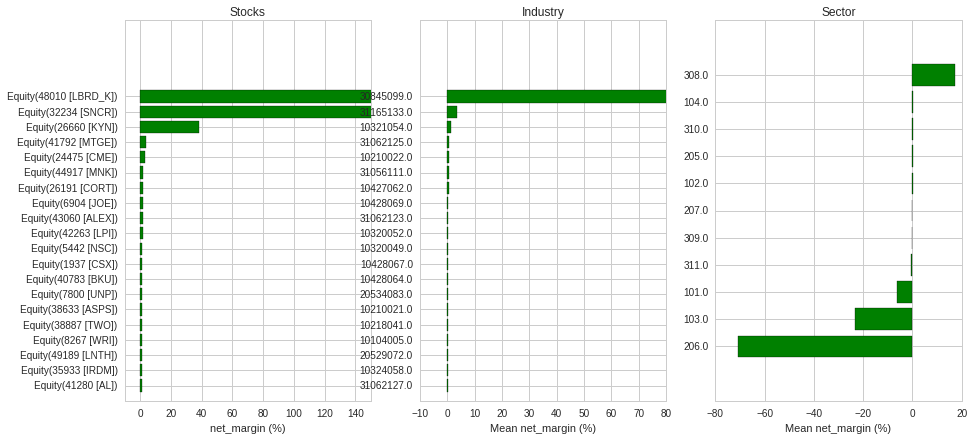

# Factor Ranking - Stock, Industry, Sector

ToDo
- Get Net Margin, industry, sector of all stocks
- Horizontal bar chart (3 in one row): 

1) Bar chart: stock factor
2) Calculate industry avg. factor, then group by industry avg.
3) sector avg. factor


```python
import numpy as np
import pandas as pd
import matplotlib.pyplot as plt
from collections import Counter
from quantopian.research import returns, symbols, run_pipeline, prices
from quantopian.pipeline import Pipeline, CustomFactor
from quantopian.pipeline.factors import Returns, AverageDollarVolume
from quantopian.pipeline.data import USEquityPricing, morningstar
from quantopian.pipeline.data.psychsignal import stocktwits
from quantopian.pipeline.experimental import QTradableStocksUS
from quantopian.pipeline.data.sentdex import sentiment_free
from quantopian.pipeline.data.psychsignal import stocktwits_free
from quantopian.pipeline.data.zacks import EarningsSurprises

import alphalens as al
```


```python
# Calculates the average impact of the sentiment over the window length
class AvgSentiment(CustomFactor):
    def compute(self, today, assets, out, impact):
        
        out[:] = np.mean(impact, axis=0, out=out)
        
class Industry(CustomFactor):
    inputs = [ morningstar.asset_classification.morningstar_industry_code ]
    window_length = 1
    def compute(self, today, assets, out, morningstar_industry_code):
        out[:] = morningstar_industry_code

class Industry_Group(CustomFactor):
    inputs = [ morningstar.asset_classification.morningstar_industry_group_code ]
    window_length = 1
    def compute(self, today, assets, out, morningstar_industry_group_code):
        out[:] = morningstar_industry_group_code
        
class Sector(CustomFactor):
    inputs = [ morningstar.asset_classification.morningstar_sector_code ]
    window_length = 1
    def compute(self, today, assets, out, sector):
        out[:] = sector
        
class SortinoRatio(CustomFactor):
    def compute(self, today, asset_ids, out, values):   
        prices= pd.DataFrame(data=values)
        daily_returns = prices.fillna(method='bfill').fillna(method='ffill').pct_change()[1:]
        # Negative daily returns
        daily_negative_returns = np.copy(daily_returns)
        daily_negative_returns[daily_negative_returns > 0] = 0
        # Mean
        mu = daily_returns.mean(axis=0)
        # Standard Deviation
        sigma = daily_negative_returns.std(axis=0)
        # Sortino Ratio
        sortino_ratio = mu / sigma
        sortino_ratio = sortino_ratio.replace(np.inf, np.nan)
        # sortino_ratio = np.where(sortino_ratio.isfinite(), sortino_ratio, np.nan)  
        # sortino_ratio = sortino_ratio.replace(np.nan, 0)

        out[:] = sortino_ratio

# Pipeline definition
def make_pipeline():

    pipe = Pipeline()
    
    universe = QTradableStocksUS()
    
    sector = Sector()
    pipe.add(sector, 'sector')

    industry_group = Industry_Group()
    pipe.add(industry_group, 'industry_group')

    industry = Industry()
    pipe.add(industry, 'industry')
    
    pipe.add(morningstar.operation_ratios.net_margin.latest, 'net_margin')

    pipe.set_screen(universe)
    
    return pipe
```


```python
# Select a time range to inspect
year = '2018'
q1_period_start = '{year}-03-31'.format(year=year)
q1_period_end = '{year}-03-31'.format(year=year)
q2_period_start = '{year}-06-30'.format(year=year)
q2_period_end = '{year}-06-30'.format(year=year)
q3_period_start = '{year}-09-30'.format(year=year)
q3_period_end = '{year}-09-30'.format(year=year)
q4_period_start = '{year}-12-31'.format(year=year)
q4_period_end = '{year}-12-31'.format(year=year)

# Pipeline execution
q1 = run_pipeline(make_pipeline() ,start_date=q1_period_start, end_date=q1_period_end)
# q2_pipeline_output = run_pipeline(make_pipeline() ,start_date=q2_period_start, end_date=q2_period_end)
# q3_pipeline_output = run_pipeline(make_pipeline() ,start_date=q3_period_start, end_date=q3_period_end)
# q4_pipeline_output = run_pipeline(make_pipeline() ,start_date=q4_period_start, end_date=q4_period_end)
```


```python
q1
```


<div>
<table border="1" class="dataframe">
  <thead>
    <tr style="text-align: right;">
      <th></th>
      <th></th>
      <th>industry</th>
      <th>industry_group</th>
      <th>net_margin</th>
      <th>sector</th>
    </tr>
  </thead>
  <tbody>
    <tr>
      <th rowspan="61" valign="top">2018-04-02 00:00:00+00:00</th>
      <th>Equity(2 [ARNC])</th>
      <td>31061119.0</td>
      <td>31061.0</td>
      <td>-0.222256</td>
      <td>310.0</td>
    </tr>
    <tr>
      <th>Equity(24 [AAPL])</th>
      <td>31167138.0</td>
      <td>31167.0</td>
      <td>0.227255</td>
      <td>311.0</td>
    </tr>
    <tr>
      <th>Equity(31 [ABAX])</th>
      <td>20640091.0</td>
      <td>20640.0</td>
      <td>0.070823</td>
      <td>206.0</td>
    </tr>
    <tr>
      <th>Equity(41 [ARCB])</th>
      <td>31062127.0</td>
      <td>31062.0</td>
      <td>0.051452</td>
      <td>310.0</td>
    </tr>
    <tr>
      <th>Equity(52 [ABM])</th>
      <td>31054109.0</td>
      <td>31054.0</td>
      <td>0.017503</td>
      <td>310.0</td>
    </tr>
    <tr>
      <th>Equity(53 [ABMD])</th>
      <td>20639090.0</td>
      <td>20639.0</td>
      <td>0.087299</td>
      <td>206.0</td>
    </tr>
    <tr>
      <th>Equity(62 [ABT])</th>
      <td>20639090.0</td>
      <td>20639.0</td>
      <td>-0.109105</td>
      <td>206.0</td>
    </tr>
    <tr>
      <th>Equity(64 [ABX])</th>
      <td>10106010.0</td>
      <td>10106.0</td>
      <td>-0.005519</td>
      <td>101.0</td>
    </tr>
    <tr>
      <th>Equity(67 [ADSK])</th>
      <td>31165133.0</td>
      <td>31165.0</td>
      <td>-0.313290</td>
      <td>311.0</td>
    </tr>
    <tr>
      <th>Equity(76 [TAP])</th>
      <td>20529071.0</td>
      <td>20529.0</td>
      <td>0.236316</td>
      <td>205.0</td>
    </tr>
    <tr>
      <th>Equity(110 [ACXM])</th>
      <td>31165132.0</td>
      <td>31165.0</td>
      <td>0.097675</td>
      <td>311.0</td>
    </tr>
    <tr>
      <th>Equity(114 [ADBE])</th>
      <td>31165133.0</td>
      <td>31165.0</td>
      <td>0.280467</td>
      <td>311.0</td>
    </tr>
    <tr>
      <th>Equity(122 [ADI])</th>
      <td>31169147.0</td>
      <td>31169.0</td>
      <td>0.175770</td>
      <td>311.0</td>
    </tr>
    <tr>
      <th>Equity(128 [ADM])</th>
      <td>20531075.0</td>
      <td>20531.0</td>
      <td>0.049035</td>
      <td>205.0</td>
    </tr>
    <tr>
      <th>Equity(154 [AEM])</th>
      <td>10106010.0</td>
      <td>10106.0</td>
      <td>0.062092</td>
      <td>101.0</td>
    </tr>
    <tr>
      <th>Equity(161 [AEP])</th>
      <td>20744096.0</td>
      <td>20744.0</td>
      <td>0.105160</td>
      <td>207.0</td>
    </tr>
    <tr>
      <th>Equity(166 [AES])</th>
      <td>20744095.0</td>
      <td>20744.0</td>
      <td>0.041850</td>
      <td>207.0</td>
    </tr>
    <tr>
      <th>Equity(185 [AFL])</th>
      <td>10324058.0</td>
      <td>10324.0</td>
      <td>0.476217</td>
      <td>103.0</td>
    </tr>
    <tr>
      <th>Equity(197 [AGCO])</th>
      <td>31059116.0</td>
      <td>31059.0</td>
      <td>0.017528</td>
      <td>310.0</td>
    </tr>
    <tr>
      <th>Equity(216 [HES])</th>
      <td>30947102.0</td>
      <td>30947.0</td>
      <td>-1.677480</td>
      <td>309.0</td>
    </tr>
    <tr>
      <th>Equity(239 [AIG])</th>
      <td>10323057.0</td>
      <td>10323.0</td>
      <td>-0.527107</td>
      <td>103.0</td>
    </tr>
    <tr>
      <th>Equity(247 [AIN])</th>
      <td>10211025.0</td>
      <td>10211.0</td>
      <td>0.025961</td>
      <td>102.0</td>
    </tr>
    <tr>
      <th>Equity(253 [AIR])</th>
      <td>31052107.0</td>
      <td>31052.0</td>
      <td>0.033531</td>
      <td>310.0</td>
    </tr>
    <tr>
      <th>Equity(266 [AJG])</th>
      <td>10321055.0</td>
      <td>10321.0</td>
      <td>0.065729</td>
      <td>103.0</td>
    </tr>
    <tr>
      <th>Equity(289 [MATX])</th>
      <td>31062126.0</td>
      <td>31062.0</td>
      <td>0.323387</td>
      <td>310.0</td>
    </tr>
    <tr>
      <th>Equity(300 [ALK])</th>
      <td>31053108.0</td>
      <td>31053.0</td>
      <td>0.190112</td>
      <td>310.0</td>
    </tr>
    <tr>
      <th>Equity(301 [ALKS])</th>
      <td>20635084.0</td>
      <td>20635.0</td>
      <td>-0.035549</td>
      <td>206.0</td>
    </tr>
    <tr>
      <th>Equity(311 [ALOG])</th>
      <td>20640091.0</td>
      <td>20640.0</td>
      <td>0.050700</td>
      <td>206.0</td>
    </tr>
    <tr>
      <th>Equity(337 [AMAT])</th>
      <td>31169145.0</td>
      <td>31169.0</td>
      <td>0.032112</td>
      <td>311.0</td>
    </tr>
    <tr>
      <th>Equity(351 [AMD])</th>
      <td>31169147.0</td>
      <td>31169.0</td>
      <td>0.041216</td>
      <td>311.0</td>
    </tr>
    <tr>
      <th>...</th>
      <td>...</td>
      <td>...</td>
      <td>...</td>
      <td>...</td>
    </tr>
    <tr>
      <th>Equity(50716 [DXC])</th>
      <td>31165132.0</td>
      <td>31165.0</td>
      <td>0.125445</td>
      <td>311.0</td>
    </tr>
    <tr>
      <th>Equity(50718 [PUMP])</th>
      <td>30951106.0</td>
      <td>30951.0</td>
      <td>0.032125</td>
      <td>309.0</td>
    </tr>
    <tr>
      <th>Equity(50735 [AYX])</th>
      <td>31165133.0</td>
      <td>31165.0</td>
      <td>-0.039883</td>
      <td>311.0</td>
    </tr>
    <tr>
      <th>Equity(50749 [BTU])</th>
      <td>10104005.0</td>
      <td>10104.0</td>
      <td>0.127414</td>
      <td>101.0</td>
    </tr>
    <tr>
      <th>Equity(50758 [OKTA])</th>
      <td>31165134.0</td>
      <td>31165.0</td>
      <td>-0.317402</td>
      <td>311.0</td>
    </tr>
    <tr>
      <th>Equity(50763 [SNDR])</th>
      <td>31062127.0</td>
      <td>31062.0</td>
      <td>0.238331</td>
      <td>310.0</td>
    </tr>
    <tr>
      <th>Equity(50779 [CADE])</th>
      <td>10320050.0</td>
      <td>10320.0</td>
      <td>0.129360</td>
      <td>103.0</td>
    </tr>
    <tr>
      <th>Equity(50780 [HCC])</th>
      <td>10104005.0</td>
      <td>10104.0</td>
      <td>0.405149</td>
      <td>101.0</td>
    </tr>
    <tr>
      <th>Equity(50781 [YEXT])</th>
      <td>31165134.0</td>
      <td>31165.0</td>
      <td>-0.353978</td>
      <td>311.0</td>
    </tr>
    <tr>
      <th>Equity(50782 [UPL])</th>
      <td>30947102.0</td>
      <td>30947.0</td>
      <td>0.397002</td>
      <td>309.0</td>
    </tr>
    <tr>
      <th>Equity(50789 [WTTR])</th>
      <td>31061121.0</td>
      <td>31061.0</td>
      <td>-0.031725</td>
      <td>310.0</td>
    </tr>
    <tr>
      <th>Equity(50798 [FND])</th>
      <td>10217035.0</td>
      <td>10217.0</td>
      <td>0.123173</td>
      <td>102.0</td>
    </tr>
    <tr>
      <th>Equity(50807 [CVNA])</th>
      <td>10217037.0</td>
      <td>10217.0</td>
      <td>-0.026851</td>
      <td>102.0</td>
    </tr>
    <tr>
      <th>Equity(50810 [CLDR])</th>
      <td>31165133.0</td>
      <td>31165.0</td>
      <td>-0.585160</td>
      <td>311.0</td>
    </tr>
    <tr>
      <th>Equity(50824 [BCEI])</th>
      <td>30947102.0</td>
      <td>30947.0</td>
      <td>0.095684</td>
      <td>309.0</td>
    </tr>
    <tr>
      <th>Equity(50839 [BHVN])</th>
      <td>20635084.0</td>
      <td>20635.0</td>
      <td>NaN</td>
      <td>206.0</td>
    </tr>
    <tr>
      <th>Equity(50860 [VST])</th>
      <td>20743094.0</td>
      <td>20743.0</td>
      <td>-0.136860</td>
      <td>207.0</td>
    </tr>
    <tr>
      <th>Equity(50869 [GDI])</th>
      <td>31167143.0</td>
      <td>31167.0</td>
      <td>0.215940</td>
      <td>311.0</td>
    </tr>
    <tr>
      <th>Equity(50870 [SOI])</th>
      <td>30951106.0</td>
      <td>30951.0</td>
      <td>0.083320</td>
      <td>309.0</td>
    </tr>
    <tr>
      <th>Equity(50891 [CARS])</th>
      <td>10209016.0</td>
      <td>10209.0</td>
      <td>0.969297</td>
      <td>102.0</td>
    </tr>
    <tr>
      <th>Equity(50900 [SGH])</th>
      <td>31169146.0</td>
      <td>31169.0</td>
      <td>0.117191</td>
      <td>311.0</td>
    </tr>
    <tr>
      <th>Equity(50902 [WOW])</th>
      <td>30845099.0</td>
      <td>30845.0</td>
      <td>0.287568</td>
      <td>308.0</td>
    </tr>
    <tr>
      <th>Equity(50903 [APPN])</th>
      <td>31165134.0</td>
      <td>31165.0</td>
      <td>-0.135853</td>
      <td>311.0</td>
    </tr>
    <tr>
      <th>Equity(50910 [JHG])</th>
      <td>10319042.0</td>
      <td>10319.0</td>
      <td>0.775676</td>
      <td>103.0</td>
    </tr>
    <tr>
      <th>Equity(50968 [GPMT])</th>
      <td>10428069.0</td>
      <td>10428.0</td>
      <td>0.380812</td>
      <td>104.0</td>
    </tr>
    <tr>
      <th>Equity(50970 [ATUS])</th>
      <td>30845100.0</td>
      <td>30845.0</td>
      <td>0.952842</td>
      <td>308.0</td>
    </tr>
    <tr>
      <th>Equity(50990 [APRN])</th>
      <td>10217037.0</td>
      <td>10217.0</td>
      <td>-0.208470</td>
      <td>102.0</td>
    </tr>
    <tr>
      <th>Equity(51012 [BHGE])</th>
      <td>30951106.0</td>
      <td>30951.0</td>
      <td>0.005379</td>
      <td>309.0</td>
    </tr>
    <tr>
      <th>Equity(51016 [JBGS])</th>
      <td>10428064.0</td>
      <td>10428.0</td>
      <td>-0.088904</td>
      <td>104.0</td>
    </tr>
    <tr>
      <th>Equity(51019 [SMPL])</th>
      <td>20531077.0</td>
      <td>20531.0</td>
      <td>0.095865</td>
      <td>205.0</td>
    </tr>
  </tbody>
</table>
<p>2153 rows × 4 columns</p>
</div>


```python
print len(q1)
# print q1.groupby(['industry']).mean().sort_values(by='net_margin', ascending=False)['net_margin'].head()

top_20 = q1.sort_values(by='net_margin', ascending=False)[:20].copy()
top_20['symbol'] = top_20.index
# print top_20['symbol']
# print top_20.index.to_series()
# print top_20.index.levels[1].tolist()
print top_20.index.get_level_values(1).tolist()
# type (q1.groupby(['industry']).mean().sort_values(by='net_margin', ascending=False)['net_margin'])
```

    2153
    [Equity(48010 [LBRD_K]), Equity(32234 [SNCR]), Equity(26660 [KYN]), Equity(41792 [MTGE]), Equity(24475 [CME]), Equity(44917 [MNK]), Equity(26191 [CORT]), Equity(6904 [JOE]), Equity(43060 [ALEX]), Equity(42263 [LPI]), Equity(5442 [NSC]), Equity(1937 [CSX]), Equity(40783 [BKU]), Equity(7800 [UNP]), Equity(38633 [ASPS]), Equity(38887 [TWO]), Equity(8267 [WRI]), Equity(49189 [LNTH]), Equity(35933 [IRDM]), Equity(41280 [AL])]


```python
def plot_factor(q1, factor_name):
    fig = plt.figure(figsize = (15,15))

    ax1 = fig.add_subplot(2,3,1)
    top_20 = q1.sort_values(by=factor_name, ascending=False)[:20]
    y_pos = np.arange(len(top_20))
    ax1.barh(y_pos, top_20.net_margin, align='center', color='green', ecolor='black')
    ax1.set_yticks(y_pos)
    # ax1.set_yticklabels(y_pos)
    ax1.set_yticklabels(top_20.index.get_level_values(1).tolist())
    ax1.set_xlim(-10, 150)
    ax1.invert_yaxis()  # labels read top-to-bottom
    ax1.set_xlabel('{0} (%)'.format(factor_name))
    ax1.set_title('Stocks')

    ax2 = fig.add_subplot(2,3,2)
    top_20 = q1.groupby(['industry']).mean().sort_values(by=factor_name, ascending=False).head(n=20)
    y_pos = np.arange(len(top_20))
    ax2.barh(y_pos, top_20['net_margin'], align='center', color='green', ecolor='black')
    ax2.set_yticks(y_pos)
    # ax2.set_yticklabels(y_pos)
    ax2.set_yticklabels(top_20.index.get_level_values(0).tolist())
    ax2.set_xlim(-10, 80)
    ax2.invert_yaxis()  # labels read top-to-bottom
    ax2.set_xlabel('Mean {0} (%)'.format(factor_name))
    ax2.set_title('Industry')

    ax3 = fig.add_subplot(2,3,3)
    top_20 = q1.groupby(['sector']).mean().sort_values(by=factor_name, ascending=False).head(n=20)
    y_pos = np.arange(len(top_20))
    ax3.barh(y_pos, top_20['net_margin'], align='center', color='green', ecolor='black')
    ax3.set_yticks(y_pos)
    # ax2.set_yticklabels(y_pos)
    ax3.set_yticklabels(top_20.index.get_level_values(0).tolist())
    ax3.invert_yaxis()  # labels read top-to-bottom
    ax3.set_xlabel('Mean {0} (%)'.format(factor_name))
    ax3.set_title('Sector')

```


```python
plot_factor(q1, 'net_margin')
```





```python
plot_factor(q1, 'net_margin')
```
